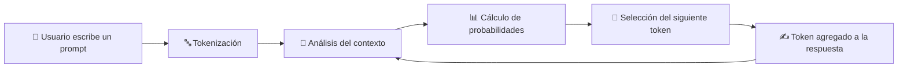

# ¿Cómo "piensa" un LLM?

## 🎯 Objetivos de aprendizaje

Al finalizar este capítulo podrás:

- Comprender qué hace realmente un LLM cuando recibe un prompt.
- Entender por qué un LLM no "piensa", sino que predice.
- Conocer el flujo general de generación de texto.
- Comprender por qué el contexto es tan importante.

---

## ⏱ Tiempo estimado

20 minutos.

---

## 📚 Prerrequisitos

- ¿Qué es la Inteligencia Artificial Generativa?
- Historia de la IA y los LLMs.

---

# Introducción

Cuando utilizamos ChatGPT, Claude, Gemini u otros modelos de lenguaje, es natural pensar que existe algún tipo de pensamiento similar al humano detrás de las respuestas.

Sin embargo, la realidad es diferente.

Aunque el resultado pueda parecer una conversación inteligente, internamente el modelo realiza una tarea mucho más concreta:

> **Predecir cuál debería ser el siguiente token de una secuencia de texto.**

Esa operación, repetida miles de veces, es la base de la generación de respuestas.

Comprender esta idea es uno de los conceptos fundamentales de todo AI Champion.

---

# La gran diferencia

Una persona responde utilizando:

- Experiencias.
- Memoria.
- Conocimientos adquiridos.
- Razonamiento.
- Intuición.
- Emociones.

Un LLM responde utilizando:

- Datos aprendidos durante su entrenamiento.
- Patrones estadísticos.
- Probabilidades matemáticas.

Un modelo de lenguaje no posee:

- Conciencia.
- Intenciones.
- Opiniones propias.
- Experiencias personales.

Su comportamiento inteligente aparece como consecuencia de la enorme cantidad de patrones que aprendió.

---

# ¿Qué significa predecir el siguiente token?

Supongamos la frase:

> "Los peces viven en el..."

Nuestro cerebro rápidamente completa:

- agua
- mar
- océano
- río

No hacemos una búsqueda consciente.

Utilizamos contexto y conocimiento previo.

Un LLM realiza una operación similar, pero mediante cálculos matemáticos sobre millones de posibilidades.

---

# El ciclo de generación

Cada respuesta sigue un proceso repetitivo.

## Paso 1 — El usuario envía un prompt

Ejemplo:

```text
Explícame qué es un Transformer.
```

Para nosotros es una frase con significado.

Para el modelo es una secuencia de datos que debe procesar.

---

## Paso 2 — Tokenización

El texto se transforma en pequeñas unidades llamadas **tokens**.

El modelo no trabaja directamente con palabras.

Trabaja con representaciones numéricas de esos tokens.

En el próximo capítulo veremos este concepto en profundidad.

---

## Paso 3 — Análisis del contexto

El modelo analiza los tokens disponibles.

No observa únicamente la última palabra.

Considera todo el contexto disponible dentro de su ventana de contexto.

Aquí aparece uno de los mecanismos más importantes de los Transformers:

**Attention.**

Lo estudiaremos más adelante.

---

## Paso 4 — Cálculo de probabilidades

El modelo genera una distribución de probabilidades sobre posibles próximos tokens.

Ejemplo simplificado:

| Token | Probabilidad |
|---|---:|
| Transformer | 42% |
| modelo | 18% |
| arquitectura | 12% |
| algoritmo | 7% |
| sistema | 5% |

Luego selecciona un token siguiendo determinadas reglas.

La selección puede verse afectada por parámetros como:

- Temperature.
- Top-p.

Estos conceptos serán estudiados posteriormente.

---

## Paso 5 — Repetición

El token seleccionado pasa a formar parte del contexto.

Luego el modelo vuelve a realizar el mismo proceso.

Una y otra vez.

Hasta completar la respuesta.

---

# 📊 Visualización

El flujo completo puede verse así:



El último paso es fundamental.

El modelo utiliza su propia salida como nuevo contexto.

Por eso una respuesta se construye progresivamente, token por token.

---

# ¿Por qué parece inteligente?

Durante su entrenamiento, un LLM analiza enormes cantidades de información.

Como resultado aprende relaciones complejas entre:

- Palabras.
- Conceptos.
- Código.
- Estructuras de lenguaje.
- Relaciones entre ideas.

No memoriza simplemente frases.

Aprende patrones.

Esos patrones permiten generar respuestas nuevas y coherentes.

---

# 💻 En la práctica

Cada vez que utilizas herramientas como ChatGPT, GitHub Copilot o Claude ocurre este proceso.

Por ejemplo:

Un desarrollador escribe:

```text
Crea una función TypeScript que valide un email.
```

El modelo no tiene una función guardada esperando esa pregunta.

Analiza:

- El lenguaje utilizado.
- El contexto del pedido.
- Patrones de código aprendidos.
- Estructuras similares vistas durante entrenamiento.

Luego genera código token por token.

Por eso un buen prompt no es simplemente una pregunta.

Es una forma de proporcionar contexto para orientar la predicción del modelo.

---

# ⚠️ Error común

## "La IA sabe la respuesta"

Esta frase es una simplificación peligrosa.

Una forma más precisa sería:

> "El modelo genera una respuesta basada en patrones aprendidos y en la probabilidad de qué tokens deberían aparecer después."

Esta diferencia es fundamental porque explica por qué los modelos pueden:

- Responder correctamente.
- Cometer errores.
- Inventar información.
- Necesitar validación externa.

---

# Conceptos clave

- Los LLM no piensan como humanos.
- Generan respuestas prediciendo tokens.
- Las respuestas se construyen paso a paso.
- El contexto tiene un papel fundamental.
- La inteligencia aparente surge de patrones aprendidos.

---

# 🔜 Lo veremos más adelante

En este capítulo aparecieron conceptos que todavía debemos construir:

- Tokens.
- Embeddings.
- Context Window.
- Transformers.
- Attention.
- Temperature.
- Top-p.

Cada uno será explicado con profundidad.

---

# Resumen

Un Large Language Model parece inteligente porque aprendió una cantidad enorme de patrones del lenguaje.

Sin embargo, su mecanismo fundamental es más simple:

> **Dado un contexto, calcula cuál es el siguiente token más probable.**

La repetición masiva de este proceso produce respuestas capaces de simular conversación, razonamiento y generación de contenido.

---

# 📝 Ejercicios

1. Explica con tus palabras qué significa "predecir el siguiente token".
2. ¿Por qué un LLM no genera una respuesta completa de una sola vez?
3. ¿Qué importancia tiene el contexto?
4. ¿Por qué un modelo puede generar información incorrecta?
5. ¿Por qué mejorar un prompt puede mejorar la respuesta obtenida?

---

# 🎯 Desafío

Piensa en una tarea real de desarrollo que realizas habitualmente.

Describe:

1. Qué información necesitaría una IA para ayudarte.
2. Qué contexto deberías proporcionarle.
3. Qué parte del resultado deberías validar manualmente.

El objetivo es comenzar a pensar como un desarrollador que trabaja junto a modelos de IA.
