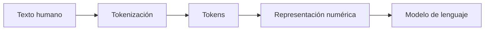

# Tokens y Tokenización

## 🎯 Objetivos de aprendizaje

Al finalizar este capítulo podrás:

- Comprender qué es un token.
- Entender por qué los LLMs no procesan palabras directamente.
- Conocer cómo funciona el proceso de tokenización.
- Comprender la relación entre tokens, contexto y costos.
- Identificar por qué una misma frase puede tener diferente cantidad de tokens.

---

## ⏱ Tiempo estimado

25 minutos.

---

## 📚 Prerrequisitos

- ¿Qué es la Inteligencia Artificial Generativa?
- ¿Cómo "piensa" un LLM?

---

# Introducción

Cuando escribimos una pregunta a un modelo de lenguaje, nosotros vemos palabras.

Por ejemplo:

```text
Explícame cómo funciona un Transformer
```

Para nosotros, esa frase tiene significado inmediato.

Pero un modelo de lenguaje no recibe palabras.

Los modelos trabajan con números.

Antes de poder procesar texto, necesitan transformar nuestra entrada en una representación matemática.

Ese proceso se llama:

> **Tokenización.**

---

# ¿Qué es un token?

Un token es una unidad de texto que el modelo utiliza para procesar información.

Puede representar:

- Una palabra completa.
- Parte de una palabra.
- Un símbolo.
- Un número.
- Un signo de puntuación.
- Una combinación frecuente de caracteres.

Un error común es pensar:

> Token = palabra

No necesariamente.

Un token es una unidad creada por un algoritmo de tokenización.

---

# Ejemplos simples

Una frase:

```text
Hola mundo
```

Podría convertirse en:

```
["Hola", " mundo"]
```

Pero una palabra más compleja podría dividirse:

```text
desarrolladores
```

Podría convertirse en algo similar a:

```
["des", "arroll", "adores"]
```

La división exacta depende del modelo utilizado.

---

# ¿Por qué no usar palabras directamente?

Parece más lógico trabajar con palabras completas.

Sin embargo, existen millones de palabras posibles.

Además:

- Aparecen palabras nuevas.
- Existen errores ortográficos.
- Existen nombres propios.
- Existen múltiples idiomas.
- Existen términos técnicos.

Un vocabulario basado únicamente en palabras sería demasiado grande y poco flexible.

---

# La solución: subpalabras

Los modelos modernos utilizan una estrategia intermedia.

En lugar de trabajar con:

- Caracteres individuales.
- Palabras completas.

Utilizan fragmentos frecuentes.

Por ejemplo:

La palabra:

```text
inteligencia
```

podría dividirse como:

```
inteligen + cia
```

Si el modelo ya conoce esos fragmentos, puede combinarlos para comprender palabras nuevas.

---

# 📊 Visualización

El flujo básico es:



El modelo nunca recibe directamente:

```text
¿Cómo funciona la IA?
```

Recibe una representación numérica de esos tokens.

---

# Del texto a números

Los modelos matemáticos no entienden texto.

Entienden números.

Por eso cada token tiene asociado un identificador.

Ejemplo simplificado:

| Token | ID |
|-|-:|
| Hola | 15496 |
| mundo | 1917 |
| IA | 9552 |

Estos números permiten que una red neuronal pueda operar sobre la información.

---

# Tokens durante una conversación

Cuando conversamos con un LLM, toda la conversación consume tokens.

Ejemplo:

Usuario:

```
Explícame qué es un Transformer.
```

Modelo:

```
Un Transformer es una arquitectura...
```

Ambos mensajes forman parte del contexto.

Ese contexto tiene un límite.

A ese límite se lo conoce como:

> **Context Window**

Lo estudiaremos próximamente.

---

# Tokens y costos

En muchos modelos comerciales, el uso se mide en tokens.

Normalmente existen dos conceptos:

## Tokens de entrada

Son los tokens que enviamos al modelo.

Ejemplo:

- Prompt.
- Instrucciones.
- Documentos adjuntos.

## Tokens de salida

Son los tokens generados por el modelo.

Ejemplo:

- Respuesta.
- Código.
- Explicación.

Cuanto más texto procesamos, mayor puede ser el costo.

---

# Tokens y programación

Para un desarrollador esto tiene consecuencias prácticas.

Un prompt como:

```text
Corrige este código:
[10.000 líneas de código]
```

puede consumir miles de tokens.

Eso puede provocar:

- Mayor costo.
- Mayor tiempo de respuesta.
- Exceder el contexto disponible.

Por eso técnicas como:

- Resumen.
- RAG.
- División de documentos.
- Recuperación selectiva.

son tan importantes.

---

# 💻 En la práctica

Cuando utilizamos un asistente de programación como GitHub Copilot, el modelo no recibe simplemente:

```text
"Completa esta función"
```

Puede recibir:

- Archivo actual.
- Código cercano.
- Nombre de variables.
- Comentarios.
- Configuración del proyecto.
- Instrucciones del usuario.

Todo ese contexto se transforma en tokens.

El modelo utiliza esos tokens para predecir la continuación más probable del código.

---

# ⚠️ Error común

## "Más tokens significa más inteligencia"

No necesariamente.

Un modelo con más contexto puede recibir más información, pero eso no significa automáticamente que razone mejor.

La calidad depende de muchos factores:

- Arquitectura.
- Datos de entrenamiento.
- Capacidad del modelo.
- Prompt.
- Contexto proporcionado.

---

# Conceptos clave

- Los LLM procesan tokens, no palabras.
- Los tokens son fragmentos de texto.
- La tokenización convierte texto en unidades procesables.
- Cada token tiene una representación numérica.
- Los tokens determinan contexto y costos.

---

# 🔜 Lo veremos más adelante

Los tokens son solamente una representación inicial.

Pero un token individual no tiene significado por sí mismo.

La siguiente pregunta será:

> **¿Cómo pasa un modelo de números y tokens a comprender relaciones entre conceptos?**

La respuesta nos lleva al siguiente concepto:

**Embeddings.**

---

# Resumen

Los humanos pensamos en palabras.

Los modelos de lenguaje trabajan con tokens.

La tokenización es el puente entre nuestro lenguaje y las operaciones matemáticas que permiten a un LLM generar respuestas.

Comprender los tokens es comprender la primera capa del funcionamiento interno de cualquier aplicación moderna basada en IA.

---

# 📝 Ejercicios

1. ¿Por qué un token no siempre equivale a una palabra?
2. ¿Por qué los modelos utilizan subpalabras?
3. ¿Por qué los tokens afectan el costo de una aplicación con IA?
4. ¿Qué diferencia existe entre tokens de entrada y salida?
5. ¿Por qué un desarrollador debería preocuparse por la cantidad de tokens?

---

# 🎯 Desafío

Selecciona un texto técnico de aproximadamente 200 palabras.

Intenta estimar:

- Cuántos tokens podría tener.
- Qué partes podrían consumir más tokens.
- Cómo reducirías el tamaño manteniendo la información importante.

Luego compáralo usando un tokenizer real de algún modelo disponible.
