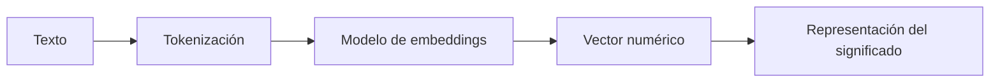
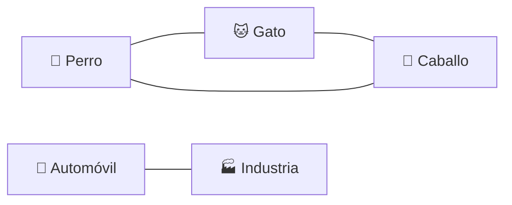

# Embeddings: cómo la IA representa significado

## 🎯 Objetivos de aprendizaje

Al finalizar este capítulo podrás:

- Comprender qué es un embedding.
- Entender cómo un modelo transforma texto en vectores.
- Comprender por qué los embeddings permiten comparar significado.
- Conocer aplicaciones prácticas de embeddings.
- Entender su relación con RAG y bases de datos vectoriales.

---

## ⏱ Tiempo estimado

30 minutos.

---

## 📚 Prerrequisitos

- Tokens y tokenización.
- Cómo "piensa" un LLM.

---

# Introducción

Hasta ahora aprendimos que:

1. Los humanos escribimos texto.
2. Ese texto se divide en tokens.
3. Los modelos convierten esos tokens en números.

Pero aparece una pregunta fundamental:

> Si una computadora solo trabaja con números, ¿cómo puede entender que dos frases tienen significados similares?

Por ejemplo:

```
¿Cómo puedo restablecer mi contraseña?
```

y

```
No recuerdo mi clave de acceso
```

Para una persona son claramente preguntas relacionadas.

Pero para una computadora son solamente caracteres diferentes.

La solución son los:

> **Embeddings.**

---

# ¿Qué es un embedding?

Un embedding es una representación matemática de una información.

Puede representar:

- Texto.
- Imágenes.
- Audio.
- Código.
- Documentos completos.

La idea principal es:

> Transformar algo complejo en un conjunto de números que conserve relaciones importantes.

---

# Del texto al vector

Supongamos una frase:

```
El perro juega en el parque
```

Un modelo de embeddings podría transformarla en algo similar a:

```
[
  0.024,
 -0.153,
  0.821,
  0.442,
  ...
]
```

Este conjunto de números se llama:

> Vector.

En aplicaciones reales, un embedding puede tener cientos o miles de dimensiones.

---

# 📊 Visualización

El proceso sería:



El objetivo no es representar las palabras literalmente.

El objetivo es capturar relaciones.

---

# La idea más importante: distancia semántica

Los embeddings permiten medir qué tan similares son dos conceptos.

Ejemplo:

```
Perro
```

y

```
Mascota doméstica
```

tendrían vectores cercanos.

Mientras que:

```
Perro
```

y

```
Motor de combustión
```

estarían mucho más alejados.

---

# Un espacio matemático de significado

Imaginemos un espacio simplificado de dos dimensiones:



En realidad los modelos trabajan con cientos o miles de dimensiones.

Pero la idea es la misma:

Los conceptos relacionados tienden a ubicarse cerca.

---

# ¿El embedding contiene la palabra?

No.

Este punto es fundamental.

Un embedding no es una traducción de una palabra.

No significa:

```
Perro = [0.24,0.52,0.11]
```

como si fuera un diccionario.

Es una representación matemática aprendida durante el entrenamiento.

Los números individuales no tienen significado humano.

El significado aparece por la relación entre muchos vectores.

---

# ¿Cómo aprende estas relaciones?

Durante el entrenamiento, el modelo observa enormes cantidades de ejemplos.

Aprende patrones como:

```
perro aparece cerca de:
- animal
- mascota
- ladrar
- cachorro
```

y:

```
avión aparece cerca de:
- vuelo
- aeropuerto
- piloto
```

Con millones de ejemplos, construye una representación matemática del lenguaje.

---

# Embeddings y búsqueda semántica

Una aplicación tradicional busca coincidencias exactas.

Ejemplo:

Usuario:

```
¿Cómo cambiar mi contraseña?
```

Base de datos:

```
Cambiar clave de usuario
```

Una búsqueda tradicional puede no encontrar coincidencias.

Una búsqueda semántica usando embeddings entiende que:

```
contraseña
```

y

```
clave
```

pueden representar la misma intención.

---

# 💻 En la práctica

Supongamos que construimos un asistente interno para una empresa.

Tenemos documentos:

```
manual_usuario.pdf
politicas_rrhh.pdf
documentacion_tecnica.pdf
```

El flujo podría ser:

1. Convertir documentos en embeddings.
2. Guardarlos en una base de datos vectorial.
3. Convertir la pregunta del usuario en un embedding.
4. Buscar documentos con vectores similares.
5. Entregar esa información al LLM.

Este patrón es la base de:

> Retrieval-Augmented Generation (RAG)

que veremos más adelante.

---

# Embeddings y bases de datos vectoriales

Las bases de datos tradicionales almacenan:

```
ID
Nombre
Fecha
Estado
```

Una base vectorial almacena:

```
Documento
+
Vector matemático
```

Ejemplos de tecnologías:

- Pinecone.
- Weaviate.
- Milvus.
- Chroma.
- PostgreSQL con pgvector.

Su objetivo es encontrar elementos matemáticamente cercanos.

---

# ⚠️ Error común

## "Los embeddings entienden el significado como una persona"

No exactamente.

Los embeddings capturan relaciones estadísticas aprendidas.

No existe comprensión humana.

El modelo aprendió que ciertos conceptos aparecen relacionados de determinadas maneras.

---

# Conceptos clave

- Un embedding transforma información en un vector.
- Los vectores permiten comparar similitud.
- Conceptos relacionados tienden a estar cerca.
- Los embeddings son fundamentales para RAG.
- Las bases vectoriales permiten buscar por significado.

---

# 🔜 Lo veremos más adelante

Los embeddings nos llevan directamente al siguiente gran concepto:

> **¿Cuánta información puede recordar un modelo durante una conversación?**

La respuesta está en:

**Context Window.**

Más adelante veremos también cómo combinar embeddings con LLMs para construir sistemas RAG.

---

# Resumen

Los tokens permiten que un modelo procese texto.

Los embeddings permiten representar significado.

Esta diferencia es fundamental:

```
Tokens:
"¿Cómo cambio mi contraseña?"

        ↓

Embedding:

[0.124, -0.332, 0.891, ...]

        ↓

Representación matemática del concepto
```

Gracias a los embeddings, una IA puede encontrar relaciones entre conceptos aunque las palabras utilizadas sean diferentes.

---

# 📝 Ejercicios

1. ¿Cuál es la diferencia entre un token y un embedding?
2. ¿Por qué dos frases diferentes pueden tener embeddings similares?
3. ¿Por qué un embedding no es simplemente un diccionario?
4. ¿Qué problema resuelve una búsqueda semántica?
5. ¿Por qué los embeddings son importantes para RAG?

---

# 🎯 Desafío

Imagina que debes construir un buscador inteligente para documentación técnica.

Define:

1. Qué información convertirías en embeddings.
2. Qué almacenarías en una base vectorial.
3. Cómo usarías esos resultados para responder preguntas con un LLM.
