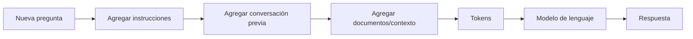

# Context Window: la memoria temporal de un LLM

## 🎯 Objetivos de aprendizaje

Al finalizar este capítulo podrás:

- Comprender qué es la ventana de contexto de un LLM.
- Diferenciar contexto de memoria permanente.
- Entender cómo una conversación mantiene información previa.
- Comprender las limitaciones prácticas del contexto.
- Conocer técnicas para trabajar con grandes volúmenes de información.

---

## ⏱ Tiempo estimado

25 minutos.

---

## 📚 Prerrequisitos

- Tokens y tokenización.
- Embeddings.

---

# Introducción

Cuando conversamos con una persona, esperamos que recuerde lo que dijimos unos segundos antes.

Por ejemplo:

Persona:

> Mi nombre es Lucas.

Más tarde:

> ¿Cuál es mi nombre?

Esperamos que responda:

> Lucas.

Esto ocurre porque nuestro cerebro mantiene información temporalmente disponible.

Pero un LLM funciona de manera diferente.

Un modelo de lenguaje no tiene memoria propia.

Cada vez que genera una respuesta, solamente conoce la información que recibe en ese momento.

Esa información se llama:

> **Contexto.**

---

# ¿Qué es el Context Window?

La **Context Window** o ventana de contexto es la cantidad máxima de información que un modelo puede procesar en una interacción.

Normalmente se mide en:

> Tokens.

No en palabras.

---

Ejemplo simplificado:

Un modelo podría tener:

```
Context Window:
128.000 tokens
```

Eso significa que puede considerar hasta esa cantidad de tokens entre:

- Instrucciones del sistema.
- Mensajes anteriores.
- Pregunta actual.
- Documentos enviados.
- Respuesta generada.

---

# Una conversación no es memoria

Este concepto es fundamental.

Cuando hablamos con ChatGPT parece que recuerda.

Pero realmente ocurre algo diferente.

La aplicación envía nuevamente parte de la conversación anterior junto con el nuevo mensaje.

Ejemplo:

Conversación:

```
Usuario:
Mi nombre es Ana.

Usuario:
¿Recuerdas mi nombre?
```

Internamente podría enviarse:

```
Sistema:
Eres un asistente.

Usuario:
Mi nombre es Ana.

Usuario:
¿Recuerdas mi nombre?
```

El modelo responde porque recibió esa información.

No porque la haya guardado.

---

# 📊 Visualización

El flujo simplificado es:



Todo lo que el modelo sabe durante una interacción está dentro de esa ventana.

---

# El problema del límite

La ventana de contexto tiene un tamaño máximo.

Si una conversación supera ese límite, algo debe ocurrir.

Algunas estrategias posibles:

- Eliminar mensajes antiguos.
- Resumir información.
- Seleccionar solo información relevante.
- Usar memoria externa.

---

# Ejemplo práctico

Imaginemos un asistente para una empresa.

Tenemos:

```
500 documentos internos
```

Una mala estrategia sería:

```
Enviar todos los documentos al modelo
```

Problemas:

- Demasiados tokens.
- Mayor costo.
- Respuestas más lentas.
- Posible límite de contexto.

Una mejor estrategia:

```
Pregunta del usuario

        ↓

Buscar información relevante

        ↓

Enviar solamente fragmentos útiles

        ↓

LLM genera respuesta
```

Este patrón se llama:

> Retrieval-Augmented Generation (RAG)

Lo estudiaremos más adelante.

---

# Context Window vs Memoria

Es importante separar ambos conceptos.

## Context Window

Es información disponible durante una interacción.

Ejemplo:

```
Los últimos mensajes de una conversación.
```

---

## Memoria

Es información almacenada para utilizar en futuras conversaciones.

Ejemplo:

```
El usuario prefiere respuestas técnicas.
```

La memoria requiere sistemas adicionales.

No forma parte del LLM base.

---

# 💻 En la práctica

Como desarrolladores, debemos diseñar cuidadosamente qué información enviamos al modelo.

Ejemplo:

Una aplicación de soporte técnico podría recibir:

```
Pregunta:
¿Cómo soluciono este error?

Contexto:
- Versión del sistema.
- Logs recientes.
- Documentación relacionada.
- Historial del usuario.
```

Enviar información irrelevante puede empeorar la respuesta.

Más contexto no siempre significa mejor respuesta.

La calidad depende del contexto correcto.

---

# Context Window y diseño de prompts

Un prompt profesional no es solamente una pregunta.

Es una construcción de contexto.

Ejemplo:

Menos efectivo:

```
Explica este error.
```

Más efectivo:

```
Actúa como un experto Angular.

Contexto:
Aplicación Angular 20.
Error durante lazy loading.
Código:
...

Analiza la causa y propone solución.
```

La diferencia está en la información disponible para el modelo.

---

# ⚠️ Error común

## "Un modelo grande recuerda todo"

Incorrecto.

Un modelo puede tener una ventana de contexto enorme y aun así:

- No recordar conversaciones anteriores.
- No conocer información privada.
- No tener acceso a datos externos.

La memoria debe implementarse mediante sistemas adicionales.

---

# Conceptos clave

- El contexto es la información disponible para el modelo.
- Los modelos procesan contexto medido en tokens.
- La ventana de contexto tiene un límite.
- La conversación no implica memoria permanente.
- RAG permite incorporar información externa.

---

# 🔜 Lo veremos más adelante

Ahora sabemos:

- Cómo representamos texto (tokens).
- Cómo representamos significado (embeddings).
- Cómo entregamos información al modelo (contexto).

El siguiente paso es entender el componente que hizo posible todo esto:

> **¿Cómo funciona internamente la arquitectura Transformer?**

---

# Resumen

Un LLM no recuerda.

Un LLM recibe contexto.

La aplicación que utiliza el modelo es responsable de decidir qué información enviarle.

Comprender esta diferencia es esencial para diseñar aplicaciones profesionales con IA.

---

# 📝 Ejercicios

1. ¿Por qué un LLM parece recordar una conversación?
2. ¿Cuál es la diferencia entre contexto y memoria?
3. ¿Por qué una ventana de contexto tiene un límite?
4. ¿Por qué enviar más información puede empeorar una respuesta?
5. ¿Qué problema intenta resolver RAG?

---

# 🎯 Desafío

Diseña el contexto ideal para un asistente IA que ayuda a programadores.

Define:

- Qué información debería recibir siempre.
- Qué información debería recibir solo cuando sea necesaria.
- Qué información debería almacenarse como memoria.
