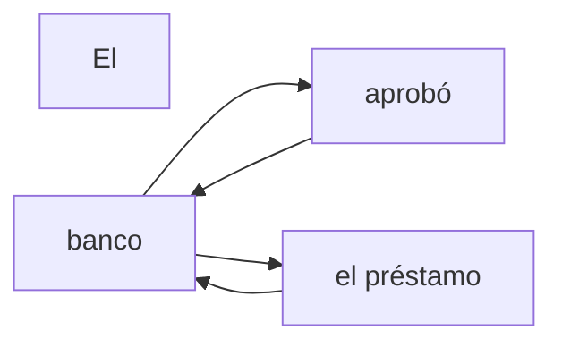
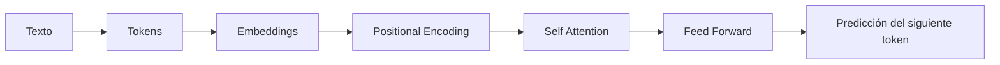

# Transformers: la arquitectura que cambió la Inteligencia Artificial

## 🎯 Objetivos de aprendizaje

Al finalizar este capítulo podrás:

- Comprender qué problema resolvieron los Transformers.
- Entender la idea fundamental detrás del mecanismo Attention.
- Conocer las principales partes de una arquitectura Transformer.
- Comprender por qué los Transformers permitieron crear modelos como GPT, Claude y Gemini.
- Relacionar Transformers con tokens, embeddings y contexto.

---

## ⏱ Tiempo estimado

40 minutos.

---

## 📚 Prerrequisitos

- Tokens y tokenización.
- Embeddings.
- Context Window.

---

# Introducción

En los capítulos anteriores vimos que un LLM:

1. Recibe texto.
2. Lo transforma en tokens.
3. Convierte esos tokens en representaciones numéricas.
4. Analiza el contexto.
5. Predice el siguiente token.

Pero todavía falta una pieza fundamental.

La pregunta es:

> ¿Cómo puede el modelo saber qué partes del texto son importantes?

Por ejemplo:

```
El programador abrió el archivo porque necesitaba modificar una función.
```

Para completar correctamente una frase, el modelo debe relacionar:

- "programador"
- "archivo"
- "modificar"
- "función"

Aunque estén separados dentro de la oración.

Ese problema fue resuelto con una arquitectura llamada:

> **Transformer**

---

# Antes de Transformers: el problema del contexto

Antes de 2017, muchos modelos de lenguaje utilizaban arquitecturas como:

- RNN (Recurrent Neural Networks)
- LSTM (Long Short-Term Memory)

Estas redes procesaban información secuencialmente.

Ejemplo:

```
Palabra 1
   ↓
Palabra 2
   ↓
Palabra 3
   ↓
Palabra 4
```

El problema:

La información debía viajar paso a paso.

Cuando una frase era muy larga, el modelo podía perder relaciones importantes.

---

# El gran cambio

En 2017 Google publicó el artículo:

> "Attention Is All You Need"

Este trabajo presentó una nueva arquitectura:

> Transformer

La idea revolucionaria fue:

**Permitir que cada elemento de una secuencia pueda relacionarse directamente con todos los demás.**

---

# La idea de Attention

Attention significa:

> "Decidir qué partes del contexto son más importantes para interpretar una información."

Veamos un ejemplo:

```
El banco aprobó el préstamo.
```

La palabra:

```
banco
```

puede significar:

- Institución financiera.
- Lugar junto al río.

El modelo necesita mirar las palabras cercanas:

```
aprobó
préstamo
```

y determinar que el significado correcto es financiero.

Eso es atención.

---

# 📊 Visualización de Attention



La palabra "banco" presta más atención a las palabras relacionadas con su significado dentro del contexto.

---

# La arquitectura Transformer

Un Transformer tiene varias piezas.

Simplificando:

```
Texto

 ↓

Tokens

 ↓

Embeddings

 ↓

Positional Encoding

 ↓

Attention

 ↓

Feed Forward Network

 ↓

Predicción

```

---

# Componentes principales

## 1. Embeddings

Ya vimos este concepto.

Los tokens se convierten en vectores matemáticos.

Ejemplo:

```
"Transformer"

↓

[0.21, -0.43, 0.77...]
```

---

## 2. Positional Encoding

Un problema importante:

El Transformer procesa información en paralelo.

Pero el lenguaje tiene orden.

No es lo mismo:

```
El perro mordió al hombre
```

que:

```
El hombre mordió al perro
```

Por eso necesita información sobre la posición de cada token.

---

## 3. Self-Attention

Es el corazón del Transformer.

Cada token analiza:

- Otros tokens.
- Sus relaciones.
- Su importancia.

Ejemplo:

```
La aplicación utiliza un servicio compartido.
```

Para entender:

```
servicio
```

el modelo analiza:

```
aplicación
utiliza
compartido
```

---

## 4. Feed Forward Network

Después de la atención, cada representación pasa por redes neuronales que transforman la información.

Podemos pensar en esto como una capa de procesamiento adicional.

---

# 📊 Flujo simplificado



---

# ¿Por qué Transformers cambiaron todo?

Porque permitieron:

## Procesamiento paralelo

Los modelos pudieron entrenarse con cantidades enormes de datos.

---

## Mayor contexto

Pudieron manejar secuencias mucho más largas.

---

## Escalabilidad

Aumentando:

- Datos.
- Parámetros.
- Capacidad computacional.

Los modelos comenzaron a mostrar capacidades emergentes.

---

# De Transformer a GPT

GPT significa:

> Generative Pre-trained Transformer

Es decir:

- Generativo.
- Pre-entrenado.
- Basado en Transformer.

La arquitectura Transformer es la base.

Luego cada laboratorio agrega:

- Datos.
- Técnicas de entrenamiento.
- Ajustes.
- Optimización.

---

# 💻 En la práctica

Cuando utilizas un asistente de programación:

Ejemplo:

```
Completa esta función TypeScript:
```

El modelo:

1. Convierte tu código en tokens.
2. Genera embeddings.
3. Usa Attention para analizar relaciones.
4. Considera el contexto disponible.
5. Predice el siguiente token.
6. Repite hasta completar la función.

La capacidad de entender que una variable declarada 50 líneas antes puede ser relevante viene justamente de mecanismos como Attention.

---

# ⚠️ Error común

## "El Transformer entiende el texto como una persona"

No exactamente.

El Transformer no tiene comprensión humana.

Calcula relaciones matemáticas entre representaciones.

El resultado parece comprensión porque esas relaciones son extremadamente complejas.

---

# Conceptos clave

- Transformer es la arquitectura base de los LLM modernos.
- Attention permite relacionar partes del contexto.
- Los modelos pueden procesar información en paralelo.
- Los embeddings representan significado.
- GPT, Claude y Gemini utilizan arquitecturas basadas en Transformers.

---

# 🔜 Lo veremos más adelante

Ahora que conocemos Transformers, podemos estudiar una de sus partes más importantes:

> **Self-Attention: el mecanismo que permite al modelo decidir qué información considerar.**

Después podremos entender mejor:

- Entrenamiento.
- Parámetros.
- Fine-tuning.
- Inference.
- Agentes.

---

# Resumen

Los Transformers fueron el punto de inflexión de la IA moderna.

Su innovación principal fue permitir que un modelo pudiera analizar relaciones entre diferentes partes de una secuencia mediante Attention.

Gracias a esta arquitectura fue posible entrenar modelos gigantes capaces de generar texto, código, imágenes y mucho más.

---

# 📝 Ejercicios

1. ¿Qué problema tenían las arquitecturas anteriores a Transformers?
2. ¿Qué significa Attention?
3. ¿Por qué un Transformer necesita información de posición?
4. ¿Cuál es la relación entre Transformer y GPT?
5. ¿Por qué los Transformers permitieron modelos mucho más grandes?

---

# 🎯 Desafío

Explica a otro desarrollador qué es un Transformer utilizando únicamente una analogía.

Tu explicación debe incluir:

- Tokens.
- Contexto.
- Atención.
- Predicción.
