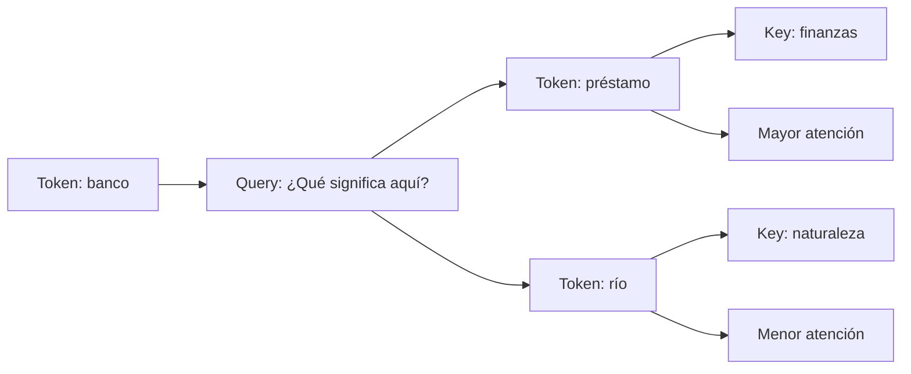
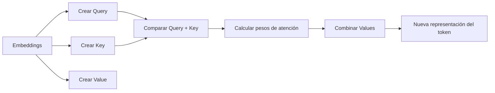

# Self-Attention: cómo un modelo decide qué información importa

## 🎯 Objetivos de aprendizaje

Al finalizar este capítulo podrás:

- Comprender qué problema resuelve Self-Attention.
- Entender cómo un token analiza otros tokens del contexto.
- Conocer los conceptos Query, Key y Value.
- Comprender por qué Attention es el corazón de los Transformers.
- Relacionar Self-Attention con el funcionamiento de los LLM modernos.

---

## ⏱ Tiempo estimado

45 minutos.

---

## 📚 Prerrequisitos

- Tokens.
- Embeddings.
- Transformers.

---

# Introducción

En el capítulo anterior vimos que los Transformers utilizan un mecanismo llamado:

> Attention

Ahora debemos responder una pregunta más profunda:

> ¿Cómo funciona realmente esa atención?

Supongamos esta frase:

```
El programador abrió el archivo porque necesitaba modificar una función.
```

Para entender correctamente la palabra:

```
archivo
```

el modelo necesita relacionarla con:

```
abrió
programador
modificar
función
```

Pero no todas las palabras tienen la misma importancia.

La palabra:

```
el
```

aporta muy poco significado.

Entonces el modelo necesita decidir:

> ¿Qué partes del contexto son relevantes para interpretar cada token?

Ese es el objetivo de Self-Attention.

---

# La idea intuitiva

Podemos imaginar Self-Attention como una conversación interna:

Cada token pregunta:

> "¿Qué otros tokens necesito mirar para entender mi significado?"

Por ejemplo:

```
El banco aprobó el préstamo.
```

La palabra:

```
banco
```

podría tener varios significados.

Entonces observa:

```
aprobó
préstamo
```

y determina:

```
banco = institución financiera
```

No porque conozca una definición como un diccionario.

Sino porque encontró relaciones dentro del contexto.

---

# Attention paso a paso

Para explicar Self-Attention utilizaremos tres conceptos:

- Query.
- Key.
- Value.

Estos nombres pueden parecer extraños, pero la idea es simple.

---

# Query (Q)

La Query representa:

> "¿Qué información estoy buscando?"

Cada token genera una pregunta.

Ejemplo:

La palabra:

```
banco
```

pregunta:

> "¿Qué significado tengo en esta frase?"

---

# Key (K)

La Key representa:

> "Qué información ofrece cada token."

Cada palabra indica qué tipo de información contiene.

Ejemplo:

```
préstamo
```

ofrece una señal relacionada con:

```
finanzas
```

---

# Value (V)

El Value representa:

> "La información que será utilizada si este token resulta relevante."

Es decir:

- Qué aporta.
- Qué información transmite.

---

# La comparación

El modelo compara:

```
Query
 +
Key
```

para determinar cuánto debe prestar atención.

Simplificando:

```
¿Qué tan relacionada está mi pregunta con la información disponible?
```

---

# 📊 Visualización conceptual



El modelo asigna diferentes pesos según la relevancia.

---

# Los pesos de atención

El resultado de Attention es una distribución de importancia.

Ejemplo simplificado:

Frase:

```
El banco aprobó el préstamo.
```

Atención desde:

```
banco
```

| Token | Peso |
|-|-:|
| El | 0.05 |
| banco | 0.20 |
| aprobó | 0.35 |
| préstamo | 0.30 |
| el | 0.05 |
| punto | 0.05 |

El modelo decide que:

```
aprobó
```

y

```
préstamo
```

son más importantes para interpretar "banco".

---

# La fórmula detrás de Attention

La fórmula original del paper "Attention Is All You Need" es:

```
Attention(Q,K,V) =
softmax(QKᵀ / √dk)V
```

No necesitamos memorizarla.

Pero sí entender sus partes:

## QKᵀ

Compara Query con Keys.

Pregunta:

> ¿Qué tan relacionados están estos elementos?

---

## Softmax

Convierte los valores en probabilidades.

Ejemplo:

```
10%
20%
70%
```

---

## V

Combina la información seleccionada.

---

# 📊 Flujo simplificado



---

# ¿Por qué se llama Self-Attention?

Porque la atención ocurre dentro de la propia secuencia.

El modelo presta atención:

```
entre sus propios tokens
```

Ejemplo:

Una frase completa se analiza a sí misma.

Por eso:

Self + Attention

---

# Multi-Head Attention

Los Transformers modernos no tienen una sola atención.

Tienen múltiples cabezas:

> Multi-Head Attention

La idea:

Cada cabeza puede especializarse en diferentes relaciones.

Una puede enfocarse en:

- Gramática.

Otra en:

- Relaciones semánticas.

Otra en:

- Estructura del código.

Otra en:

- Referencias lejanas.

---

# 💻 En la práctica

Cuando un asistente de programación analiza:

```typescript
const user = getCurrentUser();

user.profile.address.city
```

El modelo necesita relacionar:

```
user
```

con:

```
getCurrentUser()
```

aunque estén separados.

Self-Attention permite capturar esas relaciones.

Por eso los modelos modernos pueden trabajar con:

- Código.
- Documentos largos.
- Conversaciones.
- Lenguaje natural.

---

# ⚠️ Error común

## "Attention significa que la IA presta atención como una persona"

No.

No existe intención ni concentración.

Attention es un cálculo matemático que asigna pesos a relaciones entre tokens.

La palabra "atención" es una analogía.

---

# Conceptos clave

- Self-Attention permite relacionar tokens entre sí.
- Query representa lo que buscamos.
- Key representa lo que cada token ofrece.
- Value representa la información transmitida.
- Los pesos determinan la importancia relativa.
- Multi-Head Attention permite múltiples perspectivas.

---

# 🔜 Lo veremos más adelante

Ahora conocemos:

```
Tokens
 ↓
Embeddings
 ↓
Transformer
 ↓
Self-Attention
```

El siguiente paso será entender cómo un modelo aprende estos patrones:

> **¿Cómo se entrena un LLM?**

Veremos:

- Dataset.
- Pre-training.
- Parámetros.
- Gradientes.
- Fine-tuning.
- RLHF.

---

# Resumen

Self-Attention es el mecanismo que permite a un Transformer analizar relaciones entre diferentes partes del contexto.

Gracias a este mecanismo, un modelo puede determinar que una palabra depende de otra aunque estén separadas por muchos tokens.

Esta simple idea matemática fue una de las claves que permitió construir los modelos de IA Generativa actuales.

---

# 📝 Ejercicios

1. ¿Qué problema intenta resolver Self-Attention?
2. ¿Cuál es la diferencia entre Query, Key y Value?
3. ¿Por qué una palabra puede prestar más atención a algunas palabras que a otras?
4. ¿Por qué los Transformers utilizan múltiples cabezas de atención?
5. ¿Por qué Attention no significa que el modelo tenga conciencia?

---

# 🎯 Desafío

Explica Self-Attention a otro desarrollador usando una analogía relacionada con programación.

Tu explicación debe incluir:

- Tokens.
- Relaciones.
- Importancia.
- Contexto.
