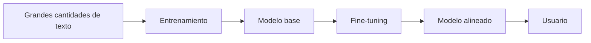
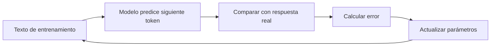

# ¿Cómo se entrena un LLM?

## 🎯 Objetivos de aprendizaje

Al finalizar este capítulo podrás:

- Comprender cómo aprende un modelo de lenguaje.
- Diferenciar entrenamiento e inferencia.
- Entender qué son los parámetros de un modelo.
- Conocer las etapas principales de creación de un LLM.
- Comprender por qué un modelo necesita entrenamiento y ajuste posterior.

---

## ⏱ Tiempo estimado

40 minutos.

---

## 📚 Prerrequisitos

- Transformers.
- Self-Attention.
- Embeddings.

---

# Introducción

Cuando utilizamos un asistente de IA, vemos algo aparentemente sencillo:

```
Pregunta
   ↓
Respuesta
```

Pero detrás existe un proceso enorme que ocurrió antes.

Antes de responder preguntas, el modelo pasó meses aprendiendo patrones del lenguaje.

Ese proceso se llama:

> **Entrenamiento.**

---

# Entrenamiento vs Inferencia

Primero debemos diferenciar dos conceptos.

---

## Entrenamiento (Training)

Es el proceso donde el modelo aprende.

Durante esta etapa:

- Recibe grandes cantidades de información.
- Ajusta sus parámetros internos.
- Aprende patrones del lenguaje.

Ejemplo:

```
Texto:
El perro corre por el parque.

Modelo:
¿Cuál es el siguiente token?

Respuesta esperada:
corre
```

El modelo compara su predicción con la respuesta correcta y ajusta sus valores internos.

---

## Inferencia (Inference)

Es cuando utilizamos un modelo ya entrenado.

Ejemplo:

```
Usuario:
Escribe una función para ordenar un array.

Modelo:
Genera código.
```

Durante inferencia el modelo normalmente no aprende.

Utiliza lo que ya aprendió.

---

# 📊 Visualización general



---

# ¿Qué aprende realmente un modelo?

Una pregunta común es:

> ¿El modelo guarda todos los textos que leyó?

La respuesta es:

No exactamente.

El modelo aprende:

- Relaciones estadísticas.
- Patrones.
- Estructuras.
- Representaciones matemáticas.

Ese aprendizaje queda almacenado en sus:

> Parámetros.

---

# ¿Qué son los parámetros?

Un modelo moderno puede tener:

- Millones.
- Miles de millones.
- Cientos de miles de millones.

de parámetros.

Los parámetros son valores matemáticos internos que determinan cómo procesa información.

Una analogía:

Un cerebro humano tiene conexiones neuronales.

Un modelo tiene parámetros.

No son equivalentes, pero cumplen una función similar dentro del sistema.

---

# Aprendizaje mediante predicción

El entrenamiento inicial de muchos LLM funciona mediante una tarea aparentemente simple:

> Predecir el siguiente token.

Ejemplo:

Entrada:

```
La inteligencia artificial es
```

El modelo intenta predecir:

```
poderosa
```

Si falla:

```
rápida
```

el sistema mide el error.

Luego ajusta sus parámetros.

Este proceso ocurre millones de veces.

---

# El ciclo de aprendizaje



Este proceso se repite una cantidad enorme de veces.

---

# Gradientes y ajuste de parámetros

Internamente, el modelo utiliza técnicas matemáticas como:

- Backpropagation.
- Gradient Descent.

La idea simplificada:

1. El modelo realiza una predicción.
2. Calcula cuánto se equivocó.
3. Identifica qué parámetros deben cambiar.
4. Ajusta esos valores.

Después vuelve a intentarlo.

---

# Pre-training

La primera gran etapa se llama:

> Pre-training.

El objetivo es crear un modelo base.

Durante esta etapa aprende:

- Lenguaje.
- Código.
- Patrones.
- Relaciones entre conceptos.

Ejemplo:

Un modelo base puede saber mucho sobre lenguaje, pero no necesariamente responder de forma útil como un asistente.

---

# Fine-tuning

Después viene una etapa de especialización:

> Fine-tuning.

Aquí se utiliza un conjunto de datos más pequeño y específico.

Ejemplos:

- Código.
- Medicina.
- Legal.
- Atención al cliente.

El objetivo es adaptar el comportamiento del modelo.

---

# RLHF: aprendizaje con feedback humano

Muchos modelos conversacionales utilizan técnicas de alineamiento.

Una de ellas:

> Reinforcement Learning from Human Feedback.

La idea:

Los humanos evalúan respuestas.

Ejemplo:

Respuesta A:

```
Correcta y clara.
```

Respuesta B:

```
Confusa y poco útil.
```

El sistema aprende qué comportamientos son preferibles.

---

# 💻 En la práctica

Para un desarrollador existen dos mundos diferentes.

## Usar un modelo existente

Ejemplo:

- API de OpenAI.
- Claude.
- Gemini.

Normalmente trabajamos con:

- Prompts.
- Contexto.
- RAG.
- Herramientas.

---

## Crear o adaptar un modelo

Implica:

- Datos.
- GPUs.
- Entrenamiento.
- Evaluación.
- Infraestructura.

Por eso la mayoría de aplicaciones profesionales no entrenan modelos desde cero.

Construyen soluciones alrededor de modelos existentes.

---

# ⚠️ Error común

## "Más parámetros significa siempre mejor modelo"

No necesariamente.

El rendimiento depende de:

- Arquitectura.
- Calidad de datos.
- Entrenamiento.
- Optimización.
- Evaluación.

Un modelo más pequeño puede superar a uno mayor en una tarea específica.

---

# Conceptos clave

- Training es aprendizaje.
- Inference es uso del modelo.
- Los parámetros almacenan patrones aprendidos.
- Pre-training crea el modelo base.
- Fine-tuning adapta el comportamiento.
- RLHF mejora la interacción humana.

---

# 🔜 Lo veremos más adelante

Ahora conocemos:

```
Cómo funciona un LLM
        ↓
Cómo representa información
        ↓
Cómo aprende
```

El siguiente paso será entender:

> **¿Cómo hacemos que un modelo general sea útil para personas reales?**

Veremos:

- Instrucciones.
- Prompt Engineering.
- System Prompts.
- Alineamiento.

---

# Resumen

Un LLM no es inteligente porque tenga una base de datos de respuestas.

Es el resultado de un proceso de entrenamiento donde millones de parámetros fueron ajustados para aprender patrones del lenguaje.

El entrenamiento crea la capacidad.

La aplicación decide cómo utilizarla.

---

# 📝 Ejercicios

1. ¿Cuál es la diferencia entre entrenamiento e inferencia?
2. ¿Qué representan los parámetros de un modelo?
3. ¿Por qué predecir el siguiente token permite aprender lenguaje?
4. ¿Qué problema resuelve el fine-tuning?
5. ¿Por qué una aplicación normalmente no entrena su propio LLM?

---

# 🎯 Desafío

Imagina que tienes que crear un asistente especializado en Angular.

Define:

1. Qué información debería utilizarse para entrenarlo.
2. Qué información debería incorporarse mediante RAG.
3. Qué comportamiento debería ajustarse mediante instrucciones.
