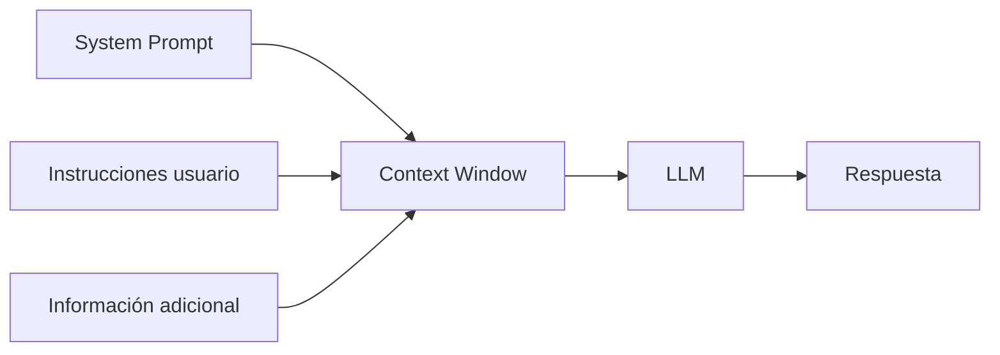

# De LLM a asistente inteligente: instrucciones, prompts y alineamiento

## 🎯 Objetivos de aprendizaje

Al finalizar este capítulo podrás:

- Comprender la diferencia entre un LLM y un asistente IA.
- Entender cómo funcionan las instrucciones de sistema.
- Comprender qué es Instruction Tuning.
- Conocer los principios básicos del Prompt Engineering.
- Entender por qué el contexto determina la calidad de una respuesta.

---

## ⏱ Tiempo estimado

35 minutos.

---

## 📚 Prerrequisitos

- Entrenamiento de un LLM.
- Context Window.
- Transformers.

---

# Introducción

En capítulos anteriores aprendimos cómo un modelo aprende lenguaje.

Ahora tenemos un modelo capaz de:

- Completar frases.
- Predecir texto.
- Generar contenido.

Pero imaginemos que entregamos ese modelo directamente a un usuario.

Podría responder:

- Sin seguir instrucciones.
- Con demasiado texto.
- De forma inconsistente.
- Sin entender la intención.

Por eso existe una etapa adicional:

> Convertir un modelo de lenguaje en un asistente.

---

# Un LLM no es un asistente

Esta diferencia es fundamental.

Un LLM base responde a una tarea:

> Predecir el siguiente token.

Un asistente IA responde a una tarea más compleja:

> Ayudar a una persona a alcanzar un objetivo.

---

Ejemplo:

Modelo base:

```
Usuario:
Explica Angular.

Modelo:
Angular es un framework...
```

Asistente:

```
Usuario:
Estoy migrando Angular 15 a Angular 20.

Asistente:
Primero revisaría:
1. Dependencias.
2. Cambios breaking.
3. Standalone components.
4. Testing.
```

La diferencia está en el comportamiento aprendido.

---

# Instruction Tuning

Después del entrenamiento inicial, los modelos pasan por una etapa llamada:

> Instruction Tuning.

El objetivo:

Enseñar al modelo a seguir instrucciones.

---

Ejemplo de entrenamiento:

Entrada:

```
Pregunta:
¿Cómo ordenar una lista en JavaScript?

Respuesta esperada:
Puedes utilizar Array.sort()
```

El modelo aprende:

```
Cuando alguien pregunta algo,
debo intentar ayudar.
```

---

# System Prompt

Cuando utilizamos asistentes modernos existe una capa especial de instrucciones:

> System Prompt.

Es información que define:

- Rol.
- Comportamiento.
- Restricciones.
- Estilo.

---

Ejemplo:

```
Eres un experto desarrollador Angular.

Responde con ejemplos prácticos.

Prioriza buenas prácticas.

No inventes APIs inexistentes.
```

---

# 📊 Visualización

El modelo recibe múltiples capas de información:



Todo forma parte del contexto utilizado durante la generación.

---

# Prompt Engineering

Un prompt no es simplemente una pregunta.

Es una forma de diseñar el contexto.

Comparación:

## Prompt débil

```
Explícame Docker.
```

---

## Prompt mejorado

```
Actúa como un arquitecto DevOps.

Explica Docker a un desarrollador frontend senior.

Incluye:
- Conceptos principales.
- Arquitectura.
- Ejemplos reales.
- Errores comunes.
```

El segundo prompt proporciona:

- Rol.
- Audiencia.
- Objetivo.
- Formato esperado.

---

# Los elementos de un buen prompt

Un prompt profesional suele incluir:

## Contexto

¿Qué debe saber el modelo?

Ejemplo:

```
Estoy trabajando con Angular 20.
```

---

## Rol

¿Qué tipo de experto debe simular?

Ejemplo:

```
Actúa como arquitecto frontend.
```

---

## Objetivo

¿Qué queremos obtener?

Ejemplo:

```
Diseña una arquitectura de microfrontends.
```

---

## Restricciones

¿Qué debe evitar?

Ejemplo:

```
No utilices librerías externas.
```

---

## Formato

¿Cómo queremos la respuesta?

Ejemplo:

```
Entrega una tabla comparativa.
```

---

# Alignment

Existe otro concepto importante:

> Alineamiento.

Un modelo puede ser técnicamente capaz, pero necesitamos que su comportamiento sea adecuado.

Ejemplos:

- Ser útil.
- Ser seguro.
- Seguir instrucciones.
- Evitar respuestas dañinas.
- Reconocer incertidumbre.

El alineamiento busca acercar el comportamiento del modelo a las necesidades humanas.

---

# 💻 En la práctica

Para un desarrollador, la mayor parte del trabajo con IA no consiste en entrenar modelos.

Consiste en diseñar sistemas alrededor de ellos.

Ejemplos:

## Asistente de código

Necesita:

- Contexto del proyecto.
- Convenciones internas.
- Arquitectura utilizada.

---

## Chatbot empresarial

Necesita:

- Documentación.
- Políticas.
- Información actualizada.

---

## Agente IA

Necesita:

- Objetivo.
- Herramientas.
- Memoria.
- Reglas.

---

# ⚠️ Error común

## "El prompt perfecto existe"

No exactamente.

Un buen prompt depende de:

- Modelo utilizado.
- Objetivo.
- Contexto disponible.
- Restricciones.

Prompt Engineering no es escribir frases mágicas.

Es diseñar correctamente la interacción entre humanos y modelos.

---

# Conceptos clave

- Un LLM no es automáticamente un asistente.
- Instruction Tuning enseña a seguir instrucciones.
- System Prompt define comportamiento.
- Prompt Engineering diseña contexto.
- Alignment busca comportamiento útil y seguro.

---

# 🔜 Lo veremos más adelante

Con esto terminamos los fundamentos internos.

Ahora estamos preparados para comenzar el siguiente módulo:

# Módulo 2 — Uso profesional de IA para desarrolladores

Donde veremos:

- Cómo trabajar con asistentes IA.
- Cómo crear mejores prompts.
- Cómo usar IA en desarrollo de software.
- Cómo integrar IA en workflows reales.

---

# Resumen

Un LLM proporciona capacidad de generación.

Un asistente IA agrega:

- Instrucciones.
- Contexto.
- Objetivos.
- Alineamiento.

La diferencia entre ambos es lo que permite pasar de un modelo matemático a una herramienta capaz de colaborar con personas.

---

# 📝 Ejercicios

1. ¿Cuál es la diferencia entre un LLM y un asistente IA?
2. ¿Qué función cumple un System Prompt?
3. ¿Por qué el contexto mejora una respuesta?
4. ¿Qué elementos tiene un buen prompt?
5. ¿Por qué Prompt Engineering no es solamente escribir mejores preguntas?

---

# 🎯 Desafío

Diseña el System Prompt de un asistente especializado en desarrollo frontend.

Debe definir:

- Rol.
- Conocimientos.
- Forma de responder.
- Restricciones.
- Criterios de calidad.
