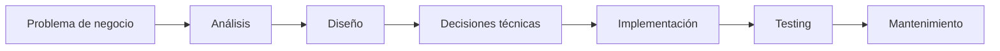

# El nuevo rol del desarrollador en la era de la IA

## 🎯 Objetivos de aprendizaje

Al finalizar este capítulo podrás:

- Comprender cómo la IA está transformando el desarrollo de software.
- Diferenciar generación de código de ingeniería de software.
- Identificar las nuevas habilidades necesarias para un desarrollador moderno.
- Entender el concepto de desarrollador aumentado por IA.
- Adoptar una nueva forma de trabajar junto a modelos inteligentes.

---

## ⏱ Tiempo estimado

30 minutos.

---

## 📚 Prerrequisitos

- Fundamentos de IA Generativa.
- Funcionamiento básico de los LLM.

---

# Introducción

Durante décadas, una gran parte del trabajo de un desarrollador consistió en transformar ideas en código.

El flujo tradicional era:

```
Requerimiento

↓

Diseño solución

↓

Escribir código

↓

Probar

↓

Corregir errores
```

La llegada de los modelos generativos cambia una parte importante de este proceso.

Ahora podemos pedir:

```
"Crea una función que valide un email"

"Genera una API REST"

"Explícame este error"

"Refactoriza este componente"
```

Y obtener resultados en segundos.

Entonces aparece una pregunta inevitable:

> Si una IA puede escribir código, ¿qué valor aporta un desarrollador?

---

# La respuesta corta

La programación nunca fue solamente escribir código.

El código es el resultado final.

El verdadero trabajo de ingeniería consiste en:

- Entender problemas.
- Diseñar soluciones.
- Tomar decisiones.
- Evaluar alternativas.
- Gestionar complejidad.
- Mantener sistemas durante años.

La IA puede generar código.

Pero no reemplaza automáticamente la ingeniería.

---

# Programar vs desarrollar software

Es importante diferenciar ambos conceptos.

## Programar

Es transformar instrucciones en código.

Ejemplo:

```
Crear una función que ordene una lista.
```

---

## Desarrollar software

Implica mucho más:

```
¿Por qué necesitamos esta función?

¿Dónde debería vivir?

¿Qué impacto tendrá?

¿Cómo será mantenida?

¿Qué riesgos introduce?

¿Cómo se prueba?

```

La IA es excelente generando código.

La ingeniería requiere criterio.

---

# 📊 Visualización



La generación de código ocurre solamente en una parte del proceso.

---

# El desarrollador aumentado

El nuevo paradigma no es:

```
Humano vs IA
```

Sino:

```
Humano + IA
```

La IA aumenta las capacidades del desarrollador.

Podemos llamarlo:

> **AI Augmented Developer**

---

# ¿Qué hace un desarrollador aumentado?

Un desarrollador aumentado utiliza IA para:

## Explorar

Ejemplo:

```
Explícame las alternativas para implementar autenticación.
```

---

## Diseñar

Ejemplo:

```
Propón una arquitectura para este sistema.
```

---

## Implementar

Ejemplo:

```
Genera una implementación inicial.
```

---

## Revisar

Ejemplo:

```
Analiza este código buscando problemas.
```

---

## Aprender

Ejemplo:

```
Explícame este concepto con ejemplos.
```

---

# La nueva habilidad principal: dirigir

Durante muchos años la habilidad principal fue:

> Escribir código rápidamente.

Ahora empieza a ser más importante:

> Saber dirigir sistemas inteligentes.

Esto requiere:

- Formular problemas correctamente.
- Proporcionar contexto.
- Evaluar resultados.
- Detectar errores.
- Tomar decisiones.

---

# La paradoja de la IA

La IA hace más fácil escribir código.

Pero hace más importante entender software.

¿Por qué?

Porque cuando generar código cuesta menos, aumenta la cantidad de código producido.

Entonces aparecen nuevos desafíos:

- ¿Es correcto?
- ¿Es mantenible?
- ¿Es seguro?
- ¿Encaja con la arquitectura?
- ¿Tiene sentido?

La velocidad sin criterio puede generar más problemas.

---

# La nueva distribución del tiempo

Antes:

```
70% escribir código

20% investigar

10% revisar
```

Un flujo aumentado podría acercarse a:

```
30% definir problema

30% revisar y validar

20% diseñar

20% escribir código
```

La escritura deja de ser el centro absoluto.

---

# 💻 En la práctica

Un desarrollador frontend tradicional podría recibir una tarea:

> "Crear pantalla de gestión de usuarios."

Flujo tradicional:

```
Pensar diseño

Crear componentes

Escribir servicios

Crear modelos

Implementar formularios

Crear tests
```

Flujo aumentado:

```
Conversar con IA:

- Analiza requerimientos.
- Propón arquitectura.
- Genera estructura inicial.
- Revisa posibles errores.
- Genera casos de prueba.

Humano:

- Decide.
- Valida.
- Ajusta.
- Integra.
```

La IA acelera la ejecución.

El desarrollador sigue siendo responsable de la solución.

---

# ⚠️ Error común

## "La IA reemplazará a los programadores"

Una visión más precisa es:

> La IA reemplazará algunas tareas repetitivas, pero aumentará el valor de quienes sepan utilizarla correctamente.

Los desarrolladores que solamente ejecutan instrucciones mecánicas tendrán más presión.

Los desarrolladores que entienden sistemas completos tendrán más capacidad.

---

# Nuevas habilidades del desarrollador

El perfil moderno necesita fortalecer:

## Pensamiento sistémico

Comprender sistemas completos.

---

## Comunicación

Expresar claramente objetivos y restricciones.

---

## Evaluación crítica

Determinar si una solución generada es correcta.

---

## Arquitectura

Tomar decisiones de alto nivel.

---

## Conocimiento del dominio

Entender el problema real.

---

# Conceptos clave

- Generar código no es hacer ingeniería.
- La IA aumenta al desarrollador, no elimina la necesidad de criterio.
- El contexto es una habilidad fundamental.
- La validación humana sigue siendo necesaria.
- El valor se mueve desde escribir hacia decidir.

---

# 💻 En la práctica: primera regla AI Champion

A partir de ahora utilizaremos una regla:

> **Nunca delegues a la IA una decisión que no puedes evaluar.**

Si no puedes revisar el resultado, primero debes aumentar tu conocimiento.

---

# 🔜 Lo veremos más adelante

Ahora que entendemos el nuevo rol, el siguiente paso será aprender:

> **¿Cómo trabajar realmente con una IA como compañero técnico?**

El próximo capítulo será:

# Pensamiento aumentado: trabajar con IA como compañero

Veremos:

- Cómo dividir problemas.
- Qué tareas delegar.
- Cómo iterar.
- Cómo mantener control técnico.

---

# Resumen

La IA cambia el rol del desarrollador.

El futuro no pertenece a quienes escriban más líneas de código.

Pertenece a quienes puedan:

- Comprender problemas complejos.
- Diseñar soluciones.
- Guiar herramientas inteligentes.
- Evaluar resultados.

La nueva habilidad no es programar menos.

Es desarrollar mejor utilizando nuevas capacidades.

---

# 📝 Ejercicios

1. ¿Cuál es la diferencia entre programar y desarrollar software?
2. ¿Por qué generar código no equivale a hacer ingeniería?
3. ¿Qué significa ser un desarrollador aumentado?
4. ¿Qué tareas delegarías a una IA?
5. ¿Qué tareas nunca delegarías completamente?

---

# 🎯 Desafío

Elige una tarea real de desarrollo que hayas realizado recientemente.

Divídela en:

1. Partes que una IA podría ayudarte a acelerar.
2. Partes donde necesitas tomar decisiones humanas.
3. Partes donde debes validar obligatoriamente el resultado.
