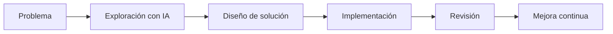

# Pensamiento aumentado: trabajar con IA como compañero técnico

## 🎯 Objetivos de aprendizaje

Al finalizar este capítulo podrás:

- Comprender el concepto de pensamiento aumentado.
- Aprender a dividir problemas junto con IA.
- Identificar qué tareas delegar y cuáles mantener bajo control humano.
- Diseñar conversaciones técnicas efectivas.
- Crear un flujo de trabajo colaborativo con IA.

---

## ⏱ Tiempo estimado

35 minutos.

---

# Introducción

Durante muchos años las herramientas de desarrollo fueron principalmente herramientas de ejecución:

- Editores.
- Compiladores.
- Debuggers.
- IDEs.

La IA introduce algo diferente:

> Una herramienta capaz de participar en el proceso de razonamiento.

Esto cambia la relación.

Ya no solamente utilizamos una herramienta.

Ahora colaboramos con un sistema que puede:

- Proponer.
- Explicar.
- Comparar.
- Revisar.
- Generar alternativas.

---

# ¿Qué es pensamiento aumentado?

Pensamiento aumentado significa:

> Utilizar una herramienta externa para ampliar nuestra capacidad de analizar y resolver problemas.

No significa delegar completamente el pensamiento.

Significa aumentar nuestras capacidades.

---

Ejemplo:

Un arquitecto de software analiza una decisión:

```
¿Debemos utilizar microfrontends o un monolito modular?
```

Antes:

```
Investigar documentación.

Leer artículos.

Comparar experiencias.

Crear una propuesta.
```

Con IA:

```
Explicar contexto.

Solicitar alternativas.

Comparar ventajas y riesgos.

Construir una decisión informada.
```

La IA acelera el proceso.

Pero la decisión sigue siendo humana.

---

# La IA como compañero técnico

Un buen compañero técnico no solamente escribe código.

También:

- Hace preguntas.
- Señala problemas.
- Propone alternativas.
- Explica conceptos.
- Revisa decisiones.

Ese es el rol que debemos buscar.

---

# El ciclo de colaboración con IA

Un flujo profesional:



---

# Fase 1: Exploración

La primera pregunta no debería ser:

```
¿Cómo implemento esto?
```

Sino:

```
¿Qué problema estoy intentando resolver?
```

Ejemplo:

Mala interacción:

```
Crea un componente Angular para cargar archivos.
```

Mejor:

```
Necesito diseñar un sistema de carga de archivos.

Contexto:
- Angular 20.
- Archivos grandes.
- Necesitamos mostrar progreso.
- Debe ser reutilizable.

Analiza alternativas.
```

La segunda conversación produce mejores resultados.

---

# Fase 2: Diseño

La IA puede ayudar a pensar:

- Arquitectura.
- Patrones.
- Trade-offs.
- Riesgos.

Ejemplo:

```
Tengo una aplicación Angular con microfrontends.

Compara:

1. Compartir estado con NgRx.
2. Comunicación por eventos.
3. Servicios compartidos.

Analiza ventajas y riesgos.
```

---

# Fase 3: Implementación

Aquí aparece la generación de código.

Pero el código llega después del razonamiento.

Ejemplo:

```
Ahora implementemos la alternativa seleccionada.

Genera una primera versión.

Incluye:
- Tipos.
- Tests.
- Manejo de errores.
```

---

# Fase 4: Revisión

Esta fase es una de las más importantes.

Nunca deberíamos aceptar código generado sin revisión.

Podemos pedir:

```
Revisa este código buscando:

- Bugs.
- Problemas de arquitectura.
- Casos borde.
- Mejoras.
```

---

# Qué delegar a la IA

La IA es especialmente útil para:

## Exploración

```
Dame alternativas.
```

---

## Investigación inicial

```
Explícame este concepto.
```

---

## Código repetitivo

```
Genera boilerplate.
```

---

## Refactoring

```
Propón mejoras.
```

---

## Testing

```
Genera casos de prueba.
```

---

## Documentación

```
Explica esta implementación.
```

---

# Qué NO delegar completamente

Hay decisiones que requieren criterio humano.

Ejemplos:

## Arquitectura principal

La IA puede proponer.

Pero alguien debe decidir.

---

## Seguridad

La IA puede ayudar.

Pero la responsabilidad sigue siendo humana.

---

## Requisitos ambiguos

La IA no conoce automáticamente el negocio.

---

## Trade-offs

Ejemplo:

```
¿Más rendimiento o mayor simplicidad?
```

Necesita contexto.

---

# La regla del contexto

La calidad de una colaboración con IA depende principalmente de:

```
Calidad del contexto
+
Calidad del razonamiento humano
=
Calidad del resultado
```

Un prompt corto puede funcionar para cosas simples.

Pero problemas complejos necesitan contexto.

---

# Anti-patrón: usar IA como buscador

Ejemplo:

```
¿Cómo hago login?
```

Problema:

La respuesta será genérica.

---

Mejor:

```
Estoy diseñando autenticación para:

- Angular 20.
- JWT.
- Refresh tokens.
- Backend .NET.
- Arquitectura BFF.

Analiza opciones.
```

Ahora la IA puede razonar sobre una situación concreta.

---

# El concepto de iteración

Los mejores resultados rara vez aparecen en un solo mensaje.

El flujo profesional es:

```
Pregunta inicial

↓

Respuesta IA

↓

Corrección humana

↓

Nueva información

↓

Mejor solución

```

La conversación es parte del proceso.

---

# 💻 Ejemplo real

Problema:

```
Necesito mejorar rendimiento de una aplicación Angular.
```

Conversación profesional:

Paso 1:

```
Analiza posibles causas de lentitud en Angular 20.
```

Paso 2:

```
Mi aplicación utiliza:
- Standalone components.
- NgRx.
- Module Federation.
- Lazy loading.

Prioriza hipótesis.
```

Paso 3:

```
Propón un plan de diagnóstico.
```

Paso 4:

```
Analiza estos resultados.
```

La IA acompaña el razonamiento.

---

# Conceptos clave

- IA como compañero, no como reemplazo.
- Primero entender, luego generar.
- Contexto antes que código.
- Iteración antes que respuesta única.
- Validación humana siempre.

---

# Regla AI Champion #2

> **La IA debe acelerar tu pensamiento, no reemplazarlo.**

---

# Ejercicios

1. ¿Cuál es la diferencia entre pedir código y trabajar con IA?
2. ¿Por qué el contexto mejora los resultados?
3. ¿Qué tareas delegarías a una IA?
4. ¿Qué decisiones mantendrías bajo control humano?
5. ¿Por qué la iteración es importante?

---

# 🎯 Desafío

Elige una tarea técnica real.

Ejemplo:

- Crear un componente.
- Diseñar una API.
- Resolver un bug.
- Mejorar arquitectura.

Diseña una conversación de 5 pasos con IA:

1. Exploración.
2. Análisis.
3. Diseño.
4. Implementación.
5. Revisión.
