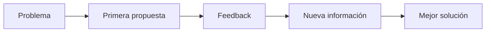

# Prompt Engineering Profesional

## 🎯 Objetivos de aprendizaje

Al finalizar este capítulo podrás:

- Comprender qué es realmente un prompt.
- Diseñar prompts profesionales y reutilizables.
- Entender por qué el contexto es más importante que la longitud.
- Aprender a trabajar mediante conversaciones iterativas.
- Descubrir el concepto de Specification Engineering.
- Comprender cómo evolucionar desde prompts hacia especificaciones.

---

## ⏱ Tiempo estimado

50 minutos.

---

# Introducción

Cuando aparecieron los primeros asistentes de IA, surgió una nueva disciplina:

> Prompt Engineering.

Durante un tiempo parecía que el éxito consistía en aprender frases especiales:

```
Actúa como...

Piensa paso a paso...

Respira profundo...

```

Sin embargo, con el paso de los meses quedó claro que esos patrones eran solamente herramientas.

Los mejores resultados no provenían de "prompts mágicos".

Provenían de comprender correctamente el problema.

Por eso, en AI Champion utilizaremos una visión diferente:

> **Un prompt no es una pregunta. Es la especificación de una tarea.**

---

# ¿Qué es realmente un prompt?

Un prompt es toda la información que recibe un modelo para realizar un trabajo.

No solamente incluye:

```
La pregunta del usuario
```

También incluye:

- instrucciones
- contexto
- ejemplos
- restricciones
- información adicional
- historial de conversación

Todo eso forma parte del prompt efectivo.

---

# El verdadero problema: la ambigüedad

Supongamos que asignamos una tarea a un desarrollador nuevo del equipo.

Le decimos:

```
Haz una pantalla.
```

¿Qué significa exactamente?

- ¿Qué framework?
- ¿Qué diseño?
- ¿Qué arquitectura?
- ¿Qué validaciones?
- ¿Qué API?
- ¿Qué criterios de aceptación?

La petición es demasiado ambigua.

Con la IA ocurre exactamente lo mismo.

---

# Un prompt profesional reduce incertidumbre

Comparación:

## Prompt básico

```
Genera un login.
```

---

## Prompt profesional

```
Angular 20

Aplicación empresarial

JWT

Refresh Token

BFF

Debe seguir nuestro Design System

No utilizar librerías externas

Generar tests

Explicar las decisiones tomadas
```

Ambos piden un login.

Pero solamente uno describe correctamente el problema.

---

# La anatomía de un prompt profesional

En AI Champion utilizaremos esta estructura.

```text
Rol

↓

Contexto

↓

Problema

↓

Objetivo

↓

Restricciones

↓

Resultado esperado

↓

Criterios de calidad
```

No es obligatorio utilizar siempre todas las secciones.

Pero cuanto mayor sea la complejidad del problema, más útil será esta estructura.

---

# 1. Rol

Define desde qué perspectiva debe responder el modelo.

Ejemplo:

```
Actúa como un arquitecto frontend especializado en Angular.
```

---

# 2. Contexto

Describe el entorno donde existe el problema.

Ejemplo:

```
Angular 20

NgRx

Microfrontends

Module Federation

SSR

Equipo de 10 desarrolladores
```

El contexto suele ser el factor que más mejora una respuesta.

---

# 3. Problema

Explica claramente qué sucede.

Ejemplo:

```
La aplicación tarda demasiado en cargar por primera vez.
```

---

# 4. Objetivo

Indica qué deseas obtener.

Ejemplo:

```
Analizar posibles causas.

No implementar todavía.
```

---

# 5. Restricciones

Toda solución tiene límites.

Ejemplo:

```
No modificar APIs públicas.

No cambiar arquitectura.

Mantener compatibilidad.
```

---

# 6. Resultado esperado

Ejemplo:

```
Quiero:

- explicación
- plan
- prioridades
- alternativas
```

---

# 7. Criterios de calidad

También podemos indicar cómo evaluar la respuesta.

Ejemplo:

```
Priorizar:

- simplicidad

- mantenibilidad

- rendimiento

- escalabilidad
```

---

# La conversación es parte de la solución

Un error frecuente consiste en esperar que todo quede resuelto con un único prompt.

Los proyectos reales evolucionan.

Las conversaciones también.



La IA mejora conforme mejora el contexto.

---

# El contexto es acumulativo

Imagina que incorporas un desarrollador nuevo al equipo.

El primer día no conoce:

- arquitectura
- negocio
- convenciones
- reglas
- decisiones históricas

Necesita contexto.

La IA funciona igual.

Cada interacción agrega conocimiento temporal.

---

# Anti-patrones

## Prompt demasiado corto

```
Haz esto.
```

---

## Demasiados objetivos

```
Diseña

Programa

Documenta

Optimiza

Haz los tests
```

Conviene dividir.

---

## Sin restricciones

```
Haz un login.
```

¿Con JWT?

¿Con OAuth?

¿Con sesiones?

¿Con BFF?

El modelo debe adivinar.

---

# Plantilla reutilizable

Durante todo el curso utilizaremos la siguiente estructura.

```text
## Contexto

...

## Problema

...

## Objetivo

...

## Restricciones

...

## Resultado esperado

...

## Información adicional

...
```

Esta plantilla funcionará para:

- arquitectura
- testing
- documentación
- debugging
- refactoring
- diseño

---

# Del Prompt Engineering al Specification Engineering

Hasta aquí hemos hablado de prompts.

Pero existe un concepto aún más poderoso.

Una conversación con IA puede verse como una simple petición.

O puede verse como una especificación de trabajo.

La diferencia es enorme.

## Prompt

```text
Genera un login en Angular.
```

---

## Especificación

```text
Contexto

Objetivo

Problema

Arquitectura

Restricciones

Casos borde

Criterios de aceptación

Resultado esperado
```

La primera busca obtener código.

La segunda describe completamente el trabajo.

---

# Prompt vs Especificación

| Prompt | Especificación |
|---------|----------------|
| Solicita una tarea | Define un trabajo |
| Suele ser temporal | Puede reutilizarse |
| Centrado en una respuesta | Centrado en un proceso |
| Difícil de versionar | Fácil de versionar |
| Conversacional | Declarativa |
| Pensado para un modelo | Pensado para personas y modelos |

---

# El siguiente paso de la industria

Durante 2023 y 2024 la mayoría de los equipos aprendieron Prompt Engineering.

En los próximos años veremos una evolución hacia algo diferente.

Las organizaciones comenzarán a trabajar con:

- especificaciones reutilizables
- workflows
- agentes
- validaciones automáticas
- ejecución basada en especificaciones

En otras palabras:

> Dejaremos de escribir prompts aislados para comenzar a diseñar sistemas completos de trabajo.

---

# 💻 En la práctica

Cuando trabajemos con IA en AI Champion utilizaremos esta filosofía.

```text
Problema

↓

Especificación

↓

Conversación

↓

Implementación

↓

Validación

↓

Iteración
```

La IA deja de ser un generador de respuestas.

Se convierte en un colaborador dentro de un proceso de ingeniería.

---

# Regla AI Champion #3

> **No escribas prompts. Diseña especificaciones.**

---

# 🧠 Para un desarrollador Senior

La evolución del desarrollo asistido por IA no consiste únicamente en mejorar prompts.

Consiste en construir procesos donde las especificaciones sean:

- reutilizables
- versionables
- ejecutables
- auditables

Esta idea será la base de los próximos módulos, donde estudiaremos:

- Specification Engineering
- Specification-Driven Development (SDD)
- OpenSpec
- SpecKit
- Agentes especializados
- Your Harness

Veremos cómo una misma especificación puede convertirse en la fuente de verdad para:

- implementación
- documentación
- testing
- validación
- revisión
- automatización

---

# Conceptos clave

- Un prompt reduce ambigüedad.
- El contexto determina la calidad de la respuesta.
- Las conversaciones evolucionan mediante iteración.
- Las especificaciones representan un nivel superior de abstracción.
- El futuro del desarrollo con IA estará centrado en especificaciones más que en prompts.

---

# Resumen

Prompt Engineering fue el primer paso para colaborar con modelos de IA.

Sin embargo, conforme los sistemas se vuelven más complejos, los prompts evolucionan hacia especificaciones completas que describen el problema, el contexto, las restricciones y los criterios de aceptación.

En AI Champion utilizaremos esta visión durante el resto del curso.

---

# 📝 Ejercicios

1. ¿Por qué un prompt no debería verse como una simple pregunta?
2. ¿Cuál de las partes de un prompt profesional aporta más valor y por qué?
3. Reescribe un prompt que hayas utilizado recientemente utilizando la plantilla del capítulo.
4. Explica con tus palabras la diferencia entre un prompt y una especificación.
5. ¿Qué ventajas tendría almacenar especificaciones en un repositorio Git?

---

# 🎯 Desafío

Toma una tarea real de tu trabajo.

Primero descríbela mediante un prompt de una línea.

Luego conviértela en una especificación completa utilizando la plantilla presentada en este capítulo.

Compara los resultados obtenidos con un asistente de IA y analiza cómo cambia la calidad de las respuestas.
