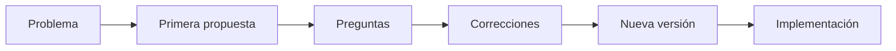

# Prompt Engineering Profesional

## 🎯 Objetivos de aprendizaje

Al finalizar este capítulo podrás:

- Comprender qué es realmente un prompt.
- Diferenciar un prompt simple de una especificación de trabajo.
- Diseñar prompts reutilizables.
- Reducir respuestas ambiguas.
- Crear conversaciones iterativas con IA.

---

## ⏱ Tiempo estimado

45 minutos.

---

# Introducción

Muchos desarrolladores creen que Prompt Engineering consiste en aprender frases especiales.

Ejemplo:

```
Actúa como un experto...

Piensa paso a paso...

Respira profundo...

```

En realidad, esos son únicamente recursos.

Lo importante es otra cosa.

> Un modelo produce mejores resultados cuando comprende claramente el problema que debe resolver.

Un buen prompt no intenta "engañar" al modelo.

Intenta comunicar correctamente una tarea.

---

# Un prompt es una especificación

Pensemos en una analogía.

Un desarrollador recibe esta tarea:

```
Haz una pantalla.
```

¿Qué falta?

Prácticamente todo.

Ahora comparemos con esto:

```
Crear una pantalla Angular 20.

Debe:

- Mostrar usuarios.
- Permitir búsqueda.
- Tener paginación.
- Consumir la API existente.
- Seguir el Design System corporativo.
- Incluir tests.

```

El segundo ejemplo reduce enormemente la ambigüedad.

Con la IA ocurre exactamente lo mismo.

---

# La anatomía de un prompt profesional

Un prompt técnico suele tener seis partes.

```text
Rol

↓

Contexto

↓

Objetivo

↓

Restricciones

↓

Formato esperado

↓

Criterios de calidad
```

No siempre necesitaremos las seis.

Pero conocerlas nos permite construir solicitudes mucho más precisas.

---

# 1. Rol

El rol ayuda al modelo a adoptar una perspectiva.

Ejemplo:

```
Actúa como un arquitecto frontend especializado en Angular.
```

No cambia el conocimiento del modelo.

Pero orienta el tipo de respuesta que priorizará.

---

# 2. Contexto

Es probablemente el elemento más importante.

Un modelo sin contexto responde de forma genérica.

Ejemplo pobre:

```
Optimiza este componente.
```

Ejemplo con contexto:

```
Aplicación Angular 20.

Microfrontends.

NgRx.

SSR.

El rendimiento inicial es lento.

Analiza posibles causas.
```

Ahora el modelo tiene información suficiente para razonar.

---

# 3. Objetivo

Debemos indicar claramente qué esperamos.

Ejemplo:

```
Quiero encontrar el cuello de botella.

No quiero todavía implementar cambios.
```

Eso evita respuestas prematuras.

---

# 4. Restricciones

Toda solución tiene límites.

Ejemplo:

```
No utilizar librerías externas.

Mantener compatibilidad con Angular 20.

No modificar la API pública.

```

Las restricciones reducen propuestas inviables.

---

# 5. Formato esperado

Muchas respuestas mejoran simplemente indicando cómo deben presentarse.

Ejemplos:

```
Entrega:

- Tabla comparativa.
- Lista priorizada.
- Diagrama Mermaid.
- Código TypeScript.
- Plan paso a paso.
```

---

# 6. Criterios de calidad

También podemos definir cómo evaluar la respuesta.

Ejemplo:

```
Prioriza:

- Simplicidad.
- Rendimiento.
- Mantenibilidad.
- Buenas prácticas.
```

---

# 📊 Ejemplo completo

Supongamos que queremos ayuda para diseñar un sistema de autenticación.

En lugar de escribir:

```
Haz un login.
```

Podemos construir una especificación.

```text
ROL

Arquitecto de software especializado en aplicaciones empresariales.

CONTEXTO

Frontend Angular 20.

Backend .NET.

JWT.

Refresh Token.

BFF.

OBJETIVO

Diseñar la arquitectura.

No generar código todavía.

RESTRICCIONES

Mantener autenticación desacoplada.

Compatibilidad con microfrontends.

FORMATO

Explica la solución.

Incluye diagrama Mermaid.

Compara alternativas.

CRITERIOS

Priorizar seguridad.

Escalabilidad.

Mantenibilidad.
```

La diferencia en la calidad de la respuesta suele ser enorme.

---

# Conversaciones iterativas

Otro error frecuente es esperar que todo se resuelva en un único mensaje.

Un flujo profesional suele verse así:



La conversación evoluciona junto con la solución.

---

# La IA necesita contexto progresivo

Imagina que estás incorporando un nuevo desarrollador al equipo.

No le entregarías únicamente esta frase:

```
Implementa esto.
```

Primero le explicarías:

- El negocio.
- La arquitectura.
- Las restricciones.
- El objetivo.
- Las convenciones del equipo.

Con la IA ocurre exactamente igual.

Cada interacción agrega contexto.

---

# Anti-patrones

## Prompt demasiado corto

```
Optimiza esto.
```

---

## Demasiados objetivos

```
Diseña la arquitectura.

Genera el código.

Escribe los tests.

Optimiza el rendimiento.

Haz documentación.

```

Conviene dividir tareas.

---

## Falta de contexto

```
No funciona.

```

El modelo necesita información para razonar.

---

# 💻 En la práctica

Cuando trabajemos con IA en AI Champion seguiremos una estructura sencilla:

```text
1. Contexto

2. Problema

3. Objetivo

4. Restricciones

5. Resultado esperado

6. Revisión
```

Este patrón funcionará para:

- Arquitectura.
- Código.
- Testing.
- Refactoring.
- Documentación.
- Diseño de APIs.

---

# Plantilla reutilizable

```text
## Contexto

...

## Problema

...

## Objetivo

...

## Restricciones

...

## Resultado esperado

...

## Información adicional

...
```

Esta será la plantilla base del resto del curso.

---

# Regla AI Champion #3

> **No escribas prompts. Escribe especificaciones de trabajo.**

Cuando piensas en términos de especificaciones, la conversación con la IA se vuelve más clara, reproducible y útil.

---

# Conceptos clave

- Un prompt profesional reduce la ambigüedad.
- El contexto suele ser más importante que la longitud.
- Dividir un problema produce mejores resultados que intentar resolverlo todo de una vez.
- Las conversaciones iterativas generan mejores soluciones.
- Un buen prompt se parece más a una especificación técnica que a una pregunta.

---

# 📝 Ejercicios

1. ¿Por qué un prompt no debería verse como una simple pregunta?
2. ¿Cuál de las seis partes consideras más importante y por qué?
3. Reescribe un prompt corto que hayas utilizado recientemente utilizando la estructura propuesta.
4. ¿Qué ventajas tiene dividir una tarea compleja en varias conversaciones?
5. ¿Cómo influye el contexto en la calidad de la respuesta?

---

# 🎯 Desafío

Elige una tarea real de tu trabajo.

Construye una especificación completa utilizando la plantilla del capítulo.

Después, compárala con un prompt de una sola línea y analiza las diferencias en las respuestas obtenidas.
