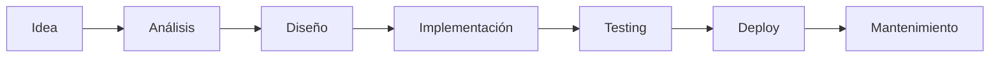
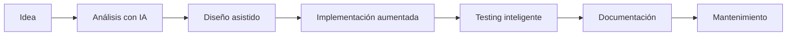
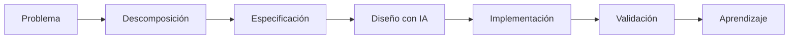

# IA dentro del ciclo de desarrollo de software

## 🎯 Objetivos de aprendizaje

Al finalizar este capítulo podrás:

- Identificar oportunidades de uso de IA en cada etapa del desarrollo.
- Comprender dónde aporta más valor la IA.
- Diseñar un flujo de trabajo aumentado por IA.
- Diferenciar automatización de colaboración.
- Aplicar IA más allá de la generación de código.

---

## ⏱ Tiempo estimado

50 minutos.

---

# Introducción

Durante muchos años las herramientas de desarrollo estuvieron enfocadas principalmente en la implementación.

Editores.

Compiladores.

IDEs.

Depuradores.

La IA introduce algo diferente:

> Puede participar en múltiples etapas del proceso de ingeniería.

Esto cambia la forma de construir software.

---

# El ciclo tradicional de desarrollo

Un flujo simplificado:



Tradicionalmente, muchas herramientas se concentraban en la etapa:

```
Implementación
```

La IA puede participar en todas.

---

# Una nueva visión: AI-Augmented SDLC

El ciclo aumentado sería:



La IA no reemplaza las etapas.

Las acelera y mejora.

---

# 1. Análisis de requerimientos

Esta etapa suele tener mucha ambigüedad.

Ejemplo:

```
Necesitamos mejorar el proceso de compra.
```

Preguntas:

- ¿Qué problema existe?
- ¿Quién es el usuario?
- ¿Cuál es el objetivo?
- ¿Cómo medimos éxito?

---

La IA puede ayudar a:

- generar preguntas,
- detectar información faltante,
- identificar casos borde,
- transformar ideas en historias de usuario.

Ejemplo:

```
Analiza este requerimiento.

Identifica:

- actores involucrados.
- supuestos.
- preguntas pendientes.
- riesgos.
```

---

# 2. Diseño de solución

Antes de escribir código debemos tomar decisiones.

Ejemplo:

```
Necesitamos compartir estado entre microfrontends.
```

La IA puede ayudar a:

- comparar alternativas,
- explicar trade-offs,
- proponer arquitecturas.

Ejemplo:

```
Compara:

- NgRx compartido.
- Eventos.
- Servicios compartidos.

Considera:

- escalabilidad.
- mantenimiento.
- acoplamiento.
```

---

# 3. Arquitectura

Esta etapa es especialmente interesante para perfiles senior.

La IA puede colaborar en:

- diagramas.
- decisiones técnicas.
- identificación de riesgos.
- revisión de diseños.

Ejemplo:

```
Revisa esta arquitectura.

Busca:

- puntos de fallo.
- problemas de escalabilidad.
- dependencias críticas.
```

---

# 4. Implementación

Esta es la etapa más conocida.

La IA puede ayudar con:

- generación de código.
- explicación de código existente.
- refactoring.
- migraciones.

Ejemplo:

```
Convierte este componente Angular basado en clase a standalone component.

Mantén comportamiento.

Explica cambios.
```

---

Pero recordemos:

Generar código no significa hacer ingeniería.

El desarrollador sigue siendo responsable de:

- arquitectura.
- calidad.
- seguridad.
- decisiones.

---

# 5. Testing

Uno de los usos más valiosos.

La IA puede ayudar a:

- generar casos de prueba.
- detectar escenarios faltantes.
- analizar cobertura.

Ejemplo:

```
Analiza este servicio.

Propón casos de prueba incluyendo:

- casos normales.
- errores.
- casos límite.
```

---

# 6. Documentación

Una de las tareas más olvidadas.

La IA puede generar:

- README.
- documentación técnica.
- comentarios.
- diagramas.
- ADR.

Ejemplo:

```
Genera documentación técnica de esta decisión arquitectónica.

Incluye:

- contexto.
- decisión.
- alternativas descartadas.
```

---

# 7. Mantenimiento

Los sistemas existentes contienen mucho conocimiento.

La IA puede ayudar a:

- entender código legado.
- encontrar problemas.
- planificar migraciones.

Ejemplo:

```
Analiza este módulo antiguo.

Explica:

- responsabilidad.
- dependencias.
- riesgos de modificación.
```

---

# Matriz de uso de IA

| Etapa | Uso de IA |
|---|---|
| Análisis | preguntas, requisitos, casos borde |
| Diseño | alternativas, trade-offs |
| Arquitectura | revisión, diagramas |
| Código | generación, refactoring |
| Testing | casos, cobertura |
| Documentación | generación y mantenimiento |
| Mantenimiento | análisis de legado |

---

# El error de pensar solamente en código

Un equipo que usa IA solamente para generar código está aprovechando una pequeña parte de su potencial.

El mayor valor aparece antes:

```
Pensar mejor

↓

Diseñar mejor

↓

Implementar mejor

↓

Validar mejor
```

---

# Workflow profesional AI Champion

A partir de ahora utilizaremos este modelo:



---

# Relación con Specification-Driven Development

Aquí aparece una conexión importante.

En un futuro flujo basado en SDD:

```
Especificación

↓

IA interpreta

↓

Agentes ejecutan

↓

Tests validan

↓

Humano aprueba
```

Por eso las etapas anteriores son tan importantes.

La especificación se convierte en el punto central del proceso.

---

# 🧠 Para desarrolladores Senior

La IA cambia la distribución del esfuerzo.

Antes:

```
Mucho tiempo escribiendo código.

Menos tiempo analizando.
```

Ahora:

```
Más tiempo definiendo correctamente.

Menos tiempo escribiendo código repetitivo.
```

El valor se desplaza hacia:

- arquitectura,
- criterio,
- diseño,
- revisión.

---

# Conceptos clave

- La IA participa en todo el SDLC.
- Generar código es solo una etapa.
- El análisis y diseño son áreas donde la IA aporta mucho valor.
- La especificación se vuelve el elemento central.
- El humano mantiene la responsabilidad técnica.

---

# Resumen

La inteligencia artificial no debe verse como una herramienta de generación de código.

Debe verse como un compañero durante todo el ciclo de desarrollo.

Los equipos que mejor aprovechen IA serán aquellos que integren la tecnología dentro de un proceso de ingeniería bien definido.

---

# 📝 Ejercicios

1. ¿En qué etapas del desarrollo utilizarías IA?
2. ¿Por qué la generación de código no es el único uso importante?
3. Diseña un flujo AI-Augmented para un proyecto frontend.
4. Identifica tres tareas repetitivas de tu trabajo que podrían acelerarse con IA.
5. ¿Dónde mantendrías siempre validación humana?

---

# 🎯 Desafío

Selecciona una funcionalidad real.

Documenta cómo utilizarías IA en cada etapa:

```
Análisis

Diseño

Arquitectura

Implementación

Testing

Documentación
```

El resultado será un primer diseño de workflow aumentado por IA.

---

# Próximo capítulo

## Generación de código profesional con IA

Aprenderemos:

- cuándo pedir código,
- cómo revisar código generado,
- cómo evitar deuda técnica,
- cómo trabajar con asistentes como parte del equipo.
