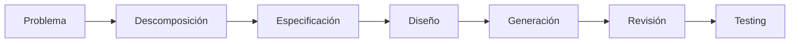
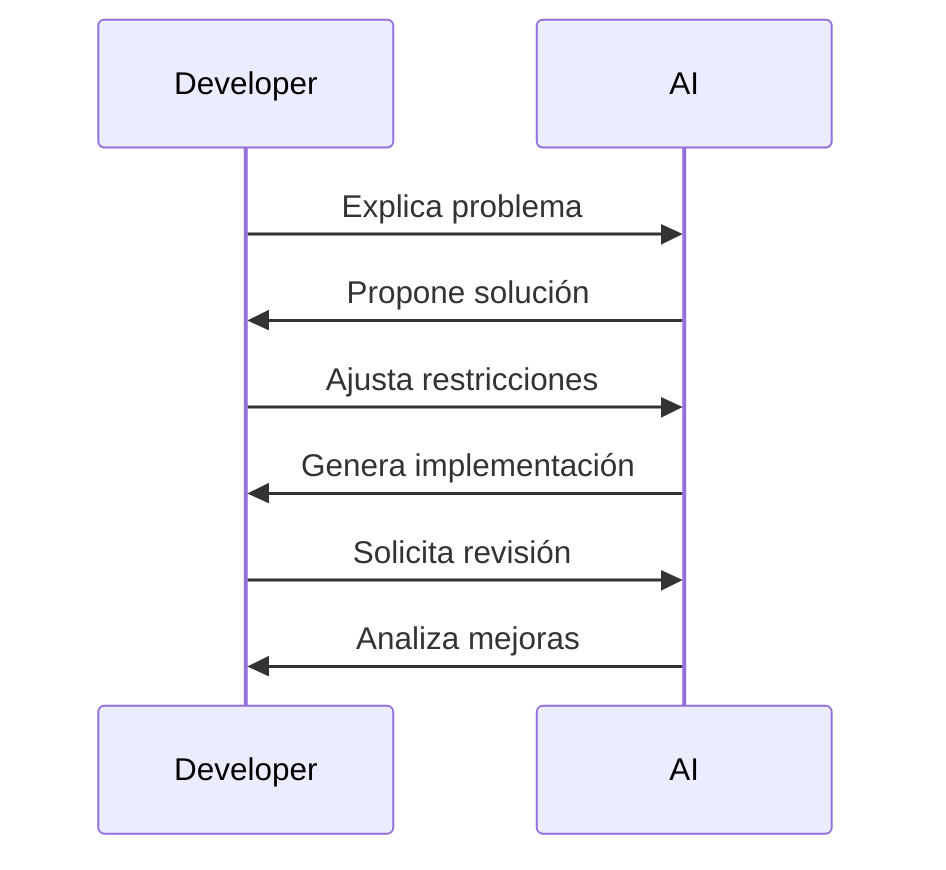
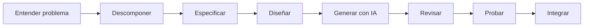

# Generación de código profesional con IA

## 🎯 Objetivos de aprendizaje

Al finalizar este capítulo podrás:

- Comprender cuándo utilizar IA para generar código.
- Preparar correctamente una tarea antes de solicitar implementación.
- Revisar código generado por IA.
- Iterar sobre una solución utilizando IA.
- Evitar problemas comunes como deuda técnica o código incorrecto.
- Integrar IA dentro de un flujo profesional de desarrollo.

---

## ⏱ Tiempo estimado

60 minutos.

---

# Introducción

La generación de código es probablemente el uso más conocido de la inteligencia artificial aplicada al desarrollo.

Herramientas como:

- GitHub Copilot.
- ChatGPT.
- Claude.
- Cursor.
- Codeium.

pueden generar código en segundos.

Pero existe una diferencia importante:

> Generar código no significa desarrollar software.

El código es solamente una parte del proceso.

Un sistema profesional necesita:

- entender el problema,
- diseñar una solución,
- validar decisiones,
- probar comportamiento,
- mantener calidad.

---

# El error más común

Un desarrollador recibe una tarea:

```
Crear módulo de usuarios.
```

Y directamente solicita:

```
Genera el módulo completo.
```

El resultado normalmente será:

- código genérico,
- decisiones arbitrarias,
- poca integración con el proyecto real.

El problema no es la IA.

El problema es que no existe suficiente especificación.

---

# El flujo correcto

El flujo profesional es:



La generación aparece después del razonamiento.

---

# Antes de pedir código

Antes de solicitar implementación debemos conocer:

## Contexto

Ejemplo:

```
Aplicación Angular 20.

Standalone components.

NgRx para estado.

Jest para testing.

```

---

## Objetivo

Ejemplo:

```
Crear formulario de alta de usuarios.
```

---

## Restricciones

Ejemplo:

```
Debe:

- utilizar Reactive Forms.
- respetar Design System.
- incluir validaciones.
- tener tests.
```

---

## Resultado esperado

Ejemplo:

```
Entrega:

- componente.
- servicio.
- tests.
- explicación.
```

---

# Generación incremental

Una práctica profesional es evitar generar demasiado código en una sola interacción.

Ejemplo incorrecto:

```
Genera toda la aplicación.
```

Ejemplo correcto:

```
Diseña primero la arquitectura del módulo.
```

Luego:

```
Genera el modelo de datos.
```

Luego:

```
Implementa el servicio.
```

Luego:

```
Implementa el componente.
```

Luego:

```
Genera tests.
```

---

# La IA como pair programmer

Una forma útil de pensar la IA:

No es un programador externo.

Es un compañero técnico.

Un flujo natural:



---

# Patrones profesionales de uso

## 1. Generación inicial

Utilizar IA para acelerar una primera versión.

Ejemplo:

```
Implementa este servicio siguiendo esta interfaz.

Explica decisiones.
```

---

## 2. Refactoring

Uno de los usos más valiosos.

Ejemplo:

```
Analiza este componente.

Identifica:

- complejidad.
- duplicación.
- posibles mejoras.

No cambies comportamiento.
```

---

## 3. Migraciones

Especialmente útil en proyectos grandes.

Ejemplo:

```
Migra este componente Angular usando NgModule
a standalone component.

Mantén compatibilidad.
```

---

## 4. Explicación de código legado

Ejemplo:

```
Analiza este módulo.

Explica:

- propósito.
- flujo.
- dependencias.
```

---

## 5. Generación de tests

Ejemplo:

```
Genera tests Jest.

Incluye:

- caso exitoso.
- errores.
- edge cases.
```

---

# Revisar código generado por IA

La IA puede generar código:

- incorrecto,
- inseguro,
- innecesariamente complejo.

Nunca debemos aceptar automáticamente.

Debemos revisar:

## Correctitud

¿Hace lo que debe?

---

## Diseño

¿Respeta la arquitectura?

---

## Seguridad

¿Introduce riesgos?

---

## Mantenibilidad

¿Otro desarrollador podrá entenderlo?

---

## Performance

¿Tiene impacto negativo?

---

# El concepto de AI Code Review

Una práctica interesante es utilizar IA para revisar IA.

Ejemplo:

Primera interacción:

```
Genera la implementación.
```

Segunda interacción:

```
Ahora revisa tu propia solución.

Busca:

- errores.
- problemas de diseño.
- casos faltantes.
```

---

# La importancia del contexto del repositorio

Una IA sin contexto conoce patrones generales.

Una IA con contexto conoce:

- arquitectura.
- convenciones.
- componentes existentes.
- reglas del proyecto.

La diferencia es enorme.

---

Ejemplo:

Sin contexto:

```
Crea un botón.
```

Con contexto:

```
Utiliza nuestro componente Button del Design System.

Mantén accesibilidad.

Respeta variantes existentes.
```

---

# Código generado vs código diseñado

Existe una diferencia:

## Código generado

La IA produce una implementación.

---

## Código diseñado

El desarrollador define:

- límites.
- responsabilidades.
- contratos.
- comportamiento esperado.

Luego utiliza IA para acelerar.

---

# Relación con SDD

Aquí aparece nuevamente el concepto central.

En un futuro flujo basado en especificaciones:

```
Specification

↓

IA interpreta

↓

Genera código

↓

Ejecuta tests

↓

Humano valida
```

La IA no empieza desde cero.

Empieza desde una definición clara.

---

# 🧠 Para desarrolladores Senior

El mayor cambio profesional será el desplazamiento del esfuerzo.

Antes:

```
70% escribir código

30% analizar
```

Con IA:

```
30% escribir código

70% diseñar, revisar y validar
```

El valor del desarrollador aumenta porque las decisiones importan más.

---

# Errores comunes

## Generar demasiado código

Problema:

```
Crea toda la aplicación.
```

---

## No proporcionar contexto

Problema:

```
Haz un componente.
```

---

## Confiar ciegamente

Problema:

```
La IA lo generó, debe estar bien.
```

---

## No validar

Problema:

Código funcional ≠ código correcto.

---

# Workflow recomendado AI Champion



---

# Conceptos clave

- La IA acelera la implementación, pero no reemplaza ingeniería.
- La calidad del código depende de la calidad de la especificación.
- La generación debe ser incremental.
- Todo código generado necesita revisión humana.
- El contexto del proyecto es fundamental.

---

# Resumen

La generación de código con IA no consiste en pedirle a un modelo que programe por nosotros.

Consiste en utilizarlo como un acelerador dentro de un proceso profesional.

Los mejores resultados aparecen cuando combinamos:

- buen análisis,
- buena especificación,
- buen criterio técnico,
- capacidad de revisión.

---

# 📝 Ejercicios

1. ¿Por qué generar código directamente suele producir malos resultados?
2. Diseña un flujo profesional para implementar una nueva funcionalidad.
3. Elige una tarea repetitiva de tu trabajo y define cómo usarías IA.
4. ¿Qué criterios revisarías antes de aceptar código generado?
5. Explica la diferencia entre código generado y código diseñado.

---

# 🎯 Desafío

Selecciona una funcionalidad real.

Realiza el siguiente proceso:

1. Describe el problema.
2. Descompón la funcionalidad.
3. Crea una especificación.
4. Solicita una implementación a una IA.
5. Revisa la solución.
6. Solicita mejoras.

Documenta las diferencias entre la primera y última versión.

---

# Próximo capítulo

## Testing asistido por IA

Veremos cómo utilizar IA para:

- diseñar estrategias de testing,
- generar casos,
- encontrar escenarios límite,
- mejorar cobertura,
- revisar calidad.
