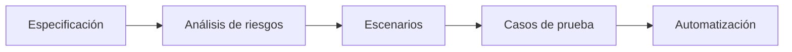
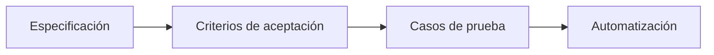
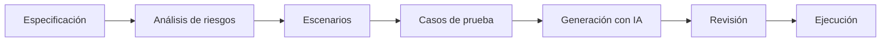

# Testing asistido por IA

## 🎯 Objetivos de aprendizaje

Al finalizar este capítulo podrás:

- Comprender cómo utilizar IA durante el proceso de testing.
- Diseñar mejores casos de prueba.
- Descubrir escenarios límite mediante IA.
- Generar pruebas automatizadas con criterio.
- Revisar la calidad de una estrategia de testing.

---

## ⏱ Tiempo estimado

60 minutos.

---

# Introducción

Cuando hablamos de IA y testing, muchas personas piensan inmediatamente en:

> "Generar tests automáticamente."

Sin embargo, ese es solo uno de sus posibles usos.

La mayor ventaja de la IA es que puede ayudarnos a pensar.

Puede cuestionar nuestras suposiciones, identificar casos que no habíamos considerado y ayudarnos a construir una estrategia de pruebas más completa.

---

# El objetivo del testing

Antes de escribir un solo test debemos responder una pregunta.

> ¿Qué queremos demostrar?

El objetivo del testing no es aumentar el porcentaje de cobertura.

El objetivo es reducir el riesgo.

---

# Un error frecuente

Supongamos que desarrollamos un formulario de inicio de sesión.

Muchos desarrolladores generan únicamente pruebas como estas:

```text
✔ Usuario válido

✔ Contraseña válida

✔ Login exitoso
```

Pero un sistema real presenta muchos más escenarios.

Por ejemplo:

- usuario inexistente,
- contraseña incorrecta,
- cuenta bloqueada,
- múltiples intentos fallidos,
- token expirado,
- error del servidor,
- pérdida de conexión,
- respuesta lenta,
- caracteres especiales,
- intentos de inyección.

La IA puede ayudarnos a descubrir estos escenarios.

---

# La IA como analista de riesgos

Antes de escribir código podemos preguntar:

```text
Analiza este caso de uso.

¿Qué escenarios podrían fallar?

¿Qué casos límite deberían probarse?

¿Qué riesgos existen?
```

La respuesta normalmente será mucho más rica que comenzar directamente escribiendo tests.

---

# Pensar antes de probar

Un flujo recomendado es:



Observa que la automatización aparece al final.

---

# Diseñando escenarios con IA

Supongamos que debemos implementar un proceso de checkout.

En lugar de pedir:

```text
Genera tests.
```

Podemos solicitar:

```text
Actúa como un QA Engineer.

Identifica:

- casos normales,
- casos límite,
- errores posibles,
- riesgos de seguridad,
- escenarios de concurrencia.
```

Obtendremos una estrategia de pruebas mucho más completa.

---

# Tipos de pruebas

La IA puede colaborar en distintos niveles.

## Pruebas unitarias

Validan unidades pequeñas.

Ejemplo:

- funciones,
- servicios,
- componentes.

---

## Pruebas de integración

Validan interacción entre módulos.

Ejemplo:

- frontend + API,
- servicio + base de datos.

---

## Pruebas end-to-end

Validan el comportamiento del sistema completo.

Ejemplo:

- registro,
- compra,
- pago,
- confirmación.

---

## Pruebas no funcionales

También podemos pedir ayuda para pensar en:

- rendimiento,
- accesibilidad,
- seguridad,
- usabilidad,
- resiliencia.

---

# Generación de pruebas

Una vez definida la estrategia podemos solicitar:

```text
Genera pruebas Jest para este servicio.

Incluye:

- caso exitoso,
- errores,
- casos límite,
- mocks necesarios.
```

La IA acelera la implementación, pero la estrategia ya fue diseñada previamente.

---

# Revisión de pruebas existentes

La IA también puede analizar tests escritos por nosotros.

Ejemplo:

```text
Revisa esta suite de pruebas.

¿Qué escenarios faltan?

¿Qué casos son redundantes?

¿Cómo mejorarías la cobertura?
```

---

# Cobertura no significa calidad

Es posible alcanzar:

```
100% de cobertura
```

y aun así tener un sistema lleno de errores.

¿Por qué?

Porque cobertura indica qué código fue ejecutado, no qué tan buenos son los casos de prueba.

La IA puede ayudarnos a identificar esa diferencia.

---

# La IA como revisor crítico

Una práctica muy útil consiste en pedirle a la IA que cuestione nuestras propias pruebas.

Ejemplo:

```text
Estos son mis casos de prueba.

Compórtate como un QA Senior.

Busca escenarios que no haya considerado.
```

Muchas veces aparecerán situaciones que pasaron desapercibidas.

---

# Testing basado en especificaciones

Aquí vuelve a aparecer un concepto importante.

Una buena especificación debería responder preguntas como:

- ¿Qué debe hacer el sistema?
- ¿Qué no debe hacer?
- ¿Cómo sabemos que funciona correctamente?

A partir de esa información podemos derivar automáticamente casos de prueba.



Este será uno de los pilares de Specification-Driven Development.

---

# Relación con SDD

En un flujo basado en especificaciones:

```text
Especificación

↓

Criterios de aceptación

↓

Casos de prueba

↓

Implementación

↓

Validación
```

Observa que los tests ya no nacen del código.

Nacen de la especificación.

---

# 🧠 Para desarrolladores Senior

Los mejores equipos no utilizan IA únicamente para escribir pruebas.

La utilizan para cuestionar decisiones.

Algunas preguntas interesantes son:

- ¿Qué escenario olvidamos?
- ¿Qué pasa si el servicio externo falla?
- ¿Qué ocurre bajo alta concurrencia?
- ¿Qué riesgos de seguridad existen?
- ¿Qué sucede si un requisito cambia?

Estas preguntas aportan mucho más valor que simplemente generar código de pruebas.

---

# Errores comunes

## Pedir únicamente generación de tests

La IA puede hacer mucho más.

---

## Pensar solo en el caso exitoso

Los errores suelen aparecer en los casos límite.

---

## Confundir cobertura con calidad

Más cobertura no implica mejores pruebas.

---

## Escribir pruebas sin comprender el negocio

Una prueba correcta valida comportamiento, no implementación.

---

# Workflow recomendado AI Champion



---

# Conceptos clave

- La IA ayuda a diseñar estrategias de testing.
- Los casos de prueba nacen de los criterios de aceptación.
- La cobertura no garantiza calidad.
- La IA puede descubrir escenarios olvidados.
- El testing comienza antes de escribir el primer test.

---

# Resumen

La inteligencia artificial puede acelerar la creación de pruebas automatizadas, pero su mayor aporte consiste en ayudarnos a pensar mejor.

Los equipos más maduros utilizan IA para analizar riesgos, cuestionar supuestos y diseñar estrategias de validación más completas.

La automatización es importante, pero siempre debe estar respaldada por una buena comprensión del problema.

---

# 📝 Ejercicios

1. ¿Por qué el testing comienza antes de escribir el primer test?
2. ¿Qué diferencia existe entre cobertura y calidad?
3. Diseña una estrategia de pruebas para un proceso de checkout.
4. Utiliza una IA para descubrir cinco casos límite que no habías considerado.
5. Explica cómo una especificación puede transformarse en casos de prueba.

---

# 🎯 Desafío

Selecciona una funcionalidad de un proyecto real.

Realiza el siguiente flujo:

1. Escribe una breve especificación.
2. Define criterios de aceptación.
3. Pide a una IA que identifique riesgos.
4. Diseña casos de prueba.
5. Genera pruebas automatizadas.
6. Revisa qué escenarios adicionales aparecen después de ejecutar el proceso.

---

# Próximo capítulo

## Documentación y arquitectura asistidas por IA

Aprenderemos cómo utilizar la IA para crear y mantener documentación técnica, diagramas, ADR, RFC y otros artefactos de ingeniería, siempre manteniendo las especificaciones como fuente de verdad.
