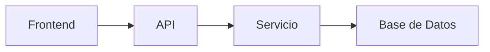
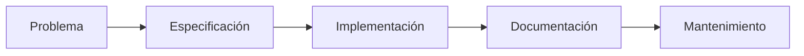
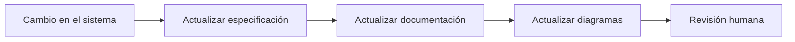

# Documentación y Arquitectura asistidas por IA

## 🎯 Objetivos de aprendizaje

Al finalizar este capítulo podrás:

- Comprender por qué la documentación sigue siendo fundamental en proyectos modernos.
- Utilizar IA para generar documentación técnica de calidad.
- Crear diagramas de arquitectura con ayuda de IA.
- Elaborar ADR (Architecture Decision Records) y RFC (Request for Comments).
- Mantener la documentación sincronizada con la evolución del software.
- Diferenciar entre documentar código y documentar decisiones.

---

## ⏱ Tiempo estimado

60 minutos.

---

# Introducción

Cuando se habla de inteligencia artificial aplicada al desarrollo, la mayoría de las personas piensa inmediatamente en generar código.

Sin embargo, una gran parte del tiempo de un desarrollador no se dedica a programar.

También dedicamos tiempo a:

- analizar requerimientos,
- diseñar soluciones,
- explicar decisiones,
- documentar funcionalidades,
- compartir conocimiento con el equipo.

La IA puede acelerar todas estas tareas.

Pero existe una condición importante.

> La IA no reemplaza el conocimiento del proyecto.

Nos ayuda a organizarlo, estructurarlo y comunicarlo.

---

# El verdadero problema de la documentación

Muchas veces escuchamos frases como:

> "No tenemos documentación."

La realidad suele ser diferente.

Lo que ocurre es que la documentación:

- está desactualizada,
- está distribuida en múltiples lugares,
- es difícil de encontrar,
- no refleja el sistema actual.

La IA no resuelve este problema por sí sola.

Pero puede ayudar enormemente a mantener la documentación viva.

---

# Documentar no es copiar código

Un error frecuente consiste en pedir:

```text
Documenta esta clase.
```

Y obtener algo similar a:

```
Esta clase contiene un método save()
que guarda un usuario.
```

Eso aporta poco valor.

Una buena documentación responde preguntas como:

- ¿Por qué existe este módulo?
- ¿Qué problema resuelve?
- ¿Cuándo debería utilizarse?
- ¿Qué decisiones importantes contiene?
- ¿Qué limitaciones tiene?

La IA puede ayudarnos a responder estas preguntas si proporcionamos el contexto adecuado.

---

# Qué puede documentar una IA

La IA puede colaborar en distintos niveles.

## Código

- Clases.
- Componentes.
- Servicios.
- Interfaces.
- APIs.

---

## Proyecto

- README.
- Guías de instalación.
- Convenciones.
- Estructura del repositorio.

---

## Arquitectura

- Diagramas.
- Componentes.
- Dependencias.
- Flujos.

---

## Ingeniería

- ADR.
- RFC.
- Especificaciones.
- Casos de uso.
- Decisiones técnicas.

---

# README de calidad

Un buen README responde rápidamente:

- ¿Qué hace este proyecto?
- ¿Cómo se instala?
- ¿Cómo se ejecuta?
- ¿Cómo se prueba?
- ¿Cómo se despliega?
- ¿Cómo está organizado?

En lugar de pedir:

```text
Genera un README.
```

Podemos solicitar:

```text
Genera un README profesional.

Incluye:

- propósito del proyecto,
- requisitos,
- instalación,
- comandos principales,
- estructura del repositorio,
- convenciones de desarrollo.
```

---

# Documentación de APIs

La IA puede ayudarnos a describir:

- endpoints,
- parámetros,
- respuestas,
- errores,
- ejemplos de uso.

Ejemplo:

```text
Analiza este controlador REST.

Genera una documentación incluyendo:

- propósito,
- endpoint,
- parámetros,
- ejemplos,
- códigos de respuesta.
```

---

# Diagramas de arquitectura

Una imagen suele comunicar mejor que varias páginas de texto.

La IA puede generar diagramas utilizando Mermaid.

Ejemplo:



Pero el verdadero valor no está en el dibujo.

Está en representar correctamente las relaciones del sistema.

---

# Documentar decisiones

Uno de los errores más comunes es documentar únicamente el resultado.

Lo realmente importante es documentar:

> ¿Por qué tomamos esta decisión?

Aquí aparecen los ADR.

---

# Architecture Decision Records (ADR)

Un ADR registra una decisión técnica importante.

Su estructura suele ser:

```text
Título

Estado

Contexto

Problema

Opciones consideradas

Decisión

Consecuencias
```

Ejemplo:

```
Título

Uso de NgRx para gestión de estado.

Contexto

La aplicación posee múltiples módulos
que comparten información.

Decisión

Adoptar NgRx.

Consecuencias

Mayor estructura.

Curva de aprendizaje más alta.

Mayor escalabilidad.
```

La IA puede generar un primer borrador, pero la decisión siempre corresponde al equipo.

---

# Request for Comments (RFC)

Mientras un ADR documenta una decisión tomada, un RFC propone una decisión para ser discutida.

Ejemplo:

```
Problema

Necesitamos dividir el frontend en microfrontends.

Opciones

- Monolito
- Module Federation
- Single SPA

Preguntas abiertas

¿Cómo compartiremos autenticación?

¿Cómo compartiremos estado?

¿Qué impacto tendrá en CI/CD?
```

La IA puede ayudarnos a organizar el documento y presentar las alternativas de forma clara.

---

# La IA como arquitecto... con supervisión

La IA puede sugerir arquitecturas.

Por ejemplo:

```text
Diseña una arquitectura para una plataforma de cursos online.

Incluye:

- frontend,
- backend,
- autenticación,
- almacenamiento,
- notificaciones.
```

La propuesta puede ser un excelente punto de partida.

Pero nunca debe aceptarse sin revisión.

La arquitectura depende de:

- presupuesto,
- experiencia del equipo,
- requisitos no funcionales,
- restricciones del negocio.

---

# Mantener la documentación actualizada

Uno de los mayores beneficios de la IA es facilitar la actualización continua.

Ejemplo:

```text
Estos son los cambios realizados en el módulo.

Actualiza:

- README,
- diagrama,
- documentación técnica,
- ADR afectados.
```

En lugar de reescribir todo desde cero, la IA puede adaptar únicamente las partes necesarias.

---

# Documentación como fuente de conocimiento

La documentación no debería ser un requisito para "cumplir con el proceso".

Debe convertirse en una herramienta para responder preguntas.

Por ejemplo:

- ¿Cómo funciona este módulo?
- ¿Por qué se eligió esta tecnología?
- ¿Qué dependencias existen?
- ¿Qué impacto tendría modificar este componente?

Una buena documentación reduce el tiempo necesario para comprender un sistema.

---

# Relación con Specification Engineering

En los próximos módulos veremos que las especificaciones se convierten en el principal artefacto del desarrollo.

La documentación deja de ser únicamente descriptiva.

Pasa a ser parte activa del proceso de construcción del software.



En Specification-Driven Development este flujo evolucionará hacia:

```text
Especificación

↓

Implementación

↓

Validación

↓

Documentación sincronizada
```

---

# 🧠 Para desarrolladores Senior

La documentación no debe competir con el código.

Debe complementarlo.

Un desarrollador senior documenta principalmente:

- decisiones,
- restricciones,
- contratos,
- supuestos,
- riesgos.

Estos elementos son mucho más difíciles de reconstruir una vez que el proyecto evoluciona.

La IA puede ayudar a redactarlos, pero solo el equipo conoce el contexto que dio origen a cada decisión.

---

# Errores comunes

## Documentar únicamente el código

El código explica el "cómo".

La documentación debe explicar el "por qué".

---

## Generar documentación y olvidarla

La documentación debe evolucionar junto con el sistema.

---

## Confiar ciegamente en la IA

La IA puede inventar información si no dispone del contexto suficiente.

Siempre valida el contenido generado.

---

## Escribir documentación demasiado extensa

Una documentación útil responde preguntas concretas.

No intenta describir absolutamente todo.

---

# Workflow recomendado AI Champion



La documentación forma parte del desarrollo.

No es una actividad posterior.

---

# Conceptos clave

- La documentación comunica conocimiento.
- La IA acelera la creación y el mantenimiento de documentación.
- Un ADR documenta una decisión técnica.
- Un RFC documenta una propuesta de cambio.
- Los diagramas ayudan a comprender relaciones complejas.
- La documentación debe mantenerse sincronizada con el software.

---

# Resumen

La inteligencia artificial permite reducir significativamente el esfuerzo necesario para crear y mantener documentación técnica.

Sin embargo, el valor de la documentación sigue dependiendo del conocimiento del equipo y de la calidad de las decisiones registradas.

La IA escribe documentos.

Los desarrolladores documentan conocimiento.

---

# 📝 Ejercicios

1. Explica la diferencia entre documentar código y documentar decisiones.
2. Diseña un README para un proyecto frontend utilizando IA.
3. Escribe un ADR para justificar la adopción de NgRx en una aplicación Angular.
4. Diseña un RFC proponiendo la migración de un monolito a microfrontends.
5. Genera un diagrama Mermaid para la arquitectura de una aplicación de reservas.

---

# 🎯 Desafío

Selecciona un proyecto real en el que hayas trabajado.

Utilizando IA:

1. Genera un README profesional.
2. Crea un diagrama de arquitectura.
3. Redacta un ADR sobre una decisión técnica importante.
4. Escribe un RFC proponiendo una mejora arquitectónica.
5. Revisa todos los documentos y corrige cualquier información incorrecta o incompleta.

Compara el tiempo invertido con el proceso tradicional y reflexiona sobre qué tareas aportaron mayor valor al utilizar IA.

---

# Próximo capítulo

## Debugging y análisis de problemas con IA

Aprenderemos cómo utilizar la inteligencia artificial para investigar errores, analizar logs, comprender excepciones, formular hipótesis y acelerar el diagnóstico de problemas complejos sin perder el criterio técnico del desarrollador.
