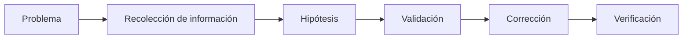
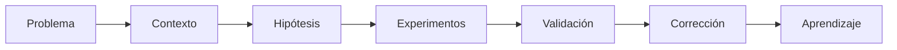
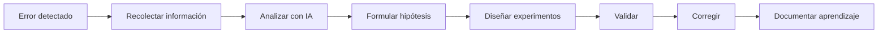

# Debugging y análisis de problemas con IA

## 🎯 Objetivos de aprendizaje

Al finalizar este capítulo podrás:

- Comprender cómo la IA puede asistir durante el proceso de debugging.
- Aprender a formular problemas de manera efectiva.
- Analizar errores, excepciones y logs utilizando IA.
- Diseñar un proceso sistemático de diagnóstico.
- Validar hipótesis antes de aplicar soluciones.
- Evitar depender de la IA para encontrar respuestas inmediatas.

---

## ⏱ Tiempo estimado

60 minutos.

---

# Introducción

Todo desarrollador dedica una parte importante de su tiempo a resolver problemas.

Un error en producción.

Una prueba que falla.

Una excepción inesperada.

Un comportamiento inconsistente.

En todos estos casos, el objetivo no es escribir código.

Es comprender qué está ocurriendo.

La IA puede acelerar enormemente este proceso.

Pero solamente si aprendemos a utilizarla como una herramienta de investigación y no como un generador de respuestas.

---

# El error más común

Supongamos que aparece este mensaje:

```text
TypeError: Cannot read properties of undefined
```

Muchas personas preguntan:

```text
¿Cómo soluciono este error?
```

La IA responderá con posibles soluciones.

Sin embargo, esa no es la mejor pregunta.

Una mejor conversación sería:

```text
Analiza esta excepción.

¿Qué información aporta?

¿Cuáles podrían ser las causas?

¿Qué datos adicionales necesitas para llegar a una conclusión?
```

Observa la diferencia.

La IA comienza investigando en lugar de adivinar.

---

# Debugging como proceso de investigación

Resolver un error consiste en responder preguntas.



La IA puede colaborar en cada etapa.

---

# Paso 1 - Comprender el problema

Antes de compartir un error con una IA debemos reunir contexto.

Por ejemplo:

- mensaje completo,
- stack trace,
- logs,
- versión del framework,
- cambios recientes,
- comportamiento esperado,
- comportamiento observado.

Cuanto mejor sea el contexto, mejor será el análisis.

---

# Paso 2 - Formular hipótesis

En lugar de pedir una solución inmediata, podemos solicitar:

```text
Actúa como un ingeniero senior.

Propón las cinco causas más probables de este problema.

Ordénalas por probabilidad.

Explica por qué.
```

Este enfoque nos ayuda a razonar de manera estructurada.

---

# Paso 3 - Diseñar experimentos

Una hipótesis debe poder validarse.

Ejemplo:

Hipótesis:

```
El estado de NgRx no se actualiza.
```

Experimento:

```
Agregar un log antes y después del dispatch.

Verificar si el reducer recibe la acción.

Comparar el estado anterior y el nuevo.
```

La IA puede sugerir experimentos sencillos para confirmar o descartar cada hipótesis.

---

# Analizando stack traces

Los stack traces contienen mucha información.

La IA puede ayudarnos a responder preguntas como:

- ¿Cuál fue el primer punto de fallo?
- ¿Qué llamadas ocurrieron antes?
- ¿Qué componente inició el proceso?
- ¿Qué dependencias están involucradas?

En lugar de leer decenas de líneas manualmente, podemos solicitar un resumen estructurado.

---

# Analizando logs

Los logs suelen ser extensos.

Podemos utilizar IA para:

- identificar patrones,
- detectar errores repetitivos,
- encontrar eventos correlacionados,
- resumir grandes volúmenes de información.

Ejemplo:

```text
Analiza estos logs.

Identifica:

- eventos anómalos,
- errores recurrentes,
- posibles relaciones entre ellos.
```

---

# Comprender código desconocido

Muchas veces el problema no está en nuestro código.

Está en un módulo legado.

Podemos preguntar:

```text
Explica este componente.

Describe:

- responsabilidad,
- flujo principal,
- dependencias,
- posibles puntos de fallo.
```

La IA acelera enormemente el proceso de comprensión.

---

# Cambios recientes

Una pregunta muy útil es:

```text
Estos fueron los últimos cambios realizados.

¿Cuál tiene mayor probabilidad de haber provocado este error?

Justifica tu respuesta.
```

La IA suele detectar relaciones que pueden pasar desapercibidas.

---

# La IA como compañero de debugging

Imagina una conversación como esta:

```text
Desarrollador:

El formulario deja de funcionar después de guardar.

IA:

¿Qué cambia después del guardado?

¿Se reinicia el estado?

¿Hay navegación?

¿Existen llamadas asíncronas?

```

Observa que la IA no responde inmediatamente.

Hace preguntas.

Ese es el comportamiento que debemos fomentar.

---

# Lo que NO debemos hacer

Evita conversaciones como:

```text
Aquí está mi proyecto.

Arréglalo.
```

O:

```text
Este error no funciona.

Dime la solución.
```

Estas preguntas obligan a la IA a completar información que no posee.

El resultado será una respuesta menos confiable.

---

# Una metodología de debugging con IA

A partir de este momento utilizaremos el siguiente flujo:



La solución aparece casi al final.

---

# Aprender del error

Cada error resuelto representa una oportunidad de mejorar el sistema.

Después de solucionar un problema podemos preguntar:

```text
¿Cómo podríamos evitar que este error vuelva a ocurrir?

¿Faltan pruebas?

¿Faltan validaciones?

¿Faltan reglas de negocio?

¿Falta observabilidad?
```

Esta conversación aporta mucho más valor que simplemente corregir el código.

---

# Relación con Specification Engineering

Muchos errores aparecen porque la especificación era ambigua o incompleta.

Una buena investigación debería responder también:

- ¿El código está mal?
- ¿La implementación es incorrecta?
- ¿La especificación era insuficiente?
- ¿El requisito cambió?

En Specification-Driven Development el debugging no termina en el código.

También revisa la especificación.

---

# 🧠 Para desarrolladores Senior

Los desarrolladores con mayor experiencia no encuentran errores más rápido porque conozcan más comandos.

Los encuentran más rápido porque saben formular mejores hipótesis.

La IA puede acelerar ese proceso.

Pero el razonamiento sigue siendo responsabilidad del desarrollador.

---

# Errores comunes

## Pedir una solución sin explicar el problema

La IA necesita contexto.

---

## Compartir únicamente el mensaje de error

Los logs y el comportamiento observado son igual de importantes.

---

## Aceptar la primera hipótesis

Siempre valida antes de modificar el sistema.

---

## No registrar el aprendizaje

Cada incidente debería dejar una mejora en el proyecto.

---

# Workflow recomendado AI Champion



---

# Conceptos clave

- El debugging es un proceso de investigación.
- La IA ayuda a formular hipótesis.
- El contexto determina la calidad del análisis.
- Las soluciones deben validarse antes de implementarse.
- Cada error es una oportunidad de mejorar el sistema.

---

# Resumen

La inteligencia artificial puede convertirse en un excelente compañero durante el proceso de debugging.

Sin embargo, su mayor valor no consiste en encontrar respuestas inmediatas.

Consiste en ayudarnos a comprender mejor el problema, formular hipótesis sólidas y acelerar el proceso de investigación.

Los mejores desarrolladores no son quienes memorizan más soluciones.

Son quienes realizan las mejores preguntas.

---

# 📝 Ejercicios

1. Explica por qué el debugging es un proceso de investigación.
2. Analiza un stack trace utilizando IA e identifica las posibles causas del error.
3. Diseña tres hipótesis para un problema de sincronización entre frontend y backend.
4. Utiliza IA para resumir un conjunto de logs y detectar patrones.
5. Describe cómo documentarías el aprendizaje obtenido después de resolver un incidente.

---

# 🎯 Desafío

Selecciona un bug real de un proyecto.

Realiza el siguiente proceso:

1. Describe el problema.
2. Reúne el contexto disponible.
3. Formula al menos cinco hipótesis con ayuda de una IA.
4. Diseña experimentos para validarlas.
5. Corrige el problema.
6. Documenta qué aprendiste y qué cambios realizarías para evitar que vuelva a ocurrir.

---

# Próximo capítulo

## Refactoring y modernización de código con IA

Aprenderemos cómo utilizar la inteligencia artificial para mejorar código existente, reducir deuda técnica, migrar tecnologías y modernizar aplicaciones sin modificar su comportamiento funcional.
