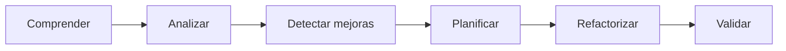
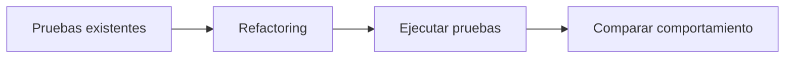
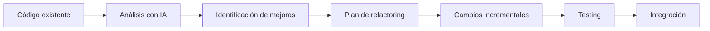

# Refactoring y modernización de código con IA

## 🎯 Objetivos de aprendizaje

Al finalizar este capítulo podrás:

- Comprender qué es realmente el refactoring.
- Utilizar IA para mejorar código existente sin modificar su comportamiento.
- Identificar deuda técnica y oportunidades de mejora.
- Planificar migraciones tecnológicas asistidas por IA.
- Diferenciar refactoring de reescritura.
- Incorporar IA dentro de un proceso seguro de modernización.

---

## ⏱ Tiempo estimado

70 minutos.

---

# Introducción

En el desarrollo profesional, la mayor parte del tiempo no se dedica a crear software desde cero.

Se dedica a:

- mantener aplicaciones,
- corregir errores,
- mejorar rendimiento,
- actualizar frameworks,
- reducir deuda técnica,
- simplificar código existente.

La inteligencia artificial puede acelerar significativamente estas tareas.

Pero debemos recordar un principio fundamental:

> El objetivo del refactoring no es cambiar lo que hace el sistema.

> El objetivo es mejorar cómo está construido.

---

# ¿Qué es el refactoring?

Martin Fowler define el refactoring como:

> "Una técnica para mejorar el diseño interno del software sin modificar su comportamiento observable."

Esto implica que un refactoring exitoso produce exactamente el mismo resultado funcional.

Lo único que cambia es la calidad del código.

---

# Refactoring vs Reescritura

Es común confundir ambos conceptos.

| Refactoring | Reescritura |
|-------------|-------------|
| Conserva el comportamiento | Cambia la implementación completa |
| Riesgo controlado | Riesgo elevado |
| Cambios pequeños e incrementales | Cambios masivos |
| Fácil de validar | Validación más compleja |
| Mejora diseño | Crea un nuevo diseño |

La IA resulta especialmente útil para el primer caso.

---

# ¿Dónde aporta valor la IA?

La IA puede identificar:

- duplicación de código,
- métodos demasiado largos,
- responsabilidades mezcladas,
- dependencias innecesarias,
- nombres poco descriptivos,
- oportunidades de simplificación.

Ejemplo:

```text
Analiza este componente Angular.

Identifica:

- código duplicado,
- responsabilidades mezcladas,
- posibles mejoras.

No modifiques el comportamiento.
```

---

# El proceso profesional

No debemos comenzar solicitando cambios.

Primero debemos comprender el código.



---

# La IA como revisor técnico

Antes de modificar código podemos preguntar:

```text
Actúa como un arquitecto de software.

Analiza este módulo.

Identifica:

- complejidad,
- acoplamiento,
- cohesión,
- mantenibilidad.

Propón mejoras justificadas.
```

La respuesta suele aportar una visión global difícil de obtener rápidamente.

---

# Refactoring incremental

Evita solicitudes como:

```text
Refactoriza toda la aplicación.
```

Es preferible avanzar paso a paso.

Ejemplo:

1. Analizar el componente.
2. Detectar problemas.
3. Refactorizar un método.
4. Validar.
5. Continuar.

Los cambios pequeños reducen el riesgo.

---

# Modernización tecnológica

Uno de los usos más interesantes consiste en actualizar tecnologías.

Ejemplos:

- Angular 15 → Angular 20.
- React Class Components → Hooks.
- JavaScript → TypeScript.
- NgModule → Standalone Components.

Ejemplo de conversación:

```text
Migra este componente Angular basado en NgModule
a Standalone Components.

Mantén:

- comportamiento,
- API pública,
- compatibilidad.

Explica cada cambio realizado.
```

---

# Reduciendo deuda técnica

La deuda técnica aparece cuando una solución rápida termina dificultando el mantenimiento futuro.

La IA puede ayudarnos a identificar:

- código muerto,
- dependencias obsoletas,
- funciones demasiado grandes,
- validaciones repetidas,
- lógica duplicada.

Pero la decisión de eliminar o modificar ese código siempre corresponde al equipo.

---

# Mejorando legibilidad

Muchas veces el mayor beneficio no es el rendimiento.

Es la claridad.

Ejemplo:

```text
Simplifica este método.

Prioriza:

- nombres descriptivos,
- menor complejidad,
- legibilidad.

No optimices rendimiento todavía.
```

Recordemos que el código se lee muchas más veces de las que se escribe.

---

# Refactoring guiado por pruebas

Antes de modificar una parte importante del sistema debemos asegurarnos de contar con pruebas suficientes.

El flujo recomendado es:



Si el comportamiento cambia, probablemente dejamos de hacer refactoring y comenzamos una reimplementación.

---

# Migraciones asistidas por IA

La IA resulta especialmente útil para:

- actualizar APIs obsoletas,
- adaptar nuevas versiones,
- reemplazar patrones antiguos,
- explicar breaking changes.

Ejemplo:

```text
Estas son las notas de migración de Angular.

Analiza este proyecto.

Identifica qué cambios son necesarios.

Ordénalos por prioridad.
```

---

# Lo que NO debemos hacer

Evita solicitudes como:

```text
Haz este código más moderno.
```

La IA necesita un objetivo concreto.

Por ejemplo:

- reducir complejidad,
- eliminar duplicación,
- separar responsabilidades,
- mejorar mantenibilidad.

---

# La IA como mentor

Además de generar cambios, la IA puede explicar por qué una mejora es conveniente.

Ejemplo:

```text
Explica por qué propones extraer este método.

¿Qué principio de diseño estás aplicando?

¿Qué ventajas aporta?
```

Esto convierte cada refactoring en una oportunidad de aprendizaje.

---

# Relación con Specification Engineering

Un buen refactoring nunca debería modificar los requisitos funcionales.

La especificación permanece estable.

Lo que cambia es la implementación.

```text
Especificación

↓

Implementación actual

↓

Refactoring

↓

Nueva implementación

↓

Misma especificación
```

Esta separación será fundamental cuando trabajemos con Specification-Driven Development.

---

# 🧠 Para desarrolladores Senior

El objetivo del refactoring no es demostrar habilidad técnica.

Es reducir el costo futuro del software.

Antes de aceptar una propuesta de la IA pregúntate:

- ¿Hace el código más fácil de entender?
- ¿Reduce el acoplamiento?
- ¿Simplifica futuras modificaciones?
- ¿Respeta la arquitectura existente?

Si la respuesta es no, probablemente no vale la pena realizar el cambio.

---

# Errores comunes

## Refactorizar sin pruebas

No podremos validar que el comportamiento siga siendo correcto.

---

## Cambiar demasiadas cosas al mismo tiempo

Los cambios pequeños facilitan la revisión y reducen el riesgo.

---

## Optimizar prematuramente

Primero debemos mejorar el diseño.

El rendimiento solo debe optimizarse cuando exista evidencia de un problema.

---

## Aceptar todas las sugerencias de la IA

Cada propuesta debe revisarse con criterio técnico.

---

# Workflow recomendado AI Champion



---

# Conceptos clave

- Refactoring mejora el diseño sin cambiar el comportamiento.
- La IA acelera el análisis y la modernización.
- Las pruebas protegen el comportamiento existente.
- Las migraciones deben planificarse antes de ejecutarse.
- La decisión final siempre pertenece al desarrollador.

---

# Resumen

La inteligencia artificial puede convertirse en un excelente aliado para mantener y modernizar aplicaciones.

Sin embargo, un buen refactoring sigue dependiendo del criterio del desarrollador, de una estrategia incremental y de una validación rigurosa mediante pruebas.

La IA propone.

El equipo decide.

---

# 📝 Ejercicios

1. Explica la diferencia entre refactoring y reescritura.
2. Analiza un componente de tu proyecto e identifica tres oportunidades de mejora utilizando IA.
3. Diseña un plan para migrar un proyecto Angular basado en NgModules hacia Standalone Components.
4. Utiliza IA para simplificar un método complejo sin modificar su comportamiento.
5. Describe qué pruebas ejecutarías antes y después de un refactoring importante.

---

# 🎯 Desafío

Selecciona un módulo de un proyecto real.

Realiza el siguiente proceso:

1. Analiza el código con ayuda de una IA.
2. Identifica la deuda técnica más importante.
3. Diseña un plan de refactoring incremental.
4. Implementa uno de los cambios propuestos.
5. Ejecuta las pruebas necesarias.
6. Documenta las mejoras obtenidas y las decisiones tomadas.

---

# Próximo capítulo

## Code Review asistido por IA

Aprenderemos cómo utilizar la inteligencia artificial para revisar código, detectar problemas de calidad, identificar riesgos de seguridad y mejorar pull requests sin reemplazar el criterio de un revisor humano.
