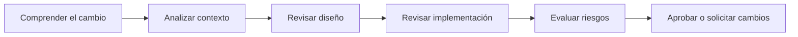
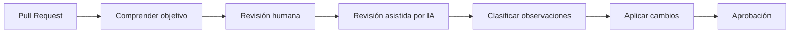

# Code Review asistido por IA

## 🎯 Objetivos de aprendizaje

Al finalizar este capítulo podrás:

- Comprender el verdadero propósito del Code Review.
- Utilizar IA para revisar código de manera sistemática.
- Detectar problemas de diseño, mantenibilidad y seguridad.
- Diferenciar errores de implementación de problemas de arquitectura.
- Incorporar IA como apoyo al proceso de revisión.
- Comprender las limitaciones de una revisión automatizada.

---

## ⏱ Tiempo estimado

60 minutos.

---

# Introducción

En muchos equipos el Code Review se convierte en una simple búsqueda de errores.

Comentarios como:

- "Falta un punto y coma."
- "Cambia el nombre de esta variable."
- "Ordena los imports."

aportan poco valor.

El verdadero objetivo del Code Review es responder una pregunta mucho más importante:

> ¿Estamos incorporando un cambio que mejora el software sin comprometer su calidad?

La IA puede ayudarnos enormemente en este proceso.

Pero no reemplaza el criterio del revisor.

---

# ¿Qué es un Code Review?

Un Code Review es una revisión técnica realizada antes de integrar un cambio al código principal.

Su objetivo es detectar problemas relacionados con:

- calidad,
- diseño,
- mantenibilidad,
- seguridad,
- rendimiento,
- arquitectura,
- cumplimiento de estándares.

No consiste únicamente en encontrar errores de sintaxis.

---

# ¿Qué puede revisar una IA?

Una IA puede analizar aspectos como:

- complejidad,
- duplicación,
- nombres poco descriptivos,
- dependencias innecesarias,
- posibles errores,
- código muerto,
- oportunidades de simplificación.

Ejemplo:

```text
Revisa este Pull Request.

Analiza:

- legibilidad,
- mantenibilidad,
- posibles errores,
- oportunidades de mejora.

No modifiques el comportamiento.
```

---

# Lo primero es comprender

Antes de revisar código debemos entender qué intenta resolver.

Por eso una buena revisión comienza con preguntas.

```text
¿Qué problema resuelve este cambio?

¿Qué requisito implementa?

¿Qué comportamiento nuevo incorpora?

¿Qué limitaciones existen?
```

Sin comprender el contexto resulta difícil evaluar la calidad del cambio.

---

# Un proceso profesional de revisión



Observa que el código aparece recién en la cuarta etapa.

---

# Revisando un Pull Request

Una buena conversación con la IA podría ser:

```text
Actúa como un Staff Engineer.

Revisa este Pull Request.

Evalúa:

- arquitectura,
- diseño,
- mantenibilidad,
- seguridad,
- rendimiento,
- deuda técnica.

Justifica cada observación.

Distingue entre observaciones críticas y sugerencias.
```

Este tipo de revisión suele ser mucho más útil que una simple lista de cambios.

---

# Clasificando observaciones

No todos los comentarios tienen la misma importancia.

Una práctica recomendable consiste en clasificarlos.

## Crítico

Debe corregirse antes de integrar.

Ejemplo:

- error funcional,
- vulnerabilidad,
- pérdida de datos.

---

## Importante

No bloquea el merge, pero conviene corregirlo.

Ejemplo:

- complejidad elevada,
- duplicación,
- acoplamiento excesivo.

---

## Sugerencia

Mejora opcional.

Ejemplo:

- nombres más claros,
- simplificación,
- reorganización del código.

Esta clasificación ayuda al equipo a priorizar.

---

# La IA como segundo revisor

Una práctica muy útil consiste en utilizar la IA después de la revisión humana.

Por ejemplo:

```text
Estos fueron los comentarios realizados durante el Code Review.

Analízalos.

¿Existe algún aspecto importante que no haya sido considerado?
```

La IA puede aportar una segunda perspectiva.

---

# Seguridad

La IA puede detectar patrones de riesgo.

Ejemplo:

```text
Busca:

- SQL Injection,
- XSS,
- exposición de secretos,
- validaciones insuficientes,
- autenticación incorrecta.
```

No sustituye herramientas especializadas, pero ayuda a identificar problemas evidentes.

---

# Rendimiento

También podemos solicitar:

```text
Analiza este código.

¿Existen:

- consultas innecesarias?
- cálculos repetidos?
- renderizados excesivos?
- operaciones costosas?
```

Muchas optimizaciones sencillas pueden detectarse rápidamente.

---

# Consistencia

En equipos grandes la consistencia suele ser más importante que la perfección.

La IA puede verificar:

- convenciones,
- estilos,
- organización,
- patrones de diseño,
- uso correcto del Design System.

Esto reduce discusiones repetitivas durante las revisiones.

---

# Lo que NO debemos hacer

No debemos preguntar:

```text
¿Este código está bien?
```

Es una pregunta demasiado amplia.

Resulta mucho más útil solicitar una revisión específica.

Por ejemplo:

```text
Analiza únicamente:

- seguridad,
- mantenibilidad,
- principios SOLID.

Ignora formato y estilo.
```

Cuanto más precisa sea la revisión, más útil será el resultado.

---

# Explicar el porqué

Un buen revisor no solo identifica problemas.

También explica por qué representan un riesgo.

La IA puede ayudarnos a redactar comentarios más útiles.

Por ejemplo:

```text
Explica este comentario de revisión para que un desarrollador junior comprenda:

- el problema,
- el riesgo,
- la mejora propuesta.
```

Esto convierte el Code Review en una instancia de aprendizaje.

---

# Relación con Specification Engineering

En este curso veremos que el código no es el único artefacto que debe revisarse.

También revisaremos:

- especificaciones,
- contratos,
- criterios de aceptación,
- arquitectura,
- decisiones técnicas.

El Code Review representa solo una parte del proceso de aseguramiento de calidad.

Más adelante ampliaremos este concepto hacia el **Specification Review**.

---

# 🧠 Para desarrolladores Senior

Un desarrollador senior no busca demostrar que encuentra más errores.

Busca reducir el riesgo de incorporar cambios incorrectos al sistema.

Antes de aprobar un Pull Request conviene preguntarse:

- ¿Comprendí realmente el cambio?
- ¿Respeta la arquitectura?
- ¿Genera deuda técnica?
- ¿Será fácil de mantener?
- ¿Existe alguna consecuencia no prevista?

Estas preguntas suelen aportar mucho más valor que una revisión centrada únicamente en el estilo del código.

---

# Errores comunes

## Revisar solo el código

Comprender el problema es igual de importante.

---

## Centrarse únicamente en el formato

Las herramientas automáticas pueden resolver gran parte del estilo.

El tiempo humano debe dedicarse a decisiones técnicas.

---

## Aceptar todas las sugerencias de la IA

Cada observación debe validarse dentro del contexto del proyecto.

---

## No justificar los comentarios

Toda observación debería explicar:

- qué ocurre,
- por qué es un problema,
- cómo podría mejorarse.

---

# Workflow recomendado AI Champion



---

# Conceptos clave

- El Code Review protege la calidad del software.
- La IA ayuda a identificar riesgos y oportunidades de mejora.
- Comprender el contexto es más importante que revisar el código de forma aislada.
- Las observaciones deben priorizarse según su impacto.
- La decisión final siempre corresponde al equipo de desarrollo.

---

# Resumen

La inteligencia artificial puede convertirse en un excelente apoyo durante el Code Review.

Sin embargo, una revisión de calidad sigue dependiendo del conocimiento del negocio, la arquitectura y los estándares del equipo.

El mejor uso de la IA consiste en complementar el criterio humano, aportando nuevas perspectivas y ayudando a detectar problemas que podrían pasar desapercibidos.

---

# 📝 Ejercicios

1. Explica por qué el objetivo del Code Review no es únicamente encontrar errores.
2. Diseña un checklist de revisión para un proyecto Angular o React.
3. Utiliza una IA para revisar un Pull Request real e identifica observaciones críticas, importantes y sugerencias.
4. Analiza un componente y evalúa si respeta los principios SOLID.
5. Reescribe un comentario de Code Review para que resulte más claro y constructivo.

---

# 🎯 Desafío

Selecciona un Pull Request de un proyecto real.

Realiza el siguiente proceso:

1. Comprende el objetivo del cambio.
2. Realiza una revisión manual.
3. Solicita una revisión adicional utilizando una IA.
4. Compara ambas revisiones.
5. Clasifica todas las observaciones por prioridad.
6. Reflexiona sobre cuáles aportaron mayor valor y cuáles no fueron relevantes.

---

# Próximo capítulo

## Workflow Profesional de AI-Assisted Development

Integraremos todos los conceptos aprendidos durante este módulo en un flujo completo de trabajo, desde la comprensión del problema hasta la entrega del software, mostrando cómo la IA puede acompañar cada etapa sin reemplazar el criterio del desarrollador.
