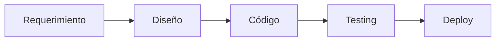
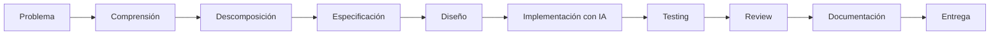
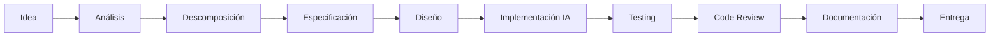
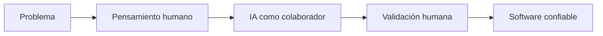

# Workflow profesional de AI-Assisted Development

## 🎯 Objetivos de aprendizaje

Al finalizar este capítulo podrás:

- Integrar IA dentro de un ciclo profesional de desarrollo.
- Comprender dónde aporta valor la IA en cada etapa.
- Aplicar un flujo completo desde la idea hasta la entrega.
- Identificar qué decisiones siguen perteneciendo al desarrollador.
- Prepararte para trabajar con Specification Engineering.

---

## ⏱ Tiempo estimado

90 minutos.

---

# Introducción

Durante este módulo aprendimos diferentes formas de utilizar inteligencia artificial:

- analizar problemas,
- diseñar soluciones,
- generar código,
- crear pruebas,
- documentar sistemas,
- revisar cambios,
- mejorar software existente.

Pero existe una pregunta fundamental:

> ¿Cómo combinamos todas estas capacidades en un flujo real de trabajo?

La respuesta es:

> La IA debe integrarse dentro del proceso de ingeniería, no reemplazarlo.

---

# El error de pensar en la IA como una herramienta aislada

Un enfoque común es:

```text
Necesito código

↓

Pregunto a la IA

↓

Copio resultado
```

Este modelo tiene muchos problemas:

- poco contexto,
- decisiones incorrectas,
- código difícil de mantener,
- falta de validación.

Un flujo profesional es diferente.

---

# El nuevo ciclo de desarrollo

El ciclo tradicional:



Evoluciona hacia:



La diferencia principal es que agregamos etapas de razonamiento antes de implementar.

---

# Caso práctico

Imaginemos el siguiente requerimiento:

> "Agregar un sistema de favoritos para una plataforma de cursos."

Parece una tarea simple.

Pero contiene muchas preguntas:

- ¿Dónde se almacenan?
- ¿Un usuario puede tener favoritos ilimitados?
- ¿Qué ocurre si elimina un curso?
- ¿Cómo se sincroniza entre dispositivos?
- ¿Qué permisos existen?
- ¿Cómo afecta al rendimiento?

La IA puede ayudarnos a descubrir estas preguntas.

---

# Etapa 1 - Comprender el problema

Antes de escribir código:

```text
Analiza este requerimiento.

Identifica:

- objetivos,
- usuarios involucrados,
- preguntas abiertas,
- riesgos.
```

Resultado:

Una comprensión más completa del problema.

---

# Etapa 2 - Descomposición

Una funcionalidad grande debe dividirse.

Ejemplo:

```text
Favoritos

├── Modelo de datos
├── API backend
├── Estado frontend
├── Componentes UI
├── Tests
└── Documentación
```

La IA puede ayudarnos a encontrar partes ocultas.

---

# Etapa 3 - Especificación inicial

Antes de implementar definimos:

```text
Cuando un usuario marque un curso como favorito:

- debe almacenarse la relación usuario-curso.
- debe mostrarse inmediatamente en la interfaz.
- debe persistir después de cerrar sesión.
```

Esta especificación será el contrato del desarrollo.

---

# Etapa 4 - Diseño

Ahora podemos preguntar:

```text
Propón una arquitectura para implementar favoritos.

Considera:

- frontend,
- backend,
- persistencia,
- pruebas.
```

La IA propone alternativas.

El equipo decide.

---

# Etapa 5 - Implementación asistida

Ahora sí utilizamos generación de código.

Ejemplo:

```text
Implementa el servicio siguiendo esta especificación.

Restricciones:

- Angular standalone components.
- NgRx para estado.
- Jest para pruebas.
```

La diferencia es que la IA ya tiene contexto.

---

# Etapa 6 - Testing

No preguntamos simplemente:

```text
Genera tests.
```

Preguntamos:

```text
Analiza esta especificación.

Identifica escenarios de prueba.

Luego genera los tests necesarios.
```

Los tests nacen del comportamiento esperado.

---

# Etapa 7 - Code Review

Antes de integrar:

```text
Revisa esta implementación.

Evalúa:

- diseño,
- seguridad,
- mantenibilidad,
- posibles errores.
```

La IA aporta una segunda perspectiva.

---

# Etapa 8 - Documentación

Finalmente:

```text
Actualiza:

- README,
- documentación técnica,
- diagramas,
- decisiones arquitectónicas.
```

El conocimiento queda registrado.

---

# El flujo completo



---

# Qué hace la IA

La IA puede:

✅ Proponer alternativas.

✅ Generar borradores.

✅ Analizar código.

✅ Encontrar riesgos.

✅ Crear documentación.

✅ Ayudar a investigar problemas.

---

# Qué sigue haciendo el humano

El desarrollador sigue siendo responsable de:

- comprender el problema,
- tomar decisiones,
- validar resultados,
- priorizar riesgos,
- entender consecuencias.

La IA acelera.

El humano dirige.

---

# La nueva habilidad fundamental

En un mundo con IA, la habilidad más importante deja de ser:

> "Escribir código rápidamente."

Y pasa a ser:

> "Transformar problemas ambiguos en instrucciones claras para sistemas inteligentes."

---

# Relación con Specification Engineering

Durante este módulo utilizamos especificaciones de manera informal.

En el siguiente módulo profundizaremos en esto.

Pasaremos de:

```text
"Explícale a la IA qué quieres hacer"
```

a:

```text
"Define formalmente qué debe construirse"
```

La especificación se convertirá en el centro del proceso.

---

# 🧠 Para desarrolladores Senior

El desarrollador senior del futuro será menos evaluado por la cantidad de código producido.

Será evaluado por:

- calidad de sus decisiones,
- capacidad de diseñar soluciones,
- claridad de sus especificaciones,
- capacidad de trabajar con sistemas inteligentes.

La IA aumenta el valor del pensamiento estructurado.

---

# Errores comunes

## Usar IA solamente para generar código

Es probablemente su uso menos interesante.

---

## Saltarse la etapa de comprensión

Una mala definición produce una mala solución.

---

## Delegar decisiones críticas

La responsabilidad técnica sigue siendo humana.

---

## No documentar aprendizajes

El conocimiento debe permanecer en el sistema.

---

# Workflow recomendado AI Champion



---

# Principios aprendidos durante el módulo

## Principio 1

Comprende antes de implementar.

---

## Principio 2

Descompón antes de generar.

---

## Principio 3

El contexto determina la calidad del resultado.

---

## Principio 4

La IA acelera la ejecución, no reemplaza el criterio.

---

## Principio 5

Todo resultado generado debe validarse.

---

# Resumen del Módulo 2

Durante este módulo aprendimos que la inteligencia artificial puede acompañar todas las etapas del desarrollo:

- análisis,
- diseño,
- implementación,
- testing,
- documentación,
- mantenimiento.

Pero la principal transformación no es tecnológica.

Es metodológica.

Los desarrolladores dejan de interactuar con la IA como un generador de respuestas y comienzan a utilizarla como un colaborador dentro de un proceso estructurado.

---

# 📝 Ejercicios finales del módulo

1. Describe cómo cambiaría tu flujo de desarrollo utilizando IA.
2. Identifica tres tareas repetitivas donde podrías incorporar asistentes inteligentes.
3. Diseña un flujo completo para implementar una nueva funcionalidad.
4. Explica qué decisiones nunca deberían delegarse completamente a una IA.
5. Define qué significa para ti "trabajar con IA como colaborador".

---

# 🎯 Proyecto integrador del módulo

Selecciona una funcionalidad real.

Aplica el workflow completo:

1. Describe el problema.
2. Descompón la funcionalidad.
3. Define una especificación inicial.
4. Diseña una solución.
5. Genera implementación asistida.
6. Crea pruebas.
7. Realiza Code Review.
8. Documenta el resultado.

Finalmente responde:

- ¿En qué etapas la IA aportó más valor?
- ¿Qué decisiones requirieron criterio humano?
- ¿Qué mejorarías del proceso?

---

# Próximo módulo

# Módulo 3 — Specification Engineering

En el siguiente módulo profundizaremos en el concepto que conecta todo el curso:

> La especificación como fuente de verdad del desarrollo.

Aprenderemos a transformar ideas ambiguas en documentos claros, verificables y reutilizables que permitan trabajar con humanos y sistemas inteligentes.
