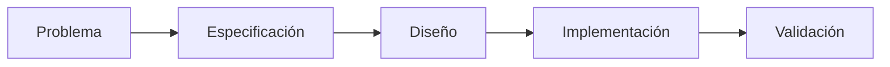

# Introducción a Specification Engineering

## 🎯 Objetivos de aprendizaje

Al finalizar este capítulo podrás:

- Comprender qué es una especificación.
- Entender por qué las especificaciones son el centro del desarrollo moderno.
- Diferenciar requisitos, documentación y especificaciones.
- Comprender el rol de las especificaciones en proyectos asistidos por IA.
- Descubrir por qué este módulo es el corazón de AI Champion.

---

## ⏱ Tiempo estimado

45 minutos.

---

# Introducción

Durante los módulos anteriores aprendimos que la IA puede ayudarnos a:

- analizar problemas,
- generar código,
- escribir pruebas,
- revisar implementaciones,
- documentar proyectos.

Sin embargo, existe una pregunta que todavía no respondimos.

> ¿Cómo sabe la IA qué debe construir?

La respuesta no es:

> Un prompt.

La respuesta es:

> Una buena especificación.

---

# El verdadero problema del desarrollo

Cuando un proyecto fracasa normalmente no ocurre porque los desarrolladores no sepan programar.

Sucede porque distintas personas entienden cosas diferentes.

Por ejemplo:

El Product Owner dice:

```
Necesitamos favoritos.
```

El diseñador entiende:

```
Un ícono de estrella.
```

El desarrollador interpreta:

```
Una tabla Favoritos.
```

El QA imagina:

```
Un usuario puede agregar y quitar favoritos.
```

La IA recibe:

```
Implementa favoritos.
```

Todos trabajan.

Todos producen.

Pero no necesariamente construyen el mismo sistema.

---

# El problema no es el código

El código suele ser la consecuencia.

El verdadero problema aparece antes.

```text
Idea

↓

Interpretación

↓

Implementación

```

Cada flecha introduce ambigüedad.

Specification Engineering busca reducir esa ambigüedad.

---

# ¿Qué es una especificación?

Una especificación es una descripción clara, verificable y compartida de lo que un sistema debe hacer y de las restricciones bajo las cuales debe hacerlo.

Su objetivo no es explicar cómo implementar una solución.

Su objetivo es definir qué comportamiento se espera.

---

# Especificación ≠ Documentación

Estos conceptos suelen confundirse.

## Documentación

Describe el sistema.

Ejemplo:

```
Este módulo administra usuarios.
```

---

## Especificación

Define el comportamiento esperado.

Ejemplo:

```
Cuando un usuario se registra:

- debe verificarse que el correo sea único,
- debe enviarse un correo de confirmación,
- la cuenta permanecerá inactiva hasta la validación.
```

La diferencia es importante.

La documentación explica.

La especificación establece un contrato.

---

# Especificación ≠ Requisito

Un requisito expresa una necesidad.

Ejemplo:

```
El usuario debe poder marcar cursos como favoritos.
```

La especificación desarrolla ese requisito.

Por ejemplo:

```
Un usuario autenticado podrá marcar un curso como favorito.

La acción deberá:

- persistirse,
- sincronizarse entre dispositivos,
- reflejarse inmediatamente en la interfaz,
- mantenerse después de cerrar sesión.
```

El requisito inicia la conversación.

La especificación elimina la ambigüedad.

---

# Especificación ≠ Diseño

Otra diferencia importante.

Una especificación responde:

> ¿Qué debe ocurrir?

El diseño responde:

> ¿Cómo construiremos esa solución?

Por ejemplo:

Especificación:

```
El sistema deberá enviar una notificación al completar una compra.
```

Diseño:

```
Se utilizará RabbitMQ para desacoplar el envío.
```

Ambos son importantes.

Pero cumplen objetivos diferentes.

---

# ¿Por qué Specification Engineering?

Porque escribir especificaciones también es una disciplina de ingeniería.

No consiste simplemente en redactar documentos.

Consiste en construir artefactos que sean:

- claros,
- completos,
- consistentes,
- verificables,
- mantenibles,
- reutilizables.

---

# El impacto de la IA

Durante muchos años las especificaciones estaban dirigidas principalmente a personas.

Hoy también serán utilizadas por:

- asistentes inteligentes,
- agentes,
- herramientas de automatización,
- pipelines,
- sistemas de generación de código.

Esto eleva enormemente su importancia.

---

# Una buena especificación

Una buena especificación responde preguntas como:

- ¿Qué problema resuelve?
- ¿Qué comportamiento se espera?
- ¿Qué restricciones existen?
- ¿Qué casos límite deben contemplarse?
- ¿Cómo validaremos el resultado?

Si alguna de estas preguntas queda sin responder, probablemente la especificación todavía no esté completa.

---

# Specification Engineering en AI Champion

En este curso utilizaremos la siguiente idea.



Observa que la especificación aparece antes del diseño y del código.

No es un documento posterior.

Es el punto de partida.

---

# Cambiando la forma de pensar

Tradicionalmente muchos equipos trabajan así:

```text
Idea

↓

Código

↓

Correcciones

```

En AI Champion proponemos otro enfoque.

```text
Idea

↓

Especificación

↓

Validación

↓

Implementación

↓

Testing

```

Esto reduce retrabajo y mejora la comunicación.

---

# 🧠 Para desarrolladores Senior

A medida que los modelos de IA generan código cada vez con mayor facilidad, el valor del desarrollador se desplaza hacia otra habilidad.

Ya no consiste únicamente en implementar.

Consiste en definir correctamente el problema.

Quien escribe mejores especificaciones obtiene mejores resultados, independientemente de la herramienta utilizada.

---

# Errores comunes

## Especificaciones ambiguas

Cada lector interpreta algo diferente.

---

## Mezclar diseño con comportamiento

Primero definimos qué debe ocurrir.

Después decidimos cómo implementarlo.

---

## Documentar demasiado tarde

La especificación debe existir antes de comenzar el desarrollo.

---

## Pensar que la IA resolverá la ambigüedad

La IA puede completar información faltante.

Pero eso no garantiza que complete correctamente.

---

# Conceptos clave

- Una especificación define comportamiento.
- Una especificación no es documentación.
- Una especificación no es diseño.
- Una buena especificación reduce la ambigüedad.
- Las especificaciones serán el principal medio de comunicación entre humanos y sistemas inteligentes.

---

# Resumen

La calidad del software depende mucho antes de la implementación.

Depende de cómo comprendemos el problema y de cómo logramos describirlo.

Specification Engineering propone tratar las especificaciones como artefactos de ingeniería, capaces de guiar tanto a personas como a sistemas inteligentes.

En los próximos capítulos aprenderemos a construirlas de manera sistemática.

---

# 📝 Ejercicios

1. Explica la diferencia entre requisito, especificación, diseño y documentación.
2. Analiza un requerimiento ambiguo y conviértelo en una primera especificación.
3. Identifica tres preguntas que toda especificación debería responder.
4. Busca un documento funcional de un proyecto anterior y evalúa si realmente es una especificación.
5. Reflexiona sobre cómo cambiaría tu forma de trabajar si la especificación fuera el principal artefacto del desarrollo.

---

# 🎯 Desafío

Selecciona una funcionalidad sencilla de un proyecto real.

No escribas código.

No diseñes la arquitectura.

Solo responde:

- ¿Qué debe hacer?
- ¿Qué no debe hacer?
- ¿Qué restricciones existen?
- ¿Cómo sabrás que está correctamente implementada?

Ese documento será tu primera especificación.

---

# Próximo capítulo

## Pensar en especificaciones

Aprenderemos cómo transformar problemas ambiguos en especificaciones claras, completas y verificables antes de hablar de tecnologías, frameworks o herramientas.
