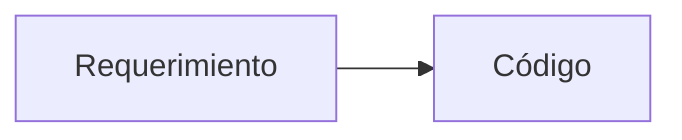
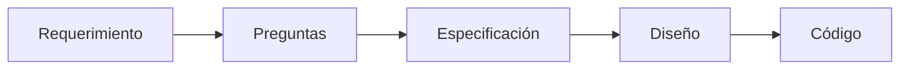

# Pensar en especificaciones

## 🎯 Objetivos de aprendizaje

Al finalizar este capítulo podrás:

- Comprender por qué las personas piensan naturalmente en soluciones y no en especificaciones.
- Aprender a identificar ambigüedades antes de comenzar el desarrollo.
- Transformar requerimientos vagos en especificaciones verificables.
- Formular las preguntas correctas antes de escribir una línea de código.
- Iniciar el caso de estudio AI Academy.

---

## ⏱ Tiempo estimado

60 minutos.

---

# Introducción

Cuando un desarrollador recibe un requerimiento, normalmente piensa en código.

Por ejemplo, si alguien dice:

> "Necesitamos un sistema de favoritos."

Muchos desarrolladores comienzan inmediatamente a imaginar:

- una nueva tabla en la base de datos,
- un endpoint REST,
- un botón con una estrella,
- un nuevo componente.

Pero todavía no sabemos qué significa realmente "favoritos".

Este es uno de los errores más comunes del desarrollo moderno.

Saltamos demasiado rápido hacia la implementación.

Specification Engineering propone detenernos unos minutos antes de escribir código.

---

# El problema de las soluciones prematuras

Observa la siguiente conversación.

**Product Owner**

> Necesitamos favoritos.

**Desarrollador**

> Perfecto, crearé una tabla `favorites`.

¿Ves el problema?

El desarrollador ya tomó una decisión técnica.

Sin embargo, todavía no respondió preguntas mucho más importantes.

- ¿Quién puede marcar favoritos?
- ¿Existe un límite?
- ¿Se sincronizan entre dispositivos?
- ¿Qué ocurre si un curso deja de existir?
- ¿Puede haber favoritos privados y públicos?
- ¿Qué sucede sin conexión a Internet?

Todavía no estamos diseñando.

Estamos comprendiendo.

---

# Cambiar la primera pregunta

En lugar de preguntar:

> ¿Cómo lo implementamos?

Debemos aprender a preguntar:

> ¿Qué significa exactamente "favoritos"?

Este cambio parece pequeño.

En realidad cambia completamente el proceso de desarrollo.

---

# La especificación comienza con preguntas

Una buena especificación nace de una buena investigación.

Antes de escribir cualquier documento debemos intentar responder preguntas como:

## Objetivo

¿Qué problema intenta resolver esta funcionalidad?

---

## Usuarios

¿Quién utilizará esta característica?

---

## Comportamiento esperado

¿Qué debe ocurrir exactamente?

---

## Restricciones

¿Qué limitaciones existen?

---

## Casos especiales

¿Qué ocurre cuando las cosas no salen como esperamos?

---

## Validación

¿Cómo comprobaremos que funciona correctamente?

---

# Caso de estudio — AI Academy

A partir de este capítulo trabajaremos siempre sobre el mismo proyecto.

## Descripción

AI Academy es una plataforma de aprendizaje online.

Los estudiantes pueden:

- inscribirse en cursos,
- realizar lecciones,
- guardar cursos favoritos,
- completar evaluaciones,
- obtener certificados.

Los instructores pueden publicar contenido.

Los administradores gestionan la plataforma.

Nuestro primer requerimiento será:

> Los usuarios podrán marcar cursos como favoritos.

Nada más.

No tenemos más información.

Y eso es completamente normal.

Así comienzan la mayoría de los proyectos reales.

---

# El requerimiento es insuficiente

Si analizamos la frase:

> Los usuarios podrán marcar cursos como favoritos.

Aparecen inmediatamente muchas preguntas.

## Usuarios

¿Todos los usuarios?

¿Solo alumnos?

¿También instructores?

---

## Persistencia

¿Dónde se almacenan los favoritos?

---

## Sincronización

¿Los favoritos aparecen en todos los dispositivos?

---

## Eliminación

¿Qué ocurre si un curso deja de existir?

---

## Experiencia de usuario

¿Debe actualizarse la interfaz inmediatamente?

---

## Seguridad

¿Puede un usuario modificar los favoritos de otro?

---

## Escalabilidad

¿Existe un límite máximo?

---

# Descubriendo ambigüedades

Podemos utilizar la IA para encontrar preguntas que todavía no hicimos.

Por ejemplo:

```text
Analiza el siguiente requerimiento.

Identifica:

- ambigüedades,
- preguntas abiertas,
- supuestos implícitos,
- posibles casos límite.

No propongas una solución todavía.

Concéntrate únicamente en comprender el problema.
```

Observa que todavía no estamos solicitando código.

Estamos investigando.

---

# Una mala especificación

```
Agregar favoritos.
```

Todo desarrollador interpretará algo diferente.

Todo modelo de IA también.

---

# Una mejor especificación

```
Un estudiante autenticado podrá marcar un curso como favorito.

La acción deberá:

- persistirse,
- sincronizarse entre dispositivos,
- reflejarse inmediatamente en la interfaz,
- mantenerse después de cerrar sesión.

Un usuario únicamente podrá modificar sus propios favoritos.
```

Todavía puede mejorarse.

Pero ya reduce gran parte de la ambigüedad.

---

# El pensamiento del ingeniero

Podemos representar ambos enfoques.



Frente a:



La diferencia parece pequeña.

En realidad cambia completamente la calidad del resultado.

---

# La IA como analista

Durante este módulo utilizaremos la IA principalmente para analizar.

No para implementar.

Algunas preguntas útiles son:

```text
¿Qué información falta?

¿Qué riesgos existen?

¿Qué casos límite no fueron considerados?

¿Qué supuestos estoy realizando?

¿Qué preguntas debería hacerle al cliente?
```

Este tipo de conversación genera mucho más valor que solicitar directamente una implementación.

---

# 💡 Consejo AI Champion

Nunca aceptes un requerimiento como definitivo en la primera lectura.

Un buen ingeniero siente curiosidad.

Hace preguntas.

Busca contradicciones.

Intenta comprender el problema antes de resolverlo.

---

# 🏆 Buenas prácticas

- No diseñes antes de comprender.
- No implementes antes de especificar.
- No supongas información que nadie confirmó.
- Documenta las preguntas abiertas.
- Valida la especificación con los interesados antes de escribir código.

---

# ⚠️ Errores comunes

## Confundir requerimiento con especificación

Un requerimiento expresa una necesidad.

Una especificación describe el comportamiento esperado.

---

## Pensar inmediatamente en tecnología

La especificación debe ser independiente de la implementación.

---

## No registrar las dudas

Las preguntas abiertas forman parte de la especificación.

Ignorarlas suele generar retrabajo.

---

## Completar los vacíos por intuición

Cada supuesto no validado representa un riesgo para el proyecto.

---

# 📌 Recuerda

Una especificación no intenta responder:

> ¿Cómo construiremos esto?

Responde:

> ¿Qué debe ocurrir?

---

# 🔗 Conexión con el próximo capítulo

Hasta ahora aprendimos a identificar preguntas.

En el próximo capítulo aprenderemos a clasificarlas y transformarlas en una especificación organizada y verificable.

---

# Conceptos clave

- Las especificaciones comienzan con preguntas.
- La ambigüedad es el principal enemigo del desarrollo.
- La IA puede ayudarnos a descubrir información faltante.
- Comprender precede a diseñar.
- Especificar precede a implementar.

---

# Resumen

El mayor error en muchos proyectos no ocurre durante la implementación.

Ocurre cuando comenzamos a programar antes de comprender realmente el problema.

Specification Engineering propone invertir algunos minutos adicionales en analizar, preguntar y especificar.

Ese pequeño esfuerzo reduce significativamente el retrabajo y mejora la comunicación entre todas las personas involucradas en el proyecto.

---

# 📝 Ejercicios

1. Explica por qué un requerimiento no es una especificación.
2. Analiza el requerimiento "Los usuarios podrán marcar cursos como favoritos" e identifica al menos 15 preguntas abiertas.
3. Utiliza una IA para detectar ambigüedades en un requerimiento de un proyecto real.
4. Convierte un requerimiento de dos líneas en una primera especificación.
5. Reflexiona sobre un proyecto anterior donde una mala comprensión del problema haya generado retrabajo.

---

# 🎯 Desafío

Selecciona una funcionalidad sencilla de un sistema que conozcas.

No diseñes la solución.

No escribas código.

Dedica 30 minutos únicamente a formular preguntas.

Al finalizar, clasifica las preguntas según:

- comportamiento,
- reglas de negocio,
- restricciones,
- seguridad,
- rendimiento,
- experiencia de usuario.

Comprueba cómo cambia tu comprensión del problema antes de comenzar el desarrollo.

---

# Evolución del caso de estudio

## Estado actual

✅ Proyecto definido: AI Academy.

✅ Funcionalidad seleccionada: Favoritos.

✅ Requerimiento inicial identificado.

✅ Ambigüedades detectadas.

✅ Primer conjunto de preguntas abiertas documentado.

## Próximo capítulo

Transformaremos estas preguntas en una **especificación estructurada**, separando claramente requisitos, reglas de negocio, restricciones y criterios de aceptación.
