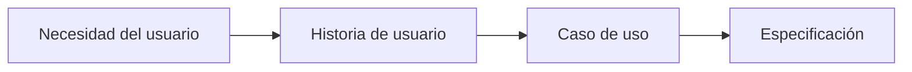

# Casos de uso como herramienta de especificación

## 🎯 Objetivos de aprendizaje

Al finalizar este capítulo podrás:

- Comprender qué problema resuelven los casos de uso.
- Diferenciar casos de uso de historias de usuario.
- Identificar actores y objetivos.
- Escribir flujos principales y alternativos.
- Utilizar casos de uso dentro de Specification Engineering.

---

## ⏱ Tiempo estimado

60 minutos.

---

# Introducción

En el capítulo anterior construimos nuestra primera especificación.

Definimos:

- objetivo,
- actores,
- hechos,
- reglas,
- preguntas abiertas.

Ahora necesitamos describir algo más concreto:

> ¿Cómo interactúan los actores con el sistema?

Para eso utilizamos casos de uso.

---

# ¿Qué es un caso de uso?

Un caso de uso describe una interacción entre un actor y un sistema para alcanzar un objetivo.

Su estructura básica es:

```text
Actor

↓

Acción

↓

Sistema

↓

Resultado esperado
```

Ejemplo:

```text
Un estudiante agrega un curso a favoritos.

El sistema registra la relación.

El curso aparece en su lista personal.
```

---

# Caso de uso vs Historia de usuario

Estos conceptos suelen confundirse.

## Historia de usuario

Normalmente utilizada en metodologías ágiles.

Ejemplo:

```
Como estudiante,
quiero guardar cursos favoritos,
para poder encontrarlos rápidamente.
```

Su objetivo es expresar una necesidad.

---

## Caso de uso

Describe la interacción completa.

Incluye:

- actor,
- precondiciones,
- flujo principal,
- alternativas,
- errores,
- resultado final.

---

# ¿Cuál utilizar?

No son conceptos opuestos.

Se complementan.

Podemos verlo así:



La historia expresa intención.

El caso de uso describe comportamiento.

---

# Anatomía de un caso de uso

Un caso de uso profesional suele contener:

```text
Nombre

Actor principal

Objetivo

Precondiciones

Flujo principal

Flujos alternativos

Excepciones

Resultado esperado
```

---

# Caso de estudio — AI Academy

Seguimos trabajando sobre:

> Los estudiantes pueden marcar cursos como favoritos.

Ahora crearemos nuestro primer caso de uso.

---

# Caso de uso: Agregar curso a favoritos

## Nombre

Agregar curso a favoritos.

---

## Actor principal

Estudiante.

---

## Objetivo

Permitir que un estudiante guarde un curso para consultarlo posteriormente.

---

## Precondiciones

- El estudiante debe estar autenticado.
- El curso debe existir.

---

## Flujo principal

```text
1. El estudiante visualiza un curso.

2. Selecciona la opción "Agregar favorito".

3. El sistema verifica que el usuario tenga permisos.

4. El sistema registra el favorito.

5. El sistema confirma la operación.

6. El curso aparece en favoritos.
```

---

# Flujos alternativos

## Caso: Curso ya agregado

```text
1. El estudiante intenta agregar un curso.

2. El sistema detecta que ya existe.

3. El sistema mantiene el estado actual.

4. Informa al usuario.
```

---

## Caso: Usuario no autenticado

```text
1. El estudiante intenta agregar un favorito.

2. El sistema detecta que no existe sesión.

3. Solicita autenticación.
```

---

# Excepciones

## Curso eliminado

```text
El sistema no permite agregar cursos inexistentes.
```

---

## Error temporal

```text
Si ocurre un error inesperado,
el sistema informa al usuario
sin perder información.
```

---

# Resultado esperado

Al finalizar:

```text
El estudiante tiene el curso registrado
como favorito.
```

---

# Por qué los casos de uso son importantes para IA

Cuando trabajamos con inteligencia artificial, la calidad del contexto determina la calidad del resultado.

Comparemos.

## Poco contexto

```text
Implementa favoritos.
```

---

## Mejor contexto

```text
Implementa el caso de uso:

Actor:
Estudiante

Objetivo:
Guardar un curso como favorito

Precondiciones:
Usuario autenticado

Resultado:
Curso disponible en favoritos
```

La segunda opción reduce mucho la interpretación.

---

# Los casos de uso como contrato

Un caso de uso funciona como un contrato entre:

- negocio,
- desarrollo,
- QA,
- arquitectura,
- sistemas inteligentes.

Todos pueden entender el comportamiento esperado.

---

# 💡 Consejo AI Champion

Si una funcionalidad es difícil de explicar en un caso de uso, probablemente todavía no comprendemos completamente el problema.

La dificultad para especificar suele indicar una dificultad previa para diseñar.

---

# 🏆 Buenas prácticas

- Un caso de uso debe tener un objetivo claro.
- Debe comenzar con un actor.
- Debe describir comportamiento observable.
- Debe evitar detalles técnicos.
- Debe contemplar escenarios alternativos.

---

# ⚠️ Errores comunes

## Escribir casos de uso demasiado técnicos

Incorrecto:

```
El servicio FavoriteService ejecutará una llamada HTTP.
```

Correcto:

```
El sistema registra el favorito.
```

---

## Crear casos de uso gigantes

Un caso de uso debe representar un objetivo concreto.

---

## Ignorar errores

Los escenarios negativos son parte del comportamiento.

---

# Relación con SDD

Más adelante, cuando trabajemos con Specification-Driven Development, estos casos de uso serán una fuente directa para:

- generar tareas,
- crear criterios de aceptación,
- construir pruebas,
- guiar agentes.

---

# Conceptos clave

- Los casos de uso describen interacción.
- Las historias expresan intención.
- La especificación define comportamiento.
- Los casos alternativos son parte del diseño funcional.
- Un buen caso de uso reduce ambigüedad.

---

# Resumen

Los casos de uso permiten transformar una idea general en una descripción concreta de comportamiento.

Son una herramienta fundamental dentro de Specification Engineering porque crean un lenguaje común entre personas y sistemas inteligentes.

---

# 📝 Ejercicios

1. Explica la diferencia entre historia de usuario y caso de uso.
2. Crea un caso de uso para "Eliminar curso de favoritos".
3. Identifica tres escenarios alternativos para una compra online.
4. Analiza una funcionalidad de tu trabajo y escribe su caso de uso.
5. Evalúa si un caso de uso podría ser utilizado como contexto para una IA.

---

# 🎯 Desafío

Selecciona una funcionalidad real.

Crea:

- actor,
- objetivo,
- precondiciones,
- flujo principal,
- tres escenarios alternativos,
- resultado esperado.

Luego utiliza una IA y pregunta:

"¿Qué información falta para que puedas implementar correctamente este caso de uso?"

Analiza las respuestas.

---

# Evolución del caso de estudio

## Estado actual

✅ Especificación inicial creada.

✅ Actores identificados.

✅ Reglas iniciales definidas.

✅ Primer caso de uso creado:

**UC-001 - Agregar curso a favoritos**

## Próximo capítulo

Convertiremos los casos de uso en **reglas de negocio formales**, separando claramente comportamiento, restricciones y decisiones del negocio.
