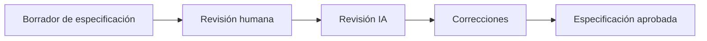

# Revisión y validación de especificaciones

## 🎯 Objetivos de aprendizaje

Al finalizar este capítulo podrás:

- Comprender por qué una especificación debe revisarse.
- Aplicar técnicas de validación.
- Detectar ambigüedades e inconsistencias.
- Utilizar IA como asistente de revisión.
- Crear un proceso repetible de Specification Review.

---

## ⏱ Tiempo estimado

75 minutos.

---

# Introducción

Una especificación es un artefacto vivo.

No nace perfecta.

Evoluciona mediante conversaciones, preguntas y revisiones.

Un error común es asumir:

```
Documento escrito

↓

Documento correcto
```

Esto rara vez ocurre.

Una especificación puede contener:

- información incompleta,
- contradicciones,
- supuestos ocultos,
- reglas faltantes.

Por eso necesita revisión.

---

# ¿Qué significa validar una especificación?

Validar significa responder:

> ¿Esta especificación representa correctamente el comportamiento esperado?

No significa revisar gramática.

Significa revisar conocimiento.

---

# Tipos de revisión

Existen diferentes perspectivas.

---

# Revisión funcional

Pregunta:

```
¿El comportamiento descrito resuelve
la necesidad del usuario?
```

Ejemplo:

```
El usuario puede guardar favoritos.
```

Pregunta:

```
¿También necesita eliminarlos?
```

---

# Revisión de negocio

Pregunta:

```
¿Las reglas reflejan realmente
las políticas del negocio?
```

Ejemplo:

```
Máximo 100 favoritos.
```

Pregunta:

```
¿Por qué 100?
¿Está definido por negocio?
```

---

# Revisión técnica

Pregunta:

```
¿La especificación es implementable?
```

Importante:

No decide tecnología.

Busca detectar imposibilidades.

---

# Revisión de calidad

Pregunta:

```
¿Podemos verificar que está correcto?
```

Ejemplo:

```
El sistema debe ser rápido.
```

Problema:

No es medible.

---

# Checklist de validación

Una revisión básica puede comenzar con preguntas.

---

## Claridad

```
¿Todos entienden lo mismo?
```

---

## Completitud

```
¿Falta información importante?
```

---

## Consistencia

```
¿Existen contradicciones?
```

---

## Verificabilidad

```
¿Podemos comprobar el comportamiento?
```

---

## Independencia técnica

```
¿Está separada la solución del problema?
```

---

# Caso de estudio — AI Academy

Revisemos nuestra especificación de favoritos.

---

## Problema encontrado 1

Especificación:

```
Los usuarios pueden guardar favoritos.
```

Pregunta:

```
¿Qué usuarios?
```

Corrección:

```
Los estudiantes autenticados pueden gestionar favoritos.
```

---

## Problema encontrado 2

Especificación:

```
Los favoritos se mantienen.
```

Pregunta:

```
¿Durante cuánto tiempo?
```

Corrección:

```
Los favoritos permanecen asociados
al estudiante mientras la cuenta exista.
```

---

## Problema encontrado 3

Especificación:

```
La operación debe ser rápida.
```

Pregunta:

```
¿Qué significa rápida?
```

Corrección:

```
La operación debe responder dentro
del objetivo definido de rendimiento.
```

---

# Usando IA como Specification Reviewer

Una IA puede actuar como un revisor.

Pero debemos darle el rol correcto.

Un mal prompt:

```
Mejora esta especificación.
```

La IA probablemente reescribirá texto.

---

Un buen prompt:

```
Actúa como un Specification Reviewer senior.

Analiza la siguiente especificación.

Busca:

- ambigüedades,
- información faltante,
- contradicciones,
- reglas no definidas,
- casos límite no considerados.

No propongas implementación.

Solo genera observaciones.
```

---

# La IA como crítico, no como generador

Este punto es fundamental.

Muchas personas utilizan IA únicamente para producir contenido.

Pero una de sus mayores capacidades es revisar.

Ejemplos:

- encontrar inconsistencias,
- cuestionar supuestos,
- generar preguntas.

---

# Flujo recomendado

Podemos representarlo así:



---

# Specification Review Loop

En equipos maduros podemos repetir:

```text
Crear

↓

Revisar

↓

Encontrar problemas

↓

Corregir

↓

Validar nuevamente
```

Hasta alcanzar suficiente confianza.

---

# 💡 Consejo AI Champion

Una IA es especialmente valiosa cuando hace preguntas que nosotros olvidamos hacer.

No la uses solamente para escribir.

Úsala para pensar.

---

# 🏆 Buenas prácticas

- Revisar antes de desarrollar.
- Usar diferentes perspectivas.
- Documentar decisiones.
- Mantener visibles las dudas.
- Hacer revisiones periódicas.

---

# ⚠️ Errores comunes

## Pedir a la IA que "complete" la especificación

Puede inventar información.

---

## No diferenciar revisión de diseño

Primero validar el problema.

Después diseñar la solución.

---

## Confiar completamente en la IA

La revisión humana sigue siendo necesaria.

---

# Relación con SDD

Este proceso será fundamental en SDD.

Antes de que una especificación genere:

- tareas,
- código,
- pruebas,

debe pasar una etapa de validación.

La calidad de la entrada determina la calidad de la salida.

---

# Conceptos clave

- Una especificación necesita revisión.
- Revisar significa encontrar riesgos.
- IA puede actuar como analista crítico.
- La revisión debe ser repetible.
- Validar antes de implementar reduce retrabajo.

---

# Resumen

Una especificación profesional no se escribe una vez.

Se construye mediante iteraciones.

La revisión transforma un documento inicial en un artefacto confiable que puede servir como base para desarrollo humano o asistido por IA.

---

# 📝 Ejercicios

1. Revisa una especificación existente y encuentra ambigüedades.
2. Crea un checklist propio de revisión.
3. Utiliza IA como Specification Reviewer.
4. Compara una revisión humana contra una revisión IA.
5. Identifica supuestos ocultos en un requerimiento.

---

# 🎯 Desafío

Toma la especificación completa de AI Academy - Favoritos.

Solicita a una IA:

```
Analiza esta especificación como un arquitecto senior.

No escribas código.

Encuentra todos los puntos donde un equipo podría interpretar algo diferente.
```

Clasifica los hallazgos en:

- corregidos,
- pendientes,
- decisiones futuras.

---

# Evolución del caso de estudio

## Estado actual

✅ Especificación inicial.

✅ Casos de uso.

✅ Reglas de negocio.

✅ Criterios de aceptación.

✅ Escenarios alternativos.

✅ Restricciones.

✅ Primera revisión formal.

## Nuevo artefacto

Specification Review Checklist.

## Próximo capítulo

Aprenderemos cómo transformar una especificación revisada en un documento preparado para equipos de desarrollo, conectando análisis, arquitectura y ejecución.
