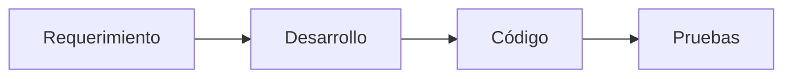
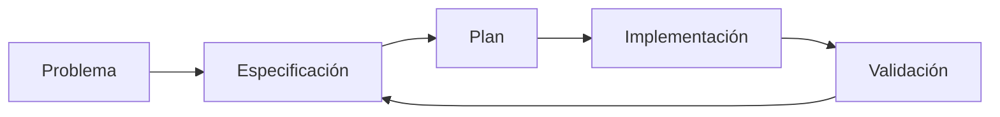
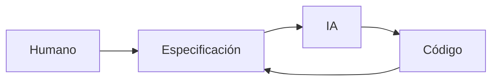

# Introducción a Specification-Driven Development

## 🎯 Objetivos de aprendizaje

Al finalizar este capítulo podrás:

- Comprender qué problema intenta resolver SDD.
- Diferenciar desarrollo tradicional y desarrollo basado en especificaciones.
- Entender por qué SDD es relevante en la era de la IA.
- Comprender el rol de la especificación como fuente de verdad.

---

# Introducción

Durante décadas el desarrollo de software siguió un patrón similar:

```
Requerimiento

↓

Diseño

↓

Código

↓

Pruebas
```

Este modelo funcionó durante mucho tiempo.

Pero la llegada de sistemas de IA capaces de generar código cambia una parte importante del proceso.

Ahora podemos producir código mucho más rápido.

La nueva pregunta es:

> ¿Cómo aseguramos que el código generado sea correcto?

---

# El problema actual

Imaginemos este escenario:

Un desarrollador pide:

```
Crea una funcionalidad para gestionar favoritos.
```

Una IA puede generar:

- componentes,
- servicios,
- APIs,
- tests.

Pero todavía existen preguntas:

- ¿Quién puede usarlo?
- ¿Qué reglas existen?
- ¿Qué casos límite hay?
- ¿Qué significa exactamente "gestionar"?

El problema no es generar código.

El problema es definir correctamente qué código necesitamos.

---

# El cuello de botella cambia

Antes:

```
Escribir código era lento.

↓

Necesitábamos acelerar implementación.
```

Ahora:

```
Generar código es rápido.

↓

Necesitamos mejorar definición y validación.
```

---

# Aparece Specification-Driven Development

SDD propone cambiar el centro del proceso.

En lugar de:

```
Código como fuente principal
```

pasamos a:

```
Especificación como fuente principal
```

---

# Modelo tradicional



---

# Modelo SDD



La especificación acompaña todo el ciclo.

---

# ¿Qué significa "Driven"?

Driven significa:

> Guiado por.

No significa que:

- la IA escribe todo,
- desaparecen los desarrolladores,
- no existe diseño.

Significa que las decisiones se toman basadas en una definición explícita del comportamiento esperado.

---

# Los principios de SDD

## 1. La intención debe ser explícita

El sistema debe conocer:

- objetivo,
- reglas,
- restricciones.

---

## 2. La ambigüedad debe reducirse antes del código

Las preguntas importantes aparecen antes.

No después.

---

## 3. La implementación debe poder rastrearse

Debemos responder:

```
¿Por qué existe este código?
```

La respuesta debe estar en la especificación.

---

## 4. La validación forma parte del proceso

No basta generar.

Hay que comprobar.

---

# SDD y desarrollo tradicional

No reemplaza ingeniería tradicional.

La complementa.

Seguimos necesitando:

- arquitectura,
- diseño,
- experiencia técnica,
- revisión humana.

---

# SDD y desarrollo con IA

Aquí aparece su mayor valor.

Una IA funciona mejor cuando recibe:

- contexto,
- restricciones,
- objetivos claros.

Una especificación proporciona exactamente eso.

---

# Ejemplo

## Prompt tradicional

```
Crea un sistema de favoritos.
```

Resultado:

La IA debe imaginar demasiado.

---

## Enfoque SDD

```
Implementa SPEC-001.

Contexto:

Actor:
Estudiante autenticado.

Reglas:
BR-001.

Criterios:
AC-001.

Restricciones:
RNF-001.
```

La IA tiene límites claros.

---

# SDD como puente entre humanos e IA

Podemos verlo así:



El humano mantiene intención.

La IA acelera ejecución.

---

# El papel del desarrollador cambia

No desaparece.

Evoluciona.

Antes:

```
Escribir código principalmente.
```

Ahora:

```
Definir intención.

Diseñar solución.

Supervisar generación.

Validar resultado.
```

---

# 💡 Consejo AI Champion

La ventaja competitiva en desarrollo con IA no será escribir más líneas de código.

Será poder transformar problemas ambiguos en especificaciones claras.

---

# Relación con OpenSpec y SpecKit

Herramientas como:

- OpenSpec.
- SpecKit.

intentan formalizar este enfoque.

Pero antes de utilizarlas necesitamos comprender el concepto.

Una herramienta no reemplaza una disciplina.

---

# Conceptos clave

- SDD significa desarrollo guiado por especificaciones.
- La especificación se convierte en fuente de verdad.
- La IA necesita contexto estructurado.
- La validación humana continúa siendo esencial.
- El desarrollo cambia de escribir a dirigir.

---

# Resumen

Specification-Driven Development propone colocar la especificación en el centro del proceso.

En la era de la IA, donde generar código es cada vez más sencillo, la capacidad crítica será definir correctamente qué debe construirse.

---

# Ejercicios

1. Explica la diferencia entre desarrollo tradicional y SDD.
2. Analiza una funcionalidad y crea su especificación mínima.
3. Identifica qué información una IA necesita antes de generar código.
4. Explica por qué SDD no elimina al desarrollador.

---

# Desafío AI Champion

Toma una funcionalidad real y realiza dos experimentos:

Experimento A:

```
Solicita implementación directamente a una IA.
```

Experimento B:

```
Primero crea una especificación.

Luego solicita implementación.
```

Compara:

- preguntas realizadas,
- calidad del resultado,
- cantidad de correcciones necesarias.
