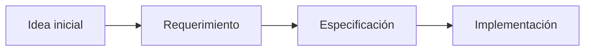

# De requerimientos a especificaciones

## 🎯 Objetivos de aprendizaje

Al finalizar este capítulo podrás:

- Comprender la diferencia entre requerimiento y especificación.
- Identificar problemas en requerimientos ambiguos.
- Aplicar un proceso de refinamiento progresivo.
- Preparar información adecuada para desarrollo asistido por IA.

---

# Introducción

Todo sistema comienza con una idea.

Normalmente llega en forma de:

- una conversación,
- un mensaje,
- un ticket,
- una reunión,
- una necesidad del negocio.

Ejemplo:

```
Necesitamos agregar favoritos a los cursos.
```

Parece claro.

Pero realmente contiene muchas preguntas.

---

# El problema de los requerimientos iniciales

Un requerimiento inicial suele estar incompleto.

Ejemplo:

```
Agregar favoritos.
```

Preguntas:

```
¿Quién puede agregar?

¿Todos los usuarios?

¿Existe límite?

¿Se pueden eliminar?

¿Los favoritos son privados?

¿Qué ocurre si el curso desaparece?
```

La información importante todavía no existe.

---

# Requerimiento vs especificación

## Requerimiento

Representa una necesidad.

Ejemplo:

```
Los usuarios quieren guardar cursos.
```

---

## Especificación

Representa comportamiento definido.

Ejemplo:

```
Los estudiantes autenticados pueden guardar cursos.

Cada estudiante administra únicamente sus favoritos.

Los cursos eliminados dejan de estar disponibles.
```

---

# El proceso de refinamiento

Podemos verlo como una reducción de incertidumbre.



Cada etapa agrega precisión.

---

# Nivel 1 — Intención

Ejemplo:

```
Queremos mejorar la experiencia del estudiante.
```

Todavía es muy amplio.

---

# Nivel 2 — Necesidad concreta

Ejemplo:

```
Los estudiantes necesitan guardar cursos
que desean realizar posteriormente.
```

Ahora entendemos el problema.

---

# Nivel 3 — Comportamiento esperado

Ejemplo:

```
Un estudiante autenticado puede agregar
y eliminar cursos favoritos.
```

Tenemos una funcionalidad.

---

# Nivel 4 — Especificación completa

Agregamos:

- reglas,
- escenarios,
- restricciones,
- criterios.

Ahora tenemos un contrato.

---

# SDD empieza antes del código

Un error común es pensar:

```
SDD = generar código desde una especificación.
```

Es incompleto.

El verdadero proceso comienza antes:

```
Comprender problema

↓

Definir comportamiento

↓

Validar intención

↓

Implementar
```

---

# Caso de estudio — AI Academy

Recordemos nuestro ejemplo.

## Requerimiento inicial

```
Agregar favoritos.
```

---

## Primera pregunta

¿Quién?

Respuesta:

```
Estudiantes autenticados.
```

---

## Segunda pregunta

¿Qué significa favorito?

Respuesta:

```
Una relación entre estudiante y curso.
```

---

## Tercera pregunta

¿Qué reglas existen?

Respuesta:

```
Un estudiante solo administra sus propios favoritos.
```

---

## Cuarta pregunta

¿Cómo verificamos?

Respuesta:

```
Criterios de aceptación.
```

---

Resultado:

```text
SPEC-001

Favoritos de cursos

Actor:
Estudiante autenticado

Objetivo:
Guardar cursos para consulta futura

Reglas:
BR-001

Casos:
UC-001

Validación:
AC-001
```

---

# ¿Por qué esto es crítico con IA?

Porque la IA amplifica la información recibida.

Si recibe:

```
Crear favoritos.
```

generará una solución basada en supuestos.

---

Si recibe:

```
Implementar SPEC-001.

Objetivo:
Guardar cursos.

Actor:
Estudiante autenticado.

Reglas:
BR-001.

Criterios:
AC-001.
```

trabaja dentro de límites conocidos.

---

# El concepto de contexto suficiente

Una pregunta clave en SDD:

> ¿La especificación contiene suficiente información para comenzar?

No significa que tenga todos los detalles técnicos.

Significa que reduce la incertidumbre relevante.

---

# Señales de una mala especificación

## Muchos "debería"

Ejemplo:

```
El sistema debería ser rápido.
```

Pregunta:

¿Qué significa rápido?

---

## Verbos ambiguos

Ejemplo:

```
Gestionar favoritos.
```

¿Qué operaciones incluye?

---

## Reglas implícitas

Ejemplo:

```
Solo usuarios autorizados.
```

¿Quién define autorizado?

---

# Specification First Thinking

El cambio mental es:

Antes:

```
Tengo una tarea.

Voy a programarla.
```

Después:

```
Tengo un problema.

Voy a especificarlo.

Luego decidiré cómo implementarlo.
```

---

# SDD y equipos profesionales

Este enfoque mejora la colaboración:

## Producto

Puede validar intención.

## Desarrollo

Tiene claridad.

## QA

Tiene criterios.

## IA

Tiene contexto.

---

# 💡 Consejo AI Champion

Antes de preguntarle a una IA:

"¿Cómo lo implemento?"

pregunta:

"¿Está suficientemente definido qué debo implementar?"

---

# Buenas prácticas

- Refinar antes de construir.
- Hacer preguntas tempranas.
- Separar intención de solución.
- Mantener trazabilidad.
- Documentar decisiones.

---

# Relación con OpenSpec y SpecKit

Estas herramientas no inventan el proceso.

Formalizan algo que ya vimos:

```
Idea

↓

Especificación estructurada

↓

Plan

↓

Implementación
```

La herramienta ayuda a mantener disciplina.

---

# Conceptos clave

- Los requerimientos iniciales suelen ser incompletos.
- Una especificación reduce incertidumbre.
- SDD empieza antes del código.
- La IA necesita contexto estructurado.
- Refinar preguntas es parte del desarrollo.

---

# Ejercicio

Toma estos requerimientos:

```
Crear perfiles de usuario.

Agregar pagos.

Implementar notificaciones.
```

Para cada uno:

1. Identifica preguntas faltantes.
2. Define actores.
3. Escribe una especificación mínima.

---

# Desafío AI Champion

Elige una tarea real de desarrollo.

Primero pregúntale a una IA:

```
Implementa esta tarea.
```

Luego:

1. Crea una especificación.
2. Entrega la especificación.
3. Compara resultados.

Analiza:

- cantidad de preguntas,
- calidad del código,
- correcciones necesarias.
