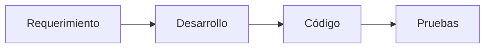
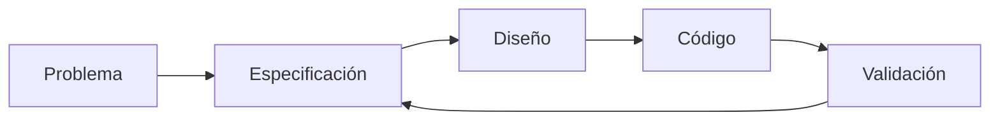
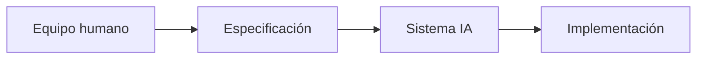

# ¿Qué es Specification-Driven Development?

## 🎯 Objetivos de aprendizaje

Al finalizar este capítulo podrás:

- Definir correctamente qué es SDD.
- Diferenciar SDD de otras prácticas de desarrollo.
- Entender la relación entre especificación, código y validación.
- Identificar cuándo SDD aporta mayor valor.
- Comprender su importancia en desarrollo asistido por IA.

---

# Introducción

Durante muchos años el código fue considerado la principal fuente de verdad de un sistema.

La lógica era:

```
Código

↓

Documentación

↓

Conocimiento del sistema
```

Si alguien quería entender cómo funcionaba algo, debía leer el código.

---

# El problema de este modelo

El código responde:

> ¿Cómo funciona actualmente?

Pero no siempre responde:

> ¿Por qué existe?

o:

> ¿Qué intención original tenía?

Ejemplo:

```javascript
if(user.role === "ADMIN"){
   allow();
}
```

El código dice qué ocurre.

Pero no explica:

- por qué existe esa regla,
- qué problema resuelve,
- qué escenarios contempla.

---

# La idea central de SDD

Specification-Driven Development cambia la dirección:

```
Intención

↓

Especificación

↓

Código

↓

Validación
```

La especificación se convierte en la fuente principal de intención.

---

# Definición

Podemos definir SDD como:

> Un enfoque de desarrollo donde las especificaciones explícitas guían la planificación, implementación y validación del software.

La palabra importante es:

**guían**.

La especificación no reemplaza el código.

Lo dirige.

---

# SDD no es documentación tradicional

Una diferencia importante.

Documentación tradicional:

```
Código

↓

Documento explicativo
```

Muchas veces termina desactualizada.

---

SDD:

```
Especificación

↓

Implementación

↓

Validación contra especificación
```

La especificación participa activamente.

---

# Comparación con desarrollo tradicional

## Modelo tradicional



El código suele convertirse en la referencia final.

---

## Modelo SDD



La especificación permanece en el ciclo.

---

# SDD y Agile

Es importante aclarar:

SDD no reemplaza Agile.

Puede convivir con:

- Scrum,
- Kanban,
- iteraciones ágiles.

---

Ejemplo:

Sprint tradicional:

```
Historia de usuario

↓

Desarrollo

↓

Review
```

---

Sprint con SDD:

```
Historia

↓

Especificación

↓

Plan técnico

↓

Implementación

↓

Validación
```

---

# SDD y TDD

También suele confundirse.

## TDD

Test Driven Development.

Pregunta:

> ¿Qué comportamiento debe validar una prueba?

Flujo:

```
Test

↓

Código

↓

Refactor
```

---

## SDD

Pregunta:

> ¿Qué debe construir el sistema?

Flujo:

```
Especificación

↓

Diseño

↓

Código

↓

Pruebas
```

---

Se complementan.

Podemos verlo:

```text
SDD define intención.

TDD valida comportamiento.
```

---

# SDD y BDD

Behavior Driven Development también está relacionado.

BDD utiliza lenguaje de comportamiento:

```
Given

When

Then
```

SDD puede incorporar BDD como parte de la especificación.

Ejemplo:

```
Especificación

↓

Criterios de aceptación

↓

Escenarios BDD

↓

Tests
```

---

# SDD y DDD

Domain Driven Design busca:

- comprender el dominio,
- modelar conceptos,
- usar lenguaje común.

SDD comparte una idea:

> El conocimiento del dominio debe ser explícito.

La diferencia:

DDD se enfoca en modelar dominio.

SDD se enfoca en guiar desarrollo mediante especificaciones.

---

# La llegada de la IA cambia la importancia de SDD

Antes:

Un desarrollador podía compensar una mala especificación conversando con:

- producto,
- usuarios,
- equipo.

Ahora una IA puede generar grandes cantidades de código rápidamente.

Pero:

Código rápido + intención incorrecta

=

Problema más rápido.

---

# La paradoja de la IA

La IA aumenta la capacidad de ejecución.

Pero aumenta la necesidad de claridad.

Podemos expresarlo:

```
Más capacidad generativa

↓

Más importancia de la definición
```

---

# SDD como lenguaje entre humanos e IA

La especificación funciona como interfaz.



La especificación es el punto común.

---

# Principios fundamentales de SDD

## 1. La intención debe ser explícita

No depender de conversaciones perdidas.

---

## 2. La ambigüedad debe resolverse temprano

Preguntar antes de construir.

---

## 3. Las decisiones importantes deben quedar registradas

Evitar conocimiento oculto.

---

## 4. El resultado debe validarse contra la intención

No solamente contra compilación.

---

## 5. La intervención humana es necesaria

La IA ejecuta.

El humano decide.

---

# Human-in-the-middle

Este concepto será central en AI Champion.

SDD no propone:

```
Humano

↓

IA

↓

Código automático
```

Propone:

```
Humano define intención

↓

IA ayuda a transformar

↓

Humano valida decisiones

↓

Sistema evoluciona
```

---

# ¿Dónde aporta más valor SDD?

Especialmente en:

- sistemas complejos,
- equipos grandes,
- mantenimiento de software,
- desarrollo con agentes IA,
- productos con muchas reglas.

---

# ¿Dónde aporta menos?

Ejemplos:

- scripts pequeños,
- prototipos rápidos,
- experimentos temporales.

No todo necesita una especificación formal.

---

# 💡 Consejo AI Champion

La pregunta no es:

"¿Debemos especificar todo?"

La pregunta correcta es:

"¿Qué partes del sistema necesitan que la intención permanezca clara?"

---

# Conceptos clave

- SDD coloca la especificación en el centro.
- No reemplaza Agile, TDD o DDD.
- La especificación representa intención.
- La IA aumenta la necesidad de claridad.
- El humano sigue siendo responsable de decisiones.

---

# Ejercicio

Compara:

## Caso A

```
Ticket:
Agregar pagos.
```

## Caso B

```
Especificación:
Actores.
Reglas.
Escenarios.
Criterios.
Restricciones.
```

Responde:

1. ¿Cuál puede implementar mejor una IA?
2. ¿Cuál genera menos preguntas?
3. ¿Cuál facilita testing?

---

# Desafío AI Champion

Selecciona una funcionalidad compleja.

Analiza:

- qué información actualmente está solo en la cabeza del equipo,
- qué conocimiento debería convertirse en especificación,
- qué parte podría ser utilizada por agentes IA.

---

# Próximo capítulo

## SDD Workflow

Veremos el ciclo completo:

```
Idea

↓

Specification

↓

Planning

↓

Implementation

↓

Review

↓

Validation
```

y cómo se aplica en un equipo real.
