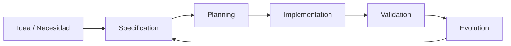
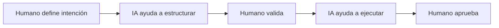

# Flujo de trabajo SDD

## 🎯 Objetivos de aprendizaje

Al finalizar este capítulo podrás:

- Comprender el ciclo completo de SDD.
- Identificar las etapas del proceso.
- Saber qué artefactos se producen en cada fase.
- Entender dónde intervienen humanos e IA.
- Preparar un flujo SDD aplicable a equipos reales.

---

# Introducción

SDD no es solamente una forma de escribir documentos.

Es un flujo de trabajo.

Define cómo una idea evoluciona hasta convertirse en software funcionando.

El ciclo completo es:

```text
Idea

↓

Especificación

↓

Planificación

↓

Implementación

↓

Validación

↓

Evolución
```

---

# Vista general del flujo



La especificación acompaña todo el ciclo.

---

# Fase 1 — Idea / Necesidad

Todo comienza con una necesidad.

Ejemplo:

```
Los estudiantes necesitan guardar cursos
para revisarlos después.
```

En esta etapa todavía existe mucha incertidumbre.

---

## Objetivo

Comprender:

- problema,
- usuario,
- contexto.

---

## Artefactos

Ejemplos:

```
Idea inicial.

Problema identificado.

Objetivo de negocio.
```

---

## Participación humana

Alta.

La IA puede ayudar a explorar, pero la intención pertenece al negocio.

---

# Fase 2 — Specification

Aquí transformamos la necesidad en conocimiento estructurado.

Creamos:

```
SPEC-001

Favoritos de cursos
```

Incluye:

- objetivo,
- actores,
- casos de uso,
- reglas,
- criterios,
- restricciones.

---

## Objetivo

Eliminar ambigüedad.

---

## Pregunta clave

Antes:

```
¿Qué queremos construir?
```

Después:

```
¿Qué comportamiento debe cumplir?
```

---

# Fase 3 — Specification Review

Antes de construir, revisamos.

Buscamos:

- inconsistencias,
- información faltante,
- riesgos.

---

Ejemplo:

Especificación:

```
Los usuarios pueden guardar favoritos.
```

Pregunta:

```
¿Todos los usuarios?
```

Descubrimos:

```
Solo estudiantes autenticados.
```

---

## Resultado

Una especificación aprobada.

---

# Fase 4 — Planning

Ahora convertimos la especificación en trabajo ejecutable.

La pregunta cambia:

De:

```
¿Qué necesita el sistema?
```

A:

```
¿Qué debemos construir?
```

---

Ejemplo:

SPEC-001 genera:

```
TASK-001

Crear modelo Favorite.


TASK-002

Crear API.


TASK-003

Crear interfaz usuario.


TASK-004

Agregar pruebas.
```

---

# Importante

El plan no reemplaza la especificación.

El plan depende de ella.

---

# Fase 5 — Implementation

Ahora comienza el desarrollo.

Puede ser:

- humano,
- asistido por IA,
- generado por agentes.

---

La implementación debe responder:

```
¿Este código cumple la especificación?
```

---

Ejemplo:

Código:

```typescript
addFavorite(course)
```

Debe cumplir:

```
AC-001

Usuario autenticado puede agregar favorito.
```

---

# Fase 6 — Validation

La validación compara:

```
Implementación

contra

Especificación
```

---

No solamente:

```
¿Compila?
```

También:

```
¿Cumple intención?
```

---

Validamos:

- criterios de aceptación,
- pruebas,
- reglas,
- restricciones.

---

# Fase 7 — Evolution

El software cambia.

La especificación también.

Ejemplo:

Versión 1:

```
Agregar favoritos.
```

Versión 2:

```
Compartir favoritos.
```

Versión 3:

```
Listas personalizadas.
```

---

La especificación evoluciona junto al producto.

---

# El rol de la IA en cada etapa

SDD no significa IA en todo.

Cada etapa tiene un uso diferente.

---

# Idea

IA puede ayudar con:

- exploración,
- preguntas,
- análisis.

---

# Specification

IA puede ayudar con:

- detectar ambigüedades,
- sugerir escenarios,
- revisar consistencia.

---

# Planning

IA puede ayudar con:

- dividir tareas,
- estimar complejidad,
- proponer orden.

---

# Implementation

IA puede ayudar con:

- generación de código,
- refactoring,
- tests.

---

# Validation

IA puede ayudar con:

- revisión,
- comparación,
- análisis de cobertura.

---

# Modelo Human + AI

El flujo recomendado:



---

# SDD vs desarrollo tradicional

## Tradicional

```text
Ticket

↓

Código

↓

Pruebas

↓

Documentación
```

---

## SDD

```text
Ticket

↓

Especificación

↓

Plan

↓

Código

↓

Validación

↓

Especificación actualizada
```

---

# Beneficios del workflow SDD

## Menos retrabajo

Los problemas aparecen antes.

---

## Mejor colaboración

Todos comparten contexto.

---

## Mejor uso de IA

La IA recibe información estructurada.

---

## Mayor trazabilidad

Podemos responder:

```
¿Por qué existe este cambio?
```

---

# Riesgo principal

Crear burocracia.

SDD no significa escribir documentos enormes.

Significa capturar conocimiento importante.

---

# La regla de oro

Una especificación debe ser:

```
Lo suficientemente completa
para evitar ambigüedad.

Lo suficientemente simple
para mantenerse viva.
```

---

# Relación con OpenSpec y SpecKit

Las herramientas SDD normalmente automatizan partes de este flujo:

```text
Specification

↓

Change proposal

↓

Plan

↓

Tasks

↓

Implementation
```

Pero el proceso conceptual es anterior a la herramienta.

---

# 💡 Consejo AI Champion

No intentes automatizar primero.

Primero define el flujo.

Después selecciona herramientas.

---

# Conceptos clave

- SDD es un ciclo, no un documento.
- La especificación guía planificación e implementación.
- La validación compara resultado contra intención.
- IA ayuda, pero humanos mantienen responsabilidad.
- La especificación evoluciona con el producto.

---

# Ejercicio

Selecciona una funcionalidad real.

Define:

1. Idea inicial.
2. Especificación.
3. Tareas derivadas.
4. Validaciones necesarias.

---

# Desafío AI Champion

Simula un equipo:

Roles:

- Product Owner.
- Arquitecto.
- Developer.
- QA.

Entrega una misma especificación a una IA y solicita:

```
Actúa como cada rol.

Indica qué preguntas haría cada uno antes de desarrollar.
```

Compara las perspectivas.

---

# Próximo capítulo

## Specification as Source of Truth

Analizaremos un concepto fundamental:

> ¿Qué significa realmente que la especificación sea la fuente de verdad?

Y veremos cómo mantener alineados:

```
Especificación

Código

Tests

Documentación
```

en un sistema moderno asistido por IA.
