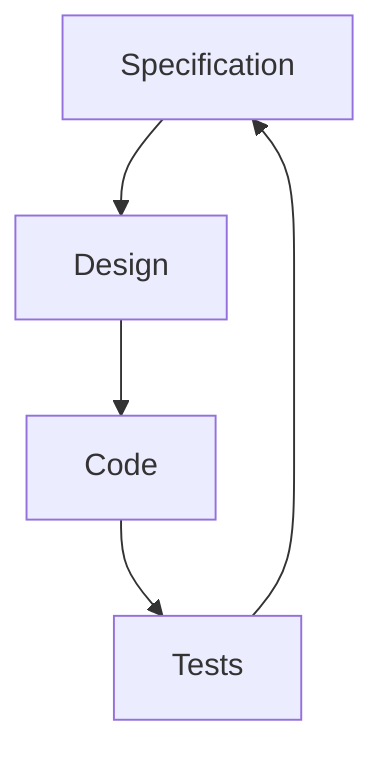

# La especificación como fuente de verdad

## 🎯 Objetivos de aprendizaje

Al finalizar este capítulo podrás:

- Comprender qué significa Source of Truth.
- Diferenciar intención, implementación y evidencia.
- Entender la relación entre especificaciones, código y pruebas.
- Identificar problemas causados por conocimiento disperso.
- Preparar una arquitectura basada en especificaciones.

---

# Introducción

En un sistema real existen muchas fuentes de información:

- documentos,
- tickets,
- código,
- pruebas,
- diagramas,
- conversaciones,
- conocimiento del equipo.

El problema aparece cuando esas fuentes dicen cosas diferentes.

---

# El problema del conocimiento distribuido

Ejemplo:

Producto dice:

```
Los usuarios premium pueden exportar reportes.
```

Código tiene:

```javascript
if(user.type === "VIP"){
   exportReport();
}
```

QA tiene:

```
Premium users can download reports.
```

Documentación:

```
Todos los usuarios pueden exportar.
```

¿Cuál es correcto?

---

# Source of Truth

Source of Truth significa:

> El lugar principal donde reside la definición oficial de una información.

En SDD:

```
La especificación define la intención.
```

---

# Pero cuidado

La especificación no reemplaza todo.

Tenemos diferentes verdades.

---

# Tres niveles de verdad

Podemos pensar en:

```text
Intención

↓

Especificación

↓

Implementación

↓

Evidencia
```

---

## Intención

¿Por qué existe?

Ejemplo:

```
Los estudiantes necesitan organizar cursos.
```

---

## Especificación

¿Qué comportamiento esperamos?

Ejemplo:

```
Un estudiante autenticado puede agregar favoritos.
```

---

## Implementación

¿Cómo fue construido?

Ejemplo:

```
Angular component + API REST + Database.
```

---

## Evidencia

¿Cómo comprobamos?

Ejemplo:

```
Tests automáticos.
```

---

# La relación correcta

No debería ser:

```
Código

↓

Explicación
```

Debe ser:

```
Especificación

↓

Implementación

↓

Pruebas
```

---

# Modelo SDD



La especificación permanece como referencia.

---

# ¿Por qué es importante con IA?

Porque una IA enfrenta el mismo problema que un nuevo integrante del equipo:

No conoce la historia.

No sabe:

- decisiones anteriores,
- reglas ocultas,
- restricciones.

---

Sin especificación:

```
Lee código.

Intenta inferir intención.
```

---

Con especificación:

```
Consulta intención explícita.
```

---

# Ejemplo

## Código existente

```typescript
if(account.status === "ACTIVE"){
   processPayment();
}
```

Preguntas:

- ¿Por qué ACTIVE?
- ¿Qué otros estados existen?
- ¿Quién decidió esto?

---

## Con especificación

```
BR-005

Solo cuentas activas pueden realizar pagos.

Estados posibles:

ACTIVE
BLOCKED
CLOSED
```

Ahora existe contexto.

---

# La especificación como memoria del sistema

Este concepto será importante para agentes.

Un agente necesita memoria.

Pero la memoria debe tener estructura.

La especificación puede funcionar como:

```
Memoria de intención del sistema.
```

---

# Repositorio de especificaciones

Un enfoque posible:

```text
project/

├── src/

├── tests/

├── docs/

└── specs/

    ├── users/

    ├── payments/

    └── orders/
```

---

Ejemplo:

```text
specs/payments/payment-processing.md
```

Contiene:

- objetivo,
- reglas,
- escenarios,
- restricciones.

---

# Versionamiento

La especificación debe evolucionar con el código.

Ejemplo:

```
SPEC-001 v1

Crear favorito


SPEC-001 v2

Agregar categorías


SPEC-001 v3

Compartir favoritos
```

---

# Relación con Git

La especificación debería formar parte del ciclo:

```text
Commit

+

Código

+

Cambio de especificación
```

---

Ejemplo:

Commit:

```
feat(favorites):

Add favorite sharing
```

Incluye:

```
specs/favorites/share-favorites.md
```

---

# Trazabilidad

Uno de los grandes beneficios:

Poder responder:

```
¿Por qué existe este cambio?
```

Flujo:

```
Requirement

↓

Specification

↓

Task

↓

Commit

↓

Test
```

---

# Specification Drift

Un problema común:

La especificación dice una cosa.

El código hace otra.

Ejemplo:

Especificación:

```
Máximo 100 favoritos.
```

Código:

```
Permite ilimitados.
```

Esto es:

> Specification Drift.

---

# Cómo evitarlo

## Revisiones

Comparar código contra especificación.

---

## Tests derivados

Crear pruebas desde criterios.

---

## Automatización

Integrar validaciones en CI/CD.

---

# SDD y documentación tradicional

No buscamos más documentos.

Buscamos documentos útiles.

Una buena especificación:

- vive cerca del código,
- cambia con el sistema,
- tiene propósito operativo.

---

# 💡 Consejo AI Champion

El mayor problema de muchos sistemas no es la falta de código.

Es la pérdida de contexto.

SDD intenta conservar ese contexto.

---

# Buenas prácticas

- Versionar especificaciones.
- Mantenerlas junto al proyecto.
- Relacionarlas con cambios.
- Evitar duplicación.
- Actualizarlas cuando cambia comportamiento.

---

# Errores comunes

## Crear specs gigantes

Deben ser navegables.

---

## Escribirlas una sola vez

Una especificación vieja pierde valor.

---

## Confundir documentación con especificación

La documentación explica.

La especificación define.

---

# Conceptos clave

- Source of Truth significa referencia oficial.
- La especificación representa intención.
- Código representa implementación.
- Tests representan evidencia.
- La alineación entre ellos evita drift.

---

# Ejercicio

Analiza un proyecto existente.

Identifica:

1. ¿Dónde está actualmente la intención?
2. ¿Existe documentación?
3. ¿Existe trazabilidad?
4. ¿Qué información solo vive en personas?

---

# Desafío AI Champion

Selecciona un módulo de software.

Crea:

```
specs/

module-name.md
```

Incluye:

- objetivo,
- reglas,
- escenarios,
- restricciones.

Luego pregunta a una IA:

```
Usa solamente esta especificación.

Explica qué comportamiento debería tener el módulo.
```

Evalúa si la IA entiende correctamente.

---

# Próximo capítulo

## Human-in-the-middle

Estudiaremos un concepto central de AI Champion:

> Cómo diseñar procesos donde humanos y agentes IA colaboran sin perder control ni calidad.
