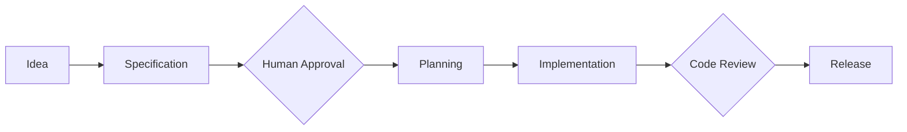

# Human-in-the-middle

## 🎯 Objetivos de aprendizaje

Al finalizar este capítulo podrás:

- Comprender el concepto Human-in-the-middle.
- Diferenciar automatización completa de colaboración humano-IA.
- Identificar puntos donde la intervención humana agrega valor.
- Diseñar workflows SDD con controles adecuados.
- Entender su importancia en sistemas basados en agentes.

---

# Introducción

La llegada de agentes IA capaces de:

- analizar código,
- crear planes,
- modificar archivos,
- ejecutar herramientas,

genera una nueva pregunta:

> ¿Hasta dónde debería actuar un agente sin supervisión?

La respuesta de AI Champion es:

> Automatizar la ejecución, mantener humana la intención y las decisiones críticas.

---

# Dos extremos posibles

Existen dos modelos extremos.

---

# Modelo 1 — Automatización total

```text
Usuario

↓

IA

↓

Código en producción
```

Ventajas:

- rapidez,
- poca intervención.

Problemas:

- decisiones incorrectas,
- falta de contexto,
- errores difíciles de detectar.

---

# Modelo 2 — Sin automatización

```text
Humano

↓

Humano

↓

Humano
```

Ventajas:

- máximo control.

Problemas:

- lento,
- difícil de escalar.

---

# Modelo recomendado

Human-in-the-middle:

```text
Humano define intención

↓

IA analiza y propone

↓

Humano valida

↓

IA ejecuta

↓

Humano verifica resultado
```

---

# ¿Qué significa "middle"?

No significa que el humano esté entre cada línea de código.

Significa que existe en los puntos donde se toman decisiones.

---

# El humano como diseñador de intención

La primera responsabilidad humana es:

Definir:

- problema,
- objetivos,
- restricciones,
- prioridades.

Ejemplo:

Incorrecto:

```
Crea una pantalla de favoritos.
```

Mejor:

```
Implementar SPEC-001.

Objetivo:
Permitir estudiantes guardar cursos.

Restricciones:
Solo usuarios autenticados.
```

---

# La IA como amplificador

La IA puede ayudar a:

- explorar soluciones,
- generar código,
- crear pruebas,
- analizar alternativas.

Pero no debería decidir:

- objetivos de negocio,
- reglas críticas,
- cambios arquitectónicos importantes.

---

# Puntos de control humanos

Un workflow SDD puede definir checkpoints.

Ejemplo:



---

# Punto de control 1 — Specification Approval

Antes de desarrollar:

Preguntas:

```
¿El problema está correctamente entendido?

¿Las reglas son correctas?

¿Falta información?
```

---

# Punto de control 2 — Planning Approval

Antes de ejecutar:

Preguntas:

```
¿Las tareas generadas tienen sentido?

¿El enfoque técnico es correcto?
```

---

# Punto de control 3 — Implementation Review

Antes de integrar:

Preguntas:

```
¿El código cumple la intención?

¿Existen riesgos?
```

---

# Punto de control 4 — Release Approval

Antes de producción:

Preguntas:

```
¿El cambio es seguro?

¿Cumple restricciones?
```

---

# Human-in-the-middle aplicado a agentes

Un agente autónomo tradicional:

```text
Recibe objetivo

↓

Decide

↓

Ejecuta
```

---

Un agente profesional:

```text
Recibe especificación

↓

Genera propuesta

↓

Solicita aprobación

↓

Ejecuta

↓

Entrega evidencia
```

---

# Ejemplo práctico

Solicitud:

```
Agregar autenticación con roles.
```

---

## Un agente sin control podría:

- elegir JWT,
- modificar arquitectura,
- cambiar permisos.

---

## Un agente con HITM:

Genera:

```
Proposal:

Agregar autenticación basada en roles.

Cambios propuestos:

- Nuevo guard.
- Nueva política.
- Nuevos tests.

Impacto:

3 módulos afectados.

Requiere aprobación.
```

---

# Relación con SDD

SDD proporciona el contexto.

HITM proporciona control.

Juntos:

```text
Especificación

+

Control humano

+

Automatización IA

=

Desarrollo confiable
```

---

# Relación con Your Harness

Este concepto será una pieza central.

Un sistema como Your Harness podría implementar:

```text
Agent Request

↓

Specification Check

↓

Human Approval

↓

Execution

↓

Evidence Generation
```

---

# Evidencias generadas por agentes

Un agente no debería entregar solamente:

```
Código generado.
```

Debería entregar:

```
Cambio realizado.

Archivos modificados.

Especificación relacionada.

Tests agregados.

Riesgos detectados.
```

---

# La nueva responsabilidad del ingeniero

Con IA cambia el foco.

Antes:

```
Escribir solución.
```

Ahora:

```
Diseñar proceso correcto para producir soluciones.
```

---

# 💡 Consejo AI Champion

La pregunta no es:

"¿Cómo hago que la IA haga todo?"

La pregunta correcta es:

"¿Qué partes puedo automatizar manteniendo control suficiente?"

---

# Buenas prácticas

- Definir puntos de aprobación.
- Mantener trazabilidad.
- Exigir evidencia.
- Separar decisiones de ejecución.
- Permitir rollback.

---

# Errores comunes

## Dar autonomía total demasiado pronto

La automatización debe ganar confianza progresivamente.

---

## Revisar solo el resultado

También debemos revisar el razonamiento y decisiones.

---

## Eliminar intervención humana crítica

Las decisiones de alto impacto requieren supervisión.

---

# Conceptos clave

- Human-in-the-middle mantiene control humano.
- IA ejecuta, humano dirige.
- Los checkpoints reducen riesgos.
- Los agentes necesitan límites.
- La especificación es la base del control.

---

# Ejercicio

Diseña un workflow para:

```
Un agente que implementa una nueva funcionalidad.
```

Define:

- qué decide la IA,
- qué aprueba un humano,
- qué evidencias debe entregar.

---

# Desafío AI Champion

Diseña un proceso donde un agente pueda:

1. Leer una especificación.
2. Crear un plan.
3. Proponer cambios.
4. Esperar aprobación.
5. Implementar.
6. Generar evidencia.

Documenta dónde colocarías controles humanos.

---

# Próximo capítulo

## AI-Assisted Planning

Aprenderemos cómo pasar de una especificación aprobada a un plan de implementación utilizando IA de manera controlada.
