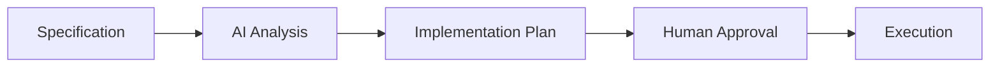

# AI-Assisted Planning

## 🎯 Objetivos de aprendizaje

Al finalizar este capítulo podrás:

- Comprender qué es la planificación asistida por IA.
- Diferenciar especificación de plan técnico.
- Diseñar planes de implementación con agentes.
- Aplicar Human-in-the-middle durante la planificación.
- Preparar el camino hacia generación automática de tareas.

---

# Introducción

Una especificación responde:

> ¿Qué comportamiento debe tener el sistema?

Pero todavía falta responder:

> ¿Cómo vamos a construirlo?

Ese paso corresponde a la planificación.

---

# Especificación vs Plan

Son artefactos diferentes.

---

## Especificación

Describe:

```
Qué debe ocurrir.
```

Ejemplo:

```
Un estudiante autenticado puede agregar favoritos.
```

---

## Plan

Describe:

```
Cómo organizar el trabajo.
```

Ejemplo:

```
1. Crear modelo Favorite.

2. Implementar endpoint.

3. Crear servicio frontend.

4. Agregar pruebas.
```

---

# El error común

Muchas herramientas IA saltan directamente:

```
Prompt

↓

Código
```

Pero falta:

```
Prompt

↓

Análisis

↓

Plan

↓

Código
```

---

# El valor del planning

La planificación permite:

- dividir problemas grandes,
- detectar riesgos,
- estimar impacto,
- revisar antes de modificar código.

---

# Flujo SDD con planificación



---

# ¿Qué hace la IA durante planning?

La IA puede analizar:

- especificación,
- arquitectura existente,
- código actual,
- dependencias.

Y generar:

- propuesta técnica,
- tareas,
- riesgos,
- preguntas.

---

# Ejemplo

Tenemos:

```
SPEC-001

Agregar favoritos.
```

La IA analiza.

---

Resultado:

```
PLAN-001

Cambios necesarios:

Backend:
- Crear entidad Favorite.
- Crear endpoint POST /favorites.

Frontend:
- Crear acción de favoritos.
- Actualizar estado global.

Testing:
- Tests unitarios.
- Tests integración.

Riesgos:
- Duplicados.
- Permisos.
```

---

# El plan como artefacto intermedio

El plan es muy importante porque es revisable.

Antes de tocar código podemos preguntar:

```
¿Este enfoque tiene sentido?
```

---

# Human Approval

El humano revisa:

## Alcance

```
¿Incluye demasiado?
```

---

## Arquitectura

```
¿Respeta decisiones existentes?
```

---

## Riesgos

```
¿Falta algún escenario?
```

---

# Ejemplo de interacción

Humano:

```
Implementa SPEC-001.
```

IA:

```
Antes de modificar código propongo:

Plan:
- Crear servicio.
- Agregar endpoint.
- Modificar componentes.

Impacto:
5 archivos.

¿Apruebas?
```

Humano:

```
Cambiar estrategia de almacenamiento.
Aprobado con ajustes.
```

---

# Planning en proyectos reales

Un plan puede contener:

```text
PLAN-001

Objetivo

Contexto

Archivos afectados

Cambios propuestos

Dependencias

Riesgos

Tareas

Validaciones
```

---

# Relación con agentes

Los agentes necesitan planificación.

Un agente sin plan:

```
Analiza

↓

Modifica archivos
```

Puede generar cambios inesperados.

---

Un agente profesional:

```
Analiza

↓

Propone plan

↓

Espera aprobación

↓

Ejecuta

↓

Entrega evidencia
```

---

# Planning como memoria temporal

El plan también deja registro:

```
¿Por qué estos archivos cambiaron?
```

---

Ejemplo:

Commit:

```
Add favorites feature
```

Relacionado:

```
PLAN-001
SPEC-001
```

---

# Descomposición de tareas

Una habilidad clave de IA es dividir problemas.

Ejemplo:

Solicitud:

```
Crear sistema de pagos.
```

Demasiado grande.

IA puede dividir:

```
TASK-001

Modelo de pago.


TASK-002

Validación.


TASK-003

Integración proveedor.


TASK-004

Tests.
```

---

# Pero cuidado

La IA puede dividir incorrectamente.

Por eso:

```
IA propone.

Humano valida.
```

---

# Relación con OpenSpec y SpecKit

Los enfoques modernos de SDD suelen tener una fase similar:

```
Specification

↓

Proposal

↓

Plan

↓

Tasks

↓

Implementation
```

La planificación es el puente entre intención y ejecución.

---

# 💡 Consejo AI Champion

Nunca confundas velocidad con ausencia de planificación.

Con IA, planificar antes puede hacer que seas mucho más rápido después.

---

# Buenas prácticas

- Generar plan antes del código.
- Revisar impacto.
- Relacionar plan con especificación.
- Mantener trazabilidad.
- Dividir cambios grandes.

---

# Errores comunes

## Pedir código demasiado pronto

Se pierde contexto.

---

## Aceptar cualquier plan generado por IA

Debe revisarse.

---

## Crear planes demasiado detallados

El plan debe guiar, no reemplazar implementación.

---

# Conceptos clave

- Specification define qué.
- Planning define cómo organizar.
- IA puede ayudar a crear planes.
- Humanos validan decisiones.
- El plan es un artefacto trazable.

---

# Ejercicio

Toma una funcionalidad:

```
Sistema de notificaciones.
```

Crea:

1. Especificación.
2. Plan generado por IA.
3. Revisión humana.
4. Lista de tareas.

---

# Desafío AI Champion

Pide a una IA:

```
Analiza esta especificación.

No escribas código.

Genera un plan técnico.

Incluye:

- tareas,
- riesgos,
- dependencias,
- preguntas abiertas.
```

Evalúa la calidad del plan.

---

# Próximo capítulo

## Task Generation

Veremos cómo transformar planes en unidades de trabajo ejecutables:

```
Specification

↓

Plan

↓

Tasks

↓

Implementación
```

Este será el punto donde comenzaremos a acercarnos al funcionamiento interno de herramientas SDD modernas.
