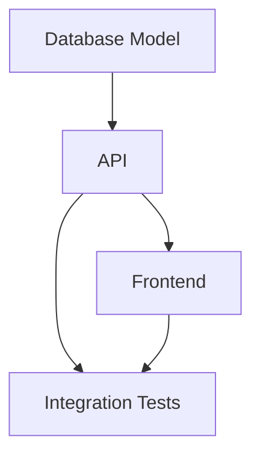

# Generación de tareas desde especificaciones

## 🎯 Objetivos de aprendizaje

Al finalizar este capítulo podrás:

- Comprender la relación entre especificaciones, planes y tareas.
- Diseñar tareas ejecutables por humanos o agentes IA.
- Aplicar criterios de buena descomposición.
- Mantener trazabilidad entre intención y ejecución.
- Entender cómo SDD escala en equipos grandes.

---

# Introducción

Una especificación define comportamiento.

Un plan define una estrategia.

Pero un equipo necesita algo más:

> Unidades concretas de trabajo.

Ejemplo:

```
Implementar favoritos.
```

No es una tarea.

Es una iniciativa.

---

# La cadena completa

En SDD tenemos:

```text
Problema

↓

Specification

↓

Plan

↓

Tasks

↓

Código

↓

Validación
```

Cada capa responde una pregunta diferente.

---

# Diferencia entre niveles

## Specification

Pregunta:

```
¿Qué necesita el usuario?
```

---

Ejemplo:

```
Un estudiante puede guardar cursos favoritos.
```

---

## Plan

Pregunta:

```
¿Cómo organizaremos la solución?
```

---

Ejemplo:

```
Modificar frontend y backend.
```

---

## Task

Pregunta:

```
¿Qué acción concreta debemos realizar?
```

---

Ejemplo:

```
Crear endpoint POST /favorites.
```

---

# ¿Por qué dividir?

Porque los sistemas reales tienen complejidad.

Una tarea demasiado grande:

```
Crear sistema de pagos completo.
```

Tiene demasiadas decisiones ocultas.

---

Una buena división:

```
TASK-001

Crear modelo Payment.


TASK-002

Implementar validación.


TASK-003

Integrar proveedor.


TASK-004

Agregar pruebas.
```

---

# Características de una buena tarea

Una tarea debería ser:

## Clara

Debe explicar qué hacer.

---

## Limitada

Debe tener un alcance definido.

---

## Verificable

Debe poder comprobarse.

---

## Relacionada

Debe apuntar a una especificación.

---

# Anatomía de una tarea SDD

Ejemplo:

```md
TASK-001

Título:
Crear entidad Favorite.

Relacionado:
SPEC-001

Objetivo:
Persistir cursos favoritos.

Cambios esperados:
- Crear modelo.
- Crear migración.

Dependencias:
Database schema.

Validación:
Test de creación.
```

---

# La trazabilidad

Una característica fundamental.

Debemos poder navegar:

```text
SPEC-001

↓

PLAN-001

↓

TASK-003

↓

Commit

↓

Test
```

---

# ¿Por qué importa esto con IA?

Porque un agente necesita límites.

Comparemos.

---

## Solicitud amplia

```
Implementa favoritos.
```

La IA debe decidir demasiado.

---

## Tarea específica

```
TASK-003

Crear servicio frontend.

Entrada:
CourseId.

Salida:
Favorite actualizado.

Validación:
AC-001.
```

La IA tiene contexto.

---

# IA como generador de tareas

Una IA puede analizar un plan:

Entrada:

```
PLAN-001

Implementar favoritos.
```

Salida:

```
TASK-001 Backend model.

TASK-002 API endpoint.

TASK-003 Frontend service.

TASK-004 UI component.

TASK-005 Tests.
```

---

# Pero existe un riesgo

La IA puede generar demasiadas tareas.

Ejemplo:

```
Crear variable.

Cambiar import.

Mover función.
```

Eso no siempre representa trabajo real.

---

# Nivel correcto de granularidad

Una tarea no debe ser:

Demasiado grande:

```
Construir aplicación completa.
```

Ni demasiado pequeña:

```
Renombrar variable x.
```

Debe representar una unidad de intención.

---

# Tareas para humanos vs agentes

No todas las tareas son iguales.

---

## Adecuadas para agentes

Ejemplos:

```
Crear tests.

Actualizar boilerplate.

Generar componentes repetitivos.
```

---

## Requieren más supervisión

Ejemplos:

```
Modificar arquitectura.

Cambiar modelo de seguridad.

Actualizar dominio crítico.
```

---

# Priorización

Una lista de tareas necesita orden.

Ejemplo:

```text
TASK-001

Modelo de datos.


TASK-002

API.


TASK-003

Frontend.


TASK-004

Tests.
```

Existe una dependencia natural.

---

# Task Graph

En sistemas complejos podemos representar:



---

# SDD y gestión tradicional

No reemplaza herramientas como:

- Jira,
- Azure Boards,
- GitHub Issues.

Puede integrarse.

Ejemplo:

```
SPEC-001

↓

Issue #542

↓

PR #800

```

---

# Relación con Your Harness

Este concepto será central.

Un sistema de ingeniería basado en IA podría mantener:

```text
Specification Registry

        ↓

Planning Engine

        ↓

Task Generator

        ↓

Agent Executor

        ↓

Validation Engine
```

---

# 💡 Consejo AI Champion

La calidad de la ejecución depende de la calidad de la descomposición.

Una IA excelente con una tarea mala producirá un resultado mediocre.

---

# Buenas prácticas

- Generar tareas desde especificaciones.
- Mantener relación explícita.
- Definir criterios de terminado.
- Evitar tareas ambiguas.
- Revisar dependencias.

---

# Errores comunes

## Crear tareas sin contexto

Ejemplo:

```
Modificar servicio.
```

¿Para qué?

---

## Dividir demasiado

Produce ruido administrativo.

---

## No relacionar tareas con intención

Se pierde trazabilidad.

---

# Conceptos clave

- Las tareas son la unidad ejecutable de SDD.
- Deben derivarse de planes.
- IA puede ayudar a generarlas.
- Humanos validan descomposición.
- La trazabilidad conecta intención y código.

---

# Ejercicio

Toma:

```
SPEC-002

Sistema de notificaciones.
```

Genera:

- PLAN-002.
- TASK-001 a TASK-005.
- Dependencias.
- Criterios de validación.

---

# Desafío AI Champion

Entrega una especificación a una IA y solicita:

```
Genera tareas de implementación.

Cada tarea debe incluir:

- objetivo,
- archivos potencialmente afectados,
- dependencias,
- criterio de terminado.
```

Después revisa:

- ¿son demasiado grandes?
- ¿son demasiado pequeñas?
- ¿mantienen la intención?

---

# Próximo capítulo

## Specification Validation

Veremos cómo validar que una especificación sea correcta antes de comenzar la implementación.

Porque en SDD:

> Un error en la especificación se multiplica durante toda la ejecución.
