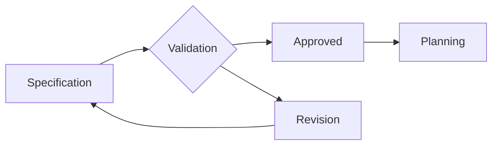
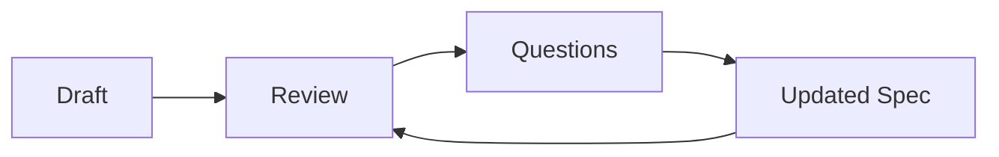

# Validación de especificaciones

## 🎯 Objetivos de aprendizaje

Al finalizar este capítulo podrás:

- Comprender por qué validar antes de implementar.
- Identificar problemas comunes en especificaciones.
- Aplicar técnicas de revisión.
- Utilizar IA como asistente de validación.
- Diseñar un proceso de aprobación de especificaciones.

---

# Introducción

En un flujo tradicional:

```text
Idea

↓

Código

↓

Problemas

↓

Correcciones
```

Muchas decisiones incorrectas se descubren tarde.

---

En SDD buscamos:

```text
Idea

↓

Specification

↓

Validación

↓

Código
```

El objetivo es mover la detección de errores hacia etapas tempranas.

---

# ¿Por qué validar una especificación?

Porque una especificación incorrecta genera:

- código incorrecto,
- pruebas incorrectas,
- decisiones arquitectónicas equivocadas.

---

Podemos verlo como una cadena:

```text
Mala especificación

↓

Mal plan

↓

Malas tareas

↓

Mal código
```

---

# La validación como Quality Gate

Una especificación no debería pasar directamente a implementación.

Debe atravesar un control.



---

# ¿Qué validamos?

Una especificación tiene varias dimensiones.

---

# 1. Claridad

Pregunta:

```
¿Se entiende qué debe ocurrir?
```

---

Ejemplo incorrecto:

```
El sistema debe gestionar usuarios.
```

Problema:

¿Qué significa gestionar?

---

Mejor:

```
Un administrador puede crear,
editar y desactivar usuarios.
```

---

# 2. Completitud

Pregunta:

```
¿Falta información importante?
```

---

Ejemplo:

```
Usuario puede realizar pagos.
```

Preguntas:

- ¿Qué métodos?
- ¿Qué límites?
- ¿Qué pasa si falla?

---

# 3. Consistencia

Pregunta:

```
¿Las reglas contradicen otras reglas?
```

---

Ejemplo:

Regla A:

```
Solo usuarios premium pueden exportar.
```

Regla B:

```
Todos los usuarios pueden descargar reportes.
```

Existe conflicto.

---

# 4. Verificabilidad

Pregunta:

```
¿Podemos comprobar que funciona?
```

---

Mala definición:

```
Debe ser rápido.
```

---

Mejor:

```
La respuesta debe ser inferior a 2 segundos.
```

---

# 5. Alcance

Pregunta:

```
¿Sabemos qué está incluido?
```

---

Ejemplo:

```
Sistema de favoritos.
```

Incluye:

- agregar,
- eliminar.

No incluye:

- compartir,
- recomendaciones.

---

# Checklist de validación

Una especificación debería responder:

```text
¿Qué problema resuelve?

¿Quién participa?

¿Qué comportamiento existe?

¿Qué reglas aplican?

¿Qué casos excepcionales existen?

¿Cómo verificamos?
```

---

# Validación humana

Los roles aportan diferentes perspectivas.

---

## Product Owner

Valida:

```
¿Resuelve la necesidad?
```

---

## Arquitecto

Valida:

```
¿Es viable técnicamente?
```

---

## Developer

Valida:

```
¿Es suficientemente clara?
```

---

## QA

Valida:

```
¿Puede probarse?
```

---

# Validación asistida por IA

La IA puede actuar como revisor.

Ejemplo:

Prompt:

```
Analiza esta especificación.

Actúa como:

- Product Owner.
- Arquitecto.
- QA.

Detecta:

- ambigüedades,
- riesgos,
- escenarios faltantes.
```

---

# Ejemplo

Especificación:

```
Los usuarios pueden recuperar contraseña.
```

---

IA puede preguntar:

```
¿Existe límite de intentos?

¿Qué ocurre con usuarios bloqueados?

¿El enlace expira?

¿Se registra auditoría?
```

---

# Specification Review Loop

La validación normalmente es iterativa.



---

# La especificación como contrato evolutivo

Una aprobación no significa que nunca cambia.

Significa:

```
Estado actual aceptado.
```

Cuando cambia:

```
Nueva versión.

Nueva validación.
```

---

# Versionado

Ejemplo:

```
SPEC-001 v1.0

Favoritos básicos


SPEC-001 v1.1

Agregar categorías
```

---

# Validación automática

Algunas verificaciones pueden automatizarse.

Ejemplos:

- formato correcto,
- campos obligatorios,
- referencias existentes,
- enlaces rotos.

---

# Validación semántica

Más avanzada:

Una IA puede analizar:

```
¿Esta regla contradice otra especificación?
```

Ejemplo:

SPEC-001:

```
Usuario puede tener máximo 10 favoritos.
```

SPEC-010:

```
Usuario puede guardar favoritos ilimitados.
```

---

# Relación con agentes IA

Los agentes necesitan especificaciones confiables.

Un agente debería recibir:

```
Specification

Estado:
Approved

Version:
1.2

Reviewer:
Human
```

---

# 💡 Consejo AI Champion

Validar antes cuesta minutos.

Corregir una implementación equivocada puede costar días.

---

# Buenas prácticas

- Revisar antes de implementar.
- Involucrar varios roles.
- Mantener versiones.
- Registrar preguntas abiertas.
- Usar IA como revisor adicional.

---

# Errores comunes

## Aprobar demasiado rápido

Una especificación incompleta se convierte en deuda.

---

## Validar solo sintaxis

Que un documento esté bien escrito no significa que esté correcto.

---

## No actualizar después de cambios

Genera divergencia.

---

# Conceptos clave

- La validación reduce errores tempranos.
- Una especificación debe ser clara y comprobable.
- IA puede ayudar a encontrar problemas.
- La aprobación humana mantiene control.
- Las especificaciones evolucionan.

---

# Ejercicio

Toma una especificación existente y realiza una revisión:

Clasifica:

- dudas,
- contradicciones,
- información faltante,
- riesgos.

---

# Desafío AI Champion

Crea un agente revisor con este rol:

```
Specification Reviewer Agent

Entrada:
Specification.

Salida:

- problemas encontrados,
- preguntas,
- nivel de confianza,
- recomendación:
  APPROVE / NEEDS_CHANGES.
```

---

# Próximo capítulo

## SDD and Testing

Veremos cómo conectar:

```
Specification

↓

Acceptance Criteria

↓

Tests

↓

Validation automática
```

y cómo SDD permite acercarse a un ciclo donde la IA puede ayudar a generar pruebas alineadas con intención.
