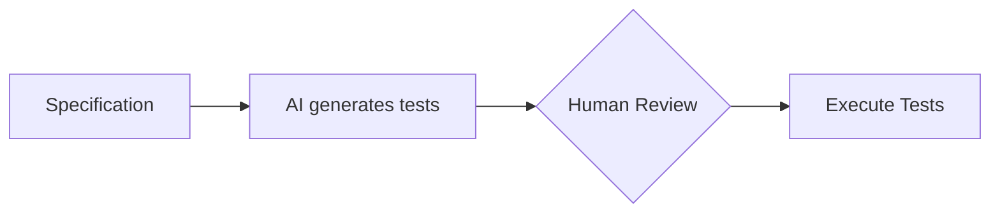

# SDD y Testing

## 🎯 Objetivos de aprendizaje

Al finalizar este capítulo podrás:

- Comprender la relación entre especificaciones y pruebas.
- Diferenciar SDD, TDD y BDD.
- Generar pruebas a partir de comportamiento esperado.
- Entender cómo la IA puede ayudar en testing.
- Diseñar ciclos de validación basados en intención.

---

# Introducción

Un problema común en desarrollo es crear pruebas después del código.

El flujo suele ser:

```text
Código

↓

Pensar qué probar

↓

Crear tests
```

El problema:

Los tests pueden terminar validando la implementación actual y no la necesidad real.

---

# Enfoque SDD

SDD propone:

```text
Necesidad

↓

Especificación

↓

Criterios de aceptación

↓

Tests

↓

Código
```

---

# La especificación como origen del testing

Ejemplo:

Especificación:

```
Un estudiante autenticado puede guardar un curso.
```

Criterio:

```
Dado un estudiante autenticado

Cuando selecciona guardar favorito

Entonces el curso aparece en su lista.
```

Test:

```text
should add course to favorites
```

---

# Cadena de trazabilidad

Un sistema profesional debería permitir:

```text
SPEC-001

↓

AC-001

↓

TEST-001

↓

CODE-001
```

---

# SDD y TDD

Son disciplinas complementarias.

---

# TDD

Test Driven Development.

Pregunta:

```
¿Qué código necesito para pasar esta prueba?
```

Flujo:

```text
Test

↓

Código

↓

Refactor
```

---

# SDD

Pregunta:

```
¿Qué comportamiento debe cumplir el sistema?
```

Flujo:

```text
Specification

↓

Tests

↓

Código
```

---

# Relación

Podemos verlo así:

```text
SDD define intención.

TDD guía implementación.

```

---

# SDD y BDD

Behavior Driven Development está muy alineado.

BDD utiliza lenguaje de negocio.

Ejemplo:

```gherkin
Feature:
Favoritos de cursos

Scenario:
Agregar curso favorito

Given:
Un estudiante autenticado

When:
Guarda un curso

Then:
El curso aparece en favoritos
```

---

# La especificación como generadora de pruebas

Una especificación bien escrita puede producir:

- tests unitarios,
- tests integración,
- tests end-to-end.

---

Ejemplo:

Regla:

```
Un usuario no puede agregar más de 100 favoritos.
```

Genera:

```text
Test positivo:

Agregar favorito número 50.


Test límite:

Agregar favorito número 100.


Test negativo:

Agregar favorito número 101.
```

---

# Pruebas negativas

Una ventaja importante.

Muchas especificaciones contienen reglas.

Ejemplo:

```
Solo usuarios autenticados pueden pagar.
```

No solamente probamos:

```
Usuario autenticado paga.
```

También:

```
Usuario anónimo intenta pagar.
```

---

# IA generando tests

Una IA puede analizar:

Entrada:

```
SPEC-001

Acceptance Criteria

Business Rules
```

Generar:

```
Test cases:

TC-001 Success case

TC-002 Unauthorized user

TC-003 Invalid data

TC-004 Boundary case
```

---

# Pero nuevamente:

La IA propone.

El humano valida.

---

# Human-in-the-middle aplicado a testing

Flujo:



---

# Testing como evidencia

Los tests no son solamente herramientas técnicas.

Son evidencia.

La pregunta cambia:

Antes:

```
¿El código funciona?
```

Después:

```
¿El sistema cumple la especificación?
```

---

# Specification Coverage

Nuevo concepto.

No medimos solamente cobertura de código.

También:

```
¿Qué parte de la especificación está validada?
```

---

Ejemplo:

Especificación:

```
10 reglas de negocio.
```

Tests:

```
8 reglas cubiertas.
```

Tenemos:

```
80% specification coverage.
```

---

# El futuro con agentes

Un agente podría:

1. Leer especificación.
2. Crear plan.
3. Generar código.
4. Crear tests.
5. Ejecutar validaciones.
6. Reportar diferencias.

Pero siempre:

```
Especificación aprobada
+
Validación humana
```

---

# Ejemplo completo

## Specification

```
Usuario premium puede exportar reportes.
```

---

## Rule

```
Usuarios básicos no pueden exportar.
```

---

## Tests

```text
TC-001

Premium exporta correctamente.


TC-002

Basic recibe error.


TC-003

Usuario sin sesión es rechazado.
```

---

# Relación con CI/CD

Un pipeline SDD puede incluir:

```text
Commit

↓

Validate Specification

↓

Run Tests

↓

Check Compliance

↓

Deploy
```

---

# 💡 Consejo AI Champion

Los tests son una forma ejecutable de expresar la intención del sistema.

---

# Buenas prácticas

- Derivar tests desde especificaciones.
- Cubrir reglas de negocio.
- Probar escenarios negativos.
- Mantener trazabilidad.
- Automatizar validaciones.

---

# Errores comunes

## Crear tests solo para aumentar cobertura

La cobertura no garantiza intención.

---

## Probar implementación interna

Los tests deben validar comportamiento.

---

## Generar tests sin entender reglas

La IA puede crear tests técnicamente correctos pero irrelevantes.

---

# Conceptos clave

- SDD conecta especificación y validación.
- TDD y SDD se complementan.
- BDD ayuda a expresar comportamiento.
- Tests representan evidencia.
- La IA puede ayudar a generar pruebas alineadas.

---

# Ejercicio

Crear una especificación:

```
Sistema de recuperación de contraseña.
```

Derivar:

- reglas,
- criterios,
- casos positivos,
- casos negativos,
- tests.

---

# Desafío AI Champion

Crea un prompt para un agente:

```
Actúa como QA Engineer.

Recibe una especificación.

Genera:

- escenarios.
- casos de prueba.
- riesgos.
- preguntas pendientes.
```

Evalúa si las pruebas realmente representan la intención.

---

# Próximo capítulo

## SDD Tools Overview

Analizaremos cómo diferentes herramientas implementan estos conceptos y prepararemos el camino para estudiar:

- OpenSpec.
- SpecKit.
- workflows basados en repositorios.
- agentes SDD.
