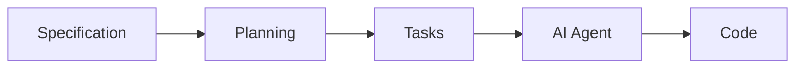
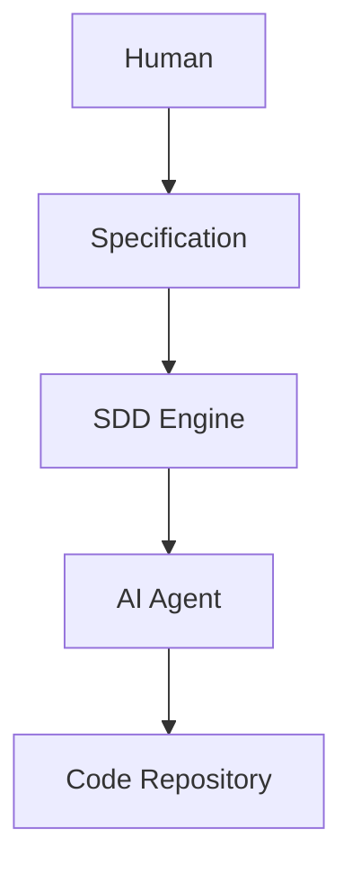
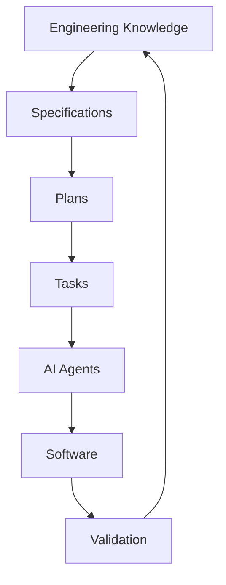

# Overview de herramientas SDD

## 🎯 Objetivos de aprendizaje

Al finalizar este capítulo podrás:

- Entender qué problemas intentan resolver las herramientas SDD.
- Identificar componentes comunes de estas plataformas.
- Diferenciar herramienta, metodología y workflow.
- Comprender dónde encajan OpenSpec y SpecKit.
- Preparar una arquitectura de desarrollo asistido por IA.

---

# Introducción

SDD es una forma de trabajar.

Pero para aplicarlo a escala necesitamos herramientas.

Un equipo pequeño puede mantener especificaciones manualmente.

Un equipo grande necesita:

- estructura,
- automatización,
- trazabilidad,
- validaciones.

---

# El problema que intentan resolver las herramientas SDD

En un sistema tradicional tenemos:

```text
Ticket

↓

Código

↓

Pull Request

↓

Deploy
```

Muchas veces se pierde:

- intención,
- decisiones,
- contexto.

---

Las herramientas SDD agregan:

```text
Specification

↓

Plan

↓

Tasks

↓

Implementation

↓

Evidence
```

---

# Componentes comunes de una plataforma SDD

Aunque cada herramienta tiene su enfoque, normalmente encontramos:

---

# 1. Specification Repository

Lugar donde viven las especificaciones.

Ejemplo:

```text
specs/

├── users/

│   └── authentication.md

├── payments/

│   └── payment-flow.md

└── orders/

    └── order-lifecycle.md
```

---

# 2. Specification Format

Define cómo escribir especificaciones.

Puede ser:

- Markdown.
- YAML.
- JSON.
- DSL propio.

---

Ejemplo:

```yaml
id: SPEC-001

name: Favorites

actor:
  - Student

rules:
  - authenticated_only
```

---

# 3. Validation Engine

Comprueba:

- estructura,
- referencias,
- consistencia.

Ejemplo:

```
SPEC-001

references:

BR-001

exists: true
```

---

# 4. Planning Engine

Transforma:

```
Specification
```

en:

```
Implementation Plan
```

---

Ejemplo:

Entrada:

```
Agregar favoritos.
```

Salida:

```
Backend changes.

Frontend changes.

Database changes.

Tests.
```

---

# 5. Task Generator

Convierte planes en trabajo.

Ejemplo:

```text
TASK-001

Create database model.


TASK-002

Create API.


TASK-003

Create UI.
```

---

# 6. Agent Integration

Permite que agentes IA trabajen sobre:

- especificaciones,
- tareas,
- código.

---

Modelo:



---

# 7. Traceability Engine

Mantiene relaciones:

```text
SPEC

↓

PLAN

↓

TASK

↓

COMMIT

↓

TEST
```

---

# Herramienta vs metodología

Un error común:

Pensar:

```
Instalo una herramienta SDD.

Tengo SDD.
```

No funciona así.

---

La herramienta ayuda con:

- organización,
- automatización,
- seguimiento.

Pero el equipo necesita adoptar:

- disciplina,
- revisión,
- ownership.

---

# Categorías de herramientas

Podemos dividirlas en:

---

# A. Specification Management

Enfocadas en almacenar conocimiento.

Ejemplos:

- repositorios Markdown.
- documentación estructurada.
- wikis técnicas.

---

# B. AI Coding Assistants

Enfocadas en generación.

Ejemplos:

- asistentes dentro del IDE.
- agentes de código.

---

# C. SDD Frameworks

Intentan unir todo:

```text
Specification

+

AI

+

Workflow

+

Validation
```

---

# OpenSpec y SpecKit

Estas herramientas pertenecen al tercer grupo.

Su objetivo es acercarse a:

```text
Specification

↓

Proposal

↓

Plan

↓

Tasks

↓

Implementation
```

---

# Arquitectura conceptual

Podemos imaginar:



---

# ¿Por qué esto es importante?

Porque cambia el rol del repositorio.

Antes:

```
Repositorio = Código
```

---

Con SDD:

```
Repositorio = Código + Intención
```

---

# Integración con Git

Un flujo posible:

```text
Developer creates spec

↓

Review specification

↓

Generate plan

↓

Create tasks

↓

Implement

↓

Pull Request
```

---

# Integración con CI/CD

Pipeline:

```text
Commit

↓

Validate specs

↓

Run tests

↓

Check implementation

↓

Deploy
```

---

# SDD en equipos enterprise

En organizaciones grandes aparecen necesidades adicionales:

- permisos,
- auditoría,
- gobernanza,
- ownership,
- versionado.

---

Ejemplo:

```text
SPEC-100

Owner:
Payments Team

Reviewer:
Architecture Team

Status:
Approved
```

---

# Relación con Your Harness

Aquí encontramos una conexión directa.

La visión de Your Harness:

```
Sistema operativo para ingeniería
```

encaja naturalmente con estos conceptos:

```text
Knowledge Layer

↓

Specification Layer

↓

Agent Layer

↓

Execution Layer

↓

Governance Layer
```

---

# La arquitectura mental completa



---

# 💡 Consejo AI Champion

Las mejores herramientas de IA no serán las que generen más código.

Serán las que mantengan mejor contexto.

---

# Buenas prácticas

- Mantener specs versionadas.
- Integrar con repositorios.
- Crear trazabilidad.
- Definir ownership.
- Automatizar validaciones.

---

# Errores comunes

## Comprar herramienta antes de definir proceso

La herramienta no arregla procesos inexistentes.

---

## Crear specs aisladas

Deben estar conectadas al desarrollo.

---

## Automatizar sin gobernanza

Los agentes necesitan límites.

---

# Conceptos clave

- Las herramientas SDD automatizan una disciplina.
- La especificación es el centro.
- La trazabilidad es fundamental.
- OpenSpec y SpecKit implementan partes del flujo.
- El repositorio debe contener intención y código.

---

# Ejercicio

Diseña una arquitectura SDD mínima:

Debe incluir:

- dónde viven specs,
- cómo se validan,
- cómo se generan tareas,
- cómo intervienen agentes,
- cómo se aprueba trabajo.

---

# Desafío AI Champion

Diseña el siguiente sistema:

```
Un agente recibe SPEC-001.

Debe:

1. Validar especificación.
2. Crear plan.
3. Pedir aprobación.
4. Generar tareas.
5. Implementar.
6. Reportar evidencia.
```

Define los componentes necesarios.

---

# Próximo capítulo

## OpenSpec y SpecKit

Analizaremos directamente estas herramientas:

- qué problema resuelven,
- cómo funcionan,
- diferencias conceptuales,
- cómo incorporarlas en un workflow profesional.
