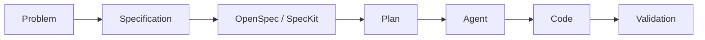

# OpenSpec y SpecKit

## 🎯 Objetivos de aprendizaje

Al finalizar este capítulo podrás:

- Comprender qué problema intentan resolver OpenSpec y SpecKit.
- Identificar su lugar dentro de un workflow SDD.
- Comparar enfoques de especificación estructurada.
- Entender cómo estas herramientas trabajan con agentes IA.
- Preparar un modelo propio de integración.

---

# Introducción

Durante este módulo vimos que SDD propone:

```
Especificación

↓

Plan

↓

Tareas

↓

Implementación

↓

Validación
```

La pregunta natural es:

> ¿Cómo podemos convertir este proceso en una práctica repetible?

Aquí aparecen herramientas como OpenSpec y SpecKit.

---

# El problema que intentan resolver

Los asistentes IA actuales suelen trabajar así:

```
Usuario

↓

Prompt

↓

Código generado
```

---

El problema:

La IA debe inferir demasiado.

Ejemplo:

```
Crea un sistema de pagos.
```

Preguntas ocultas:

- ¿Qué proveedor?
- ¿Qué reglas?
- ¿Qué estados existen?
- ¿Qué errores manejar?
- ¿Qué restricciones aplicar?

---

# Enfoque SDD

La interacción cambia:

```
Usuario

↓

Specification

↓

AI Agent

↓

Implementation
```

La IA trabaja con intención explícita.

---

# ¿Qué es OpenSpec?

OpenSpec puede entenderse como un enfoque orientado a:

- definir especificaciones,
- gestionar cambios,
- estructurar propuestas,
- guiar agentes.

Su objetivo principal:

> Convertir cambios de software en unidades explicables y revisables.

---

# Modelo conceptual OpenSpec

Un flujo típico:

```text
Specification

↓

Change Proposal

↓

Implementation Plan

↓

Tasks

↓

Execution
```

---

# Ejemplo conceptual

Cambio solicitado:

```
Agregar favoritos.
```

---

OpenSpec podría representar:

```yaml
change:

name: course-favorites

reason:
  Students need saved courses.

scope:
  - frontend
  - backend

constraints:
  - authenticated users only
```

---

Después:

```
Proposal

↓

Plan

↓

Tasks
```

---

# ¿Qué es SpecKit?

SpecKit sigue una filosofía similar:

Utilizar especificaciones como entrada principal para agentes IA.

Su objetivo:

- reducir ambigüedad,
- mejorar planificación,
- mantener contexto.

---

# Modelo conceptual SpecKit

```text
Idea

↓

Specification

↓

Clarification

↓

Plan

↓

Implementation
```

---

# Diferencia conceptual

Aunque ambos pertenecen al mismo espacio, pueden tener enfoques diferentes.

---

## OpenSpec

Más orientado a:

- cambios,
- propuestas,
- evolución del sistema.

Pregunta:

```
¿Qué cambio queremos introducir?
```

---

## SpecKit

Más orientado a:

- construir desde especificaciones,
- guiar agentes.

Pregunta:

```
¿Qué sistema queremos crear?
```

---

# Comparación simplificada

| Aspecto | OpenSpec | SpecKit |
|-|-|-|
| Enfoque | Cambios estructurados | Desarrollo basado en specs |
| Centro | Proposal | Specification |
| Uso | Evolución | Construcción |
| Objetivo | Controlar cambios | Guiar implementación |

---

# Ubicación dentro del workflow SDD

Ambos encajan aquí:



---

# El rol de la IA

La IA no reemplaza la especificación.

La consume.

Ejemplo:

Entrada:

```
SPEC-001

Approved

Version 1.2
```

Agente:

```
Analiza.

Propone plan.

Solicita aprobación.

Ejecuta.
```

---

# Human-in-the-middle

Estas herramientas tienen sentido cuando existe control.

Modelo:

```text
Specification creada

↓

IA analiza

↓

Humano revisa propuesta

↓

IA ejecuta

↓

Humano valida resultado
```

---

# Relación con Git

Una implementación profesional podría ser:

```text
repository/

├── src/

├── tests/

├── specs/

│   └── favorites.md

├── plans/

│   └── favorites-plan.md

└── tasks/

    └── favorites-tasks.md
```

---

# Relación con agentes

Un agente SDD podría recibir:

```json
{
 "specification": "SPEC-001",
 "status": "approved",
 "allowed_actions": [
   "create_files",
   "modify_tests"
 ]
}
```

---

# El aprendizaje importante

La herramienta no es el punto central.

El punto central es:

```
Contexto estructurado

+

Proceso controlado

+

Ejecución asistida
```

---

# Relación con AI Champion

El modelo que estamos construyendo:

```text
Knowledge

↓

Specifications

↓

Governance

↓

Agents

↓

Execution

↓

Evidence
```

es una evolución natural de estos conceptos.

---

# Relación con Your Harness

Your Harness puede verse como una capa superior.

OpenSpec y SpecKit resuelven parte del problema:

```
Specification workflow
```

Pero una plataforma completa necesitaría además:

```
Memory

Governance

Agent orchestration

Repository integration

Metrics

Audit
```

---

# 💡 Consejo AI Champion

No busques una herramienta que programe por ti.

Busca una plataforma que conserve el razonamiento detrás del software.

---

# Buenas prácticas

- Mantener especificaciones versionadas.
- Separar intención de implementación.
- Aprobar planes antes de ejecutar.
- Registrar decisiones.
- Mantener evidencia.

---

# Errores comunes

## Usar una herramienta SDD como generador mágico

Pierde su propósito.

---

## Crear specs sin conexión al código

Genera documentación muerta.

---

## Eliminar revisión humana

Aumenta riesgos.

---

# Conceptos clave

- OpenSpec y SpecKit representan enfoques SDD.
- La especificación es la entrada principal.
- Los agentes trabajan mejor con contexto.
- La aprobación humana sigue siendo necesaria.
- La herramienta implementa el proceso, no lo reemplaza.

---

# Ejercicio

Diseña un flujo utilizando:

```
Specification

↓

OpenSpec/SpecKit

↓

Agent

↓

Code

↓

Tests
```

Define:

- qué genera la IA,
- qué aprueba el humano,
- qué evidencia se guarda.

---

# Desafío AI Champion

Diseña un "mini SDD engine":

Debe poder:

1. Registrar especificaciones.
2. Generar planes.
3. Crear tareas.
4. Ejecutar agentes.
5. Guardar evidencia.

Este ejercicio será la base conceptual para módulos posteriores.

---

# Próximo capítulo

## Final Project — SDD aplicado

Cerraremos el módulo construyendo un flujo completo:

```
Idea real

↓

Specification

↓

Plan

↓

Tasks

↓

Agent

↓

Código

↓

Validación
```

Será el primer acercamiento práctico al modelo completo de AI Champion.
