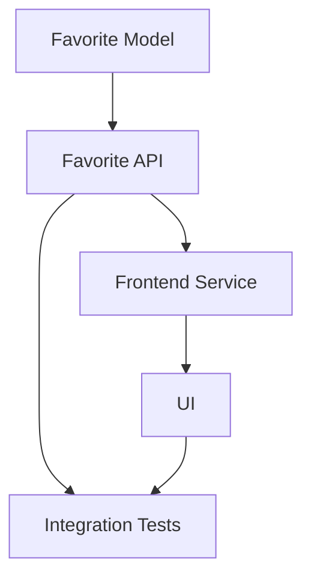
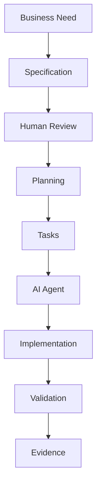

# Proyecto final SDD

## 🎯 Objetivos de aprendizaje

Al finalizar este capítulo podrás:

- Aplicar un workflow SDD completo.
- Crear una especificación desde una necesidad real.
- Generar un plan técnico.
- Descomponer trabajo en tareas.
- Diseñar validaciones.
- Entender cómo un agente IA podría participar.

---

# Introducción

Durante este módulo vimos cada pieza individual:

```
Specification

Validation

Planning

Tasks

Implementation

Testing
```

Ahora construiremos un flujo completo.

---

# Caso práctico

## Necesidad

Una plataforma educativa quiere permitir que los estudiantes guarden cursos favoritos.

---

# Paso 1 — Definir la intención

Primero definimos el problema.

```
Los estudiantes tienen dificultad para encontrar nuevamente cursos interesantes.

Necesitan una forma de guardar cursos para revisarlos después.
```

---

# Paso 2 — Crear Specification

Creamos:

```
SPEC-001

Course Favorites
```

---

## Objetivo

Permitir que estudiantes autenticados puedan guardar cursos favoritos.

---

## Actores

```
Student
```

---

## Reglas

```
BR-001

Solo usuarios autenticados pueden agregar favoritos.


BR-002

Un curso no puede agregarse dos veces.


BR-003

Un usuario puede eliminar favoritos.
```

---

# Casos de uso

## Agregar favorito

```
Given:

Usuario autenticado.


When:

Selecciona guardar curso.


Then:

Curso aparece en favoritos.
```

---

## Eliminar favorito

```
Given:

Curso guardado.


When:

Usuario elimina favorito.


Then:

Curso desaparece.
```

---

# Paso 3 — Specification Validation

Revisión:

## Product Owner

Pregunta:

```
¿Resuelve el problema?
```

---

## Arquitectura

Pregunta:

```
¿Dónde se almacena?
```

---

## QA

Pregunta:

```
¿Qué ocurre con duplicados?
```

---

Resultado:

```
SPEC-001

Status:

APPROVED
```

---

# Paso 4 — Crear Plan

Generamos:

```
PLAN-001
```

---

## Backend

Cambios:

```
Crear entidad Favorite.

Crear endpoints:

POST /favorites

DELETE /favorites

GET /favorites
```

---

## Frontend

Cambios:

```
Crear FavoriteService.

Crear estado favorito.

Actualizar componentes.
```

---

## Testing

Crear:

```
Unit tests.

Integration tests.

E2E tests.
```

---

# Paso 5 — Generar tareas

El plan produce:

---

## TASK-001

Crear modelo Favorite.

Relacionado:

```
SPEC-001
```

---

## TASK-002

Crear API de favoritos.

---

## TASK-003

Crear servicio frontend.

---

## TASK-004

Agregar interacción visual.

---

## TASK-005

Crear pruebas.

---

# Grafo de ejecución



---

# Paso 6 — Ejecución asistida por IA

Un agente recibe:

```json
{
"spec":"SPEC-001",
"plan":"PLAN-001",
"task":"TASK-003"
}
```

---

El agente:

1. Analiza contexto.
2. Propone cambios.
3. Solicita aprobación.
4. Implementa.
5. Genera evidencia.

---

# Paso 7 — Human-in-the-middle

Antes:

```
IA modifica código
```

Ahora:

```
IA propone:

Modificar FavoriteService.

Archivos:

favorite.service.ts

favorite.store.ts

Tests:
favorite.service.spec.ts


¿Aprobar?
```

---

Humano:

```
Aprobado.
```

---

# Paso 8 — Testing

Desde la especificación generamos:

---

## Caso positivo

```
Usuario autenticado agrega favorito.
```

---

## Caso negativo

```
Usuario anónimo intenta agregar favorito.
```

---

## Caso límite

```
Usuario intenta agregar curso repetido.
```

---

# Paso 9 — Evidence

El agente entrega:

```
Implementation Report

SPEC:
SPEC-001

Tasks completed:
TASK-001
TASK-002
TASK-003

Tests:
25 passed

Files changed:
8

Risks:
None detected
```

---

# Trazabilidad completa

El resultado final:

```text
SPEC-001

↓

PLAN-001

↓

TASK-001..005

↓

Pull Request

↓

Tests

↓

Release
```

---

# Arquitectura conceptual completa



---

# Qué aprendimos

SDD no es escribir documentos.

Es crear un sistema donde:

```
La intención es explícita.

El trabajo es trazable.

La ejecución es controlada.
```

---

# Relación con AI Champion

Este flujo representa la base para construir sistemas de ingeniería aumentada.

Modelo:

```text
Human Intent

↓

Structured Knowledge

↓

AI Assistance

↓

Controlled Execution

↓

Evidence
```

---

# Relación con Your Harness

Your Harness puede evolucionar este modelo agregando:

```
Specification Registry

+

Memory Layer

+

Agent Orchestration

+

Governance

+

Metrics
```

---

# Retos futuros

Un sistema avanzado debería poder responder:

## ¿Por qué existe este código?

Buscar:

```
Code

↓

Task

↓

Specification
```

---

## ¿Qué impacto tendrá este cambio?

Analizar:

```
Specification

↓

Dependencies

↓

Risk
```

---

## ¿Puede un agente ejecutar este cambio?

Evaluar:

```
Complexity

+

Permissions

+

Confidence
```

---

# Proyecto final del módulo

Crear una especificación real de un proyecto propio.

Debe incluir:

```
SPEC

PLAN

TASKS

TESTS

EVIDENCE
```

---

# Checklist final del Módulo 4

Antes de continuar:

✅ Entiendo qué es SDD.  
✅ Sé crear especificaciones.  
✅ Sé validar intención.  
✅ Sé generar planes.  
✅ Sé descomponer tareas.  
✅ Sé conectar tests con requisitos.  
✅ Entiendo Human-in-the-middle.  
✅ Entiendo el rol de OpenSpec y SpecKit.

---

# Cierre del módulo

SDD cambia la pregunta principal del desarrollo.

Antes:

```
¿Cómo escribimos código más rápido?
```

Después:

```
¿Cómo mantenemos intención, contexto y calidad mientras aumentamos la velocidad con IA?
```

Esa es la base del desarrollo profesional asistido por inteligencia artificial.
