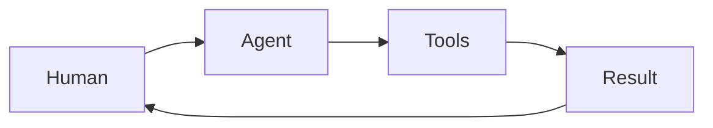
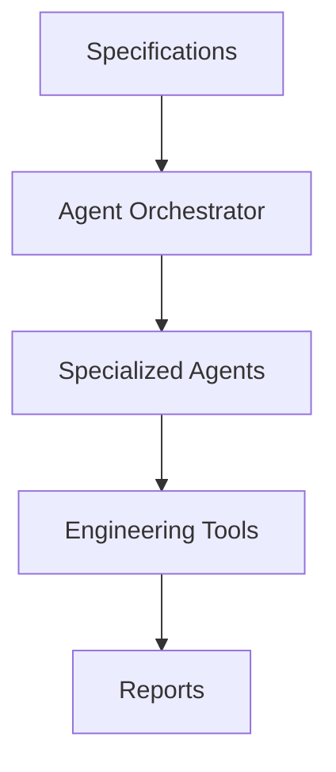

---

sidebar_position: 1
title: "Introducción a agentes IA"
description: "Conceptos fundamentales sobre agentes, capacidades, límites y arquitectura."
------------------------------------------------------------------------------------------

# Introducción a agentes IA

## 🎯 Objetivos de aprendizaje

Al finalizar este capítulo podrás:

* Comprender qué es un agente IA.
* Diferenciar un modelo de lenguaje de un agente.
* Entender los componentes principales de un agente.
* Conocer cómo los agentes participan en procesos de ingeniería.
* Preparar la base para arquitecturas multi-agente.

---

# Introducción

Durante años hemos utilizado inteligencia artificial principalmente como sistemas de consulta:

```
Usuario

↓

Modelo IA

↓

Respuesta
```

Ejemplo:

```
Explícame este código.
```

La IA responde, pero no actúa.

---

Los agentes representan un cambio:

```
Usuario

↓

Agente IA

↓

Análisis

↓

Decisión

↓

Acción

↓

Resultado
```

---

# ¿Qué es un agente IA?

Un agente IA es un sistema capaz de:

* recibir un objetivo,
* analizar información,
* tomar decisiones,
* utilizar herramientas,
* ejecutar acciones,
* evaluar resultados.

---

Una definición simple:

> Un agente es un sistema que percibe un entorno, razona sobre él y actúa para alcanzar un objetivo.

---

# Modelo de lenguaje vs Agente

Es importante diferenciarlos.

---

# Modelo de lenguaje (LLM)

Un modelo como GPT es principalmente:

```
Entrada

↓

Procesamiento

↓

Salida
```

Ejemplo:

Usuario:

```
Genera una función para ordenar usuarios.
```

Respuesta:

```
Código generado.
```

---

# Agente

Un agente agrega capacidades:

```
Objetivo

↓

Razonamiento

↓

Herramientas

↓

Acciones

↓

Evaluación
```

Ejemplo:

Objetivo:

```
Implementar autenticación.
```

El agente puede:

* leer el repositorio,
* analizar arquitectura,
* crear un plan,
* modificar archivos,
* ejecutar tests,
* reportar resultados.

---

# Arquitectura básica de un agente

Un agente normalmente contiene:

```text
Agent

├── Model

├── Memory

├── Tools

├── Planning

├── Execution

└── Evaluation
```

---

# 1. Model

Es el componente de razonamiento.

Puede ser:

* GPT,
* Claude,
* Gemini,
* modelos locales.

Su responsabilidad:

```
Interpretar información.

Generar decisiones.
```

---

# 2. Memory

Permite conservar contexto.

Puede almacenar:

* conversaciones,
* decisiones,
* conocimiento del proyecto,
* especificaciones.

---

Ejemplo:

Sin memoria:

```
¿Dónde está definido el modelo User?
```

Con memoria:

```
El modelo User fue definido en auth/domain/user.ts según SPEC-004.
```

---

# 3. Tools

Son capacidades externas.

Ejemplos:

* leer archivos,
* escribir archivos,
* ejecutar comandos,
* consultar APIs,
* acceder a bases de datos.

---

Un modelo sin herramientas:

```
Puede pensar.
```

Un agente:

```
Puede actuar.
```

---

# 4. Planning

Permite dividir objetivos.

Ejemplo:

Objetivo:

```
Crear sistema de pagos.
```

Plan:

```
1. Analizar dominio.

2. Crear modelo.

3. Implementar API.

4. Crear pruebas.
```

---

# 5. Execution

Ejecuta acciones.

Ejemplo:

```
Modificar archivo.

Crear commit.

Ejecutar tests.
```

---

# 6. Evaluation

Permite comprobar resultados.

Ejemplo:

```
Los tests pasaron.

La especificación fue cumplida.

No existen errores.
```

---

# Agentes en desarrollo de software

Un agente puede asumir diferentes roles.

Ejemplos:

## Developer Agent

Responsable:

* implementar código,
* corregir errores,
* crear tests.

---

## QA Agent

Responsable:

* analizar calidad,
* generar pruebas,
* detectar riesgos.

---

## Architecture Agent

Responsable:

* revisar decisiones,
* evaluar impacto.

---

## Documentation Agent

Responsable:

* mantener conocimiento actualizado.

---

# Modelo Human + Agents

En AI Champion no buscamos reemplazar personas.

Buscamos aumentar capacidades.

Modelo:



El humano mantiene:

* intención,
* aprobación,
* decisiones críticas.

---

# Agentes y SDD

SDD proporciona el contexto que los agentes necesitan.

Sin SDD:

```text
Agente

↓

Código
```

Existe mucha incertidumbre.

---

Con SDD:

```text
Specification

↓

Agent

↓

Plan

↓

Implementation
```

El agente trabaja con intención explícita.

---

# Ejemplo

Solicitud:

```
Implementar favoritos.
```

---

Agente tradicional:

```
Analiza código.

Supone comportamiento.

Modifica archivos.
```

---

Agente SDD:

```
Lee SPEC-001.

Genera PLAN-001.

Solicita aprobación.

Implementa TASK-003.
```

---

# El concepto de autonomía

Los agentes pueden tener diferentes niveles.

---

## Nivel 0 — Asistente

```
Responde preguntas.
```

---

## Nivel 1 — Generador

```
Produce código.
```

---

## Nivel 2 — Ejecutor supervisado

```
Realiza acciones con aprobación.
```

---

## Nivel 3 — Agente autónomo

```
Planifica y ejecuta con mínima intervención.
```

---

En ingeniería profesional actualmente el modelo más seguro suele ser:

```
Nivel 2

Autonomía supervisada.
```

---

# Riesgos de agentes

## Falta de contexto

El agente toma decisiones incorrectas.

---

## Exceso de permisos

Puede realizar cambios peligrosos.

---

## Falta de validación

Puede generar errores silenciosos.

---

# Diseño responsable de agentes

Un agente profesional necesita:

```
Objetivo claro

+

Contexto

+

Permisos limitados

+

Validación

+

Evidencia
```

---

# Relación con Your Harness

Your Harness puede verse como una plataforma para administrar:

```
Agentes

+

Memoria

+

Especificaciones

+

Gobernanza

+

Evidencia
```

---

Arquitectura conceptual:



---

# 💡 Consejo AI Champion

El valor de un agente no está solamente en generar código.

Está en ejecutar procesos de ingeniería completos.

---

# Buenas prácticas

* Definir objetivos claros.
* Limitar permisos.
* Registrar acciones.
* Mantener trazabilidad.
* Usar aprobación humana cuando corresponda.

---

# Errores comunes

## Confundir chatbot con agente

Un agente necesita capacidad de acción.

---

## Dar acceso ilimitado

Los agentes deben operar con límites.

---

## Automatizar procesos mal definidos

La IA amplifica procesos existentes, buenos o malos.

---

# Conceptos clave

* Un agente puede percibir, razonar y actuar.
* Un LLM no es necesariamente un agente.
* Los agentes necesitan memoria y herramientas.
* SDD mejora la efectividad de los agentes.
* La autonomía debe diseñarse.

---

# Ejercicio

Diseña un agente:

Nombre:

```
CodeReview Agent
```

Define:

* objetivo,
* herramientas,
* memoria necesaria,
* límites,
* evidencia generada.

---

# Desafío AI Champion

Diseña una arquitectura donde:

```
Human

↓

Specification

↓

Agent

↓

Tools

↓

Evidence
```

sea el flujo principal.

Identifica dónde debe existir aprobación humana.

---

# Próximo capítulo

## Arquitectura interna de un agente

Analizaremos en profundidad:

* ciclo de razonamiento,
* planificación,
* herramientas,
* memoria,
* ejecución,
* evaluación.

---
