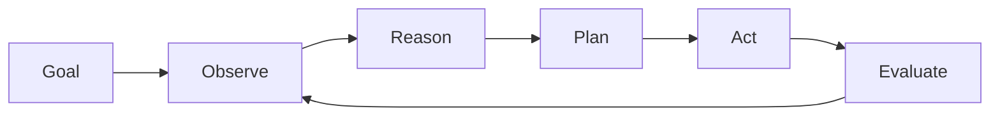
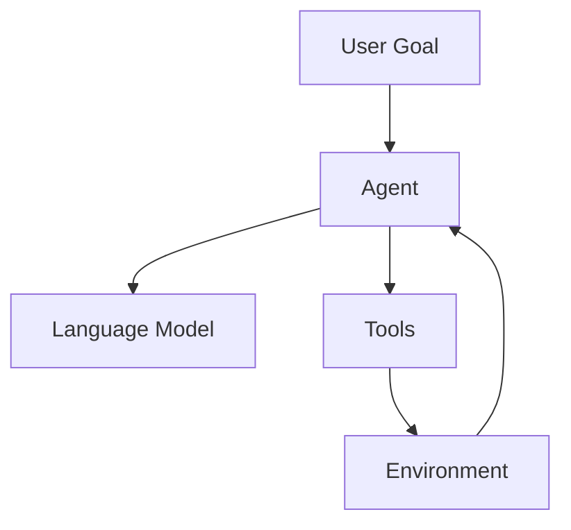
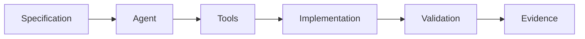

# Arquitectura interna de un agente IA

## 🎯 Objetivos de aprendizaje

Al finalizar este capítulo podrás:

- Comprender el ciclo interno de un agente.
- Identificar las etapas de percepción, razonamiento y acción.
- Entender cómo funcionan las herramientas.
- Comprender la importancia de memoria y evaluación.
- Diseñar agentes más controlables.

---

# Introducción

Un modelo de lenguaje tradicional funciona como una función:

```
Entrada

↓

Modelo

↓

Respuesta
```

Pero un agente funciona como un sistema dinámico:

```
Objetivo

↓

Analizar

↓

Planificar

↓

Actuar

↓

Evaluar

↓

Repetir
```

---

# El ciclo fundamental de un agente

El patrón más común es:



Este ciclo se conoce como:

```
Agent Loop
```

---

# 1. Goal — Objetivo

Todo comienza con un objetivo.

Ejemplo:

```
Implementar autenticación con roles.
```

Pero un objetivo puede ser demasiado amplio.

El agente debe convertirlo en algo ejecutable.

---

Ejemplo:

Entrada:

```
Crear autenticación.
```

Análisis:

```
Necesito:

- revisar arquitectura actual.
- identificar sistema existente.
- definir cambios.
- implementar.
```

---

# 2. Observe — Percepción

El agente necesita conocer el entorno.

Puede observar:

- archivos,
- código,
- especificaciones,
- documentación,
- errores,
- métricas.

---

Ejemplo:

Antes de modificar:

```
src/auth/

├── auth.service.ts

├── guards/

└── models/
```

El agente analiza:

```
Existe una capa de autenticación.
Debe extenderse.
```

---

# 3. Reason — Razonamiento

Aquí participa el modelo.

El agente intenta responder:

```
¿Qué debo hacer?
```

Ejemplo:

```
La funcionalidad requiere:

- nuevo guard.
- actualización del modelo usuario.
- nuevas pruebas.
```

---

Importante:

El razonamiento no debería estar aislado.

Debe estar basado en:

- contexto,
- reglas,
- especificaciones.

---

# 4. Planning — Planificación

El agente transforma intención en pasos.

Ejemplo:

Objetivo:

```
Agregar roles.
```

Plan:

```
Paso 1:
Analizar JWT actual.

Paso 2:
Crear RoleGuard.

Paso 3:
Actualizar rutas.

Paso 4:
Crear tests.
```

---

# Planning dinámico

Un agente puede modificar su plan.

Ejemplo:

Plan inicial:

```
Modificar AuthService.
```

Descubre:

```
Existe IdentityService.
```

Nuevo plan:

```
Extender IdentityService.
```

---

# 5. Act — Acción

Aquí el agente usa herramientas.

Ejemplos:

```
Leer archivo.

Crear archivo.

Modificar código.

Ejecutar tests.

Consultar documentación.
```

---

El modelo no modifica directamente el sistema.

Solicita acciones.

Ejemplo conceptual:

```json
{
 "tool": "read_file",
 "input": {
   "path": "src/auth/service.ts"
 }
}
```

---

La herramienta devuelve:

```json
{
 "content": "class AuthService..."
}
```

---

El agente continúa.

---

# Tool Calling

Esta es una característica fundamental.

El modelo decide:

```
Necesito información adicional.
```

Solicita una herramienta.

---

Ejemplo:

Usuario:

```
Corrige el bug.
```

Agente:

```
Necesito revisar logs.
```

Tool:

```
get_logs()
```

Resultado:

```
Error encontrado.
```

Agente:

```
Propongo cambio.
```

---

# Arquitectura con herramientas



---

# 6. Evaluate — Evaluación

Un agente necesita saber si tuvo éxito.

Ejemplos:

```
¿Los tests pasan?

¿La especificación se cumple?

¿El cambio es correcto?
```

---

Sin evaluación:

```
Agente ejecuta.

Termina.
```

---

Con evaluación:

```
Agente ejecuta.

Comprueba.

Corrige.

Reporta.
```

---

# Memoria dentro del ciclo

La memoria permite recuperar información.

Ejemplo:

Primera ejecución:

```
SPEC-001 usa arquitectura Redux.
```

Meses después:

```
Modificar módulo relacionado.
```

El agente consulta:

```
Decisiones anteriores.
```

---

# Tipos de memoria

## Short-term memory

Contexto actual.

Ejemplo:

```
Conversación actual.
```

---

## Long-term memory

Información persistente.

Ejemplo:

```
Arquitectura del proyecto.
```

---

## Episodic memory

Historial de experiencias.

Ejemplo:

```
Este cambio falló anteriormente.
```

---

# Agentes reactivos vs agentes deliberativos

Existen diferentes estilos.

---

# Reactivo

Responde inmediatamente.

```text
Evento

↓

Acción
```

Ejemplo:

```
Error de compilación.

↓

Intentar solución.
```

---

# Deliberativo

Planifica antes.

```text
Objetivo

↓

Análisis

↓

Plan

↓

Acción
```

---

Para ingeniería compleja:

```
Deliberativo
```

suele ser más adecuado.

---

# Agentes con estado

Un agente profesional necesita saber:

```
Dónde estaba.

Qué hizo.

Qué falta.
```

---

Ejemplo:

```json
{
 "task": "TASK-003",
 "status": "in_progress",
 "completed": [
   "analysis"
 ],
 "pending": [
   "implementation"
 ]
}
```

---

# Relación con SDD

Aquí conectamos ambos mundos.

SDD entrega:

```
Contexto

↓

Especificación

↓

Restricciones
```

El agente entrega:

```
Plan

↓

Acción

↓

Evidencia
```

---

Arquitectura completa:



---

# Relación con Your Harness

Un sistema como Your Harness necesitaría separar:

## Orquestador

Decide:

```
Qué agente ejecutar.
```

---

## Agentes especialistas

Ejemplo:

```
Architecture Agent

Coding Agent

QA Agent

Documentation Agent
```

---

## Herramientas

Ejemplo:

```
Git

IDE

CI/CD

Repositories
```

---

# 💡 Consejo AI Champion

El error más común es diseñar agentes pensando solamente en el modelo.

El modelo es una pieza.

El sistema completo es el agente.

---

# Buenas prácticas

- Separar razonamiento y ejecución.
- Limitar herramientas.
- Registrar acciones.
- Mantener memoria controlada.
- Evaluar resultados.

---

# Errores comunes

## Dar demasiadas herramientas

Más capacidades no siempre significa más inteligencia.

---

## No tener evaluación

El agente no sabe si terminó correctamente.

---

## No conservar estado

Los procesos complejos se vuelven frágiles.

---

# Conceptos clave

- Los agentes funcionan mediante ciclos.
- El razonamiento necesita contexto.
- Las herramientas permiten actuar.
- La memoria permite continuidad.
- La evaluación permite confianza.

---

# Ejercicio

Diseña un agente:

```
Backend Developer Agent
```

Define:

- objetivo,
- herramientas,
- memoria,
- pasos de planificación,
- validaciones.

---

# Desafío AI Champion

Diseña el loop:

```
Goal

↓

Observe

↓

Plan

↓

Execute

↓

Validate

↓

Report
```

para una tarea:

```
Implementar nueva API REST.
```

---

# Próximo capítulo

## Herramientas y Tool Calling

Profundizaremos en cómo los agentes interactúan con sistemas externos y cómo diseñar herramientas seguras para ellos.
