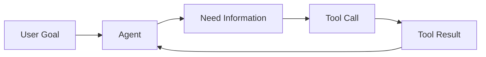

---

sidebar_position: 3
title: "Herramientas y Tool Calling"
description: "Cómo los agentes IA utilizan herramientas externas para interactuar con sistemas reales."
-------------------------------------------------------------------------------------------------------

# Herramientas y Tool Calling

## Objetivos de aprendizaje

Al finalizar este capítulo podrás:

* Comprender qué son las herramientas de un agente.
* Entender cómo funciona Tool Calling.
* Diferenciar razonamiento de ejecución.
* Diseñar herramientas seguras para agentes.
* Comprender su importancia en sistemas de ingeniería asistida por IA.

---

# Introducción

En los capítulos anteriores vimos que un agente combina:

```
Modelo

+

Memoria

+

Planificación

+

Acciones
```

Pero existe una pregunta fundamental:

> ¿Cómo realiza realmente acciones sobre el mundo?

La respuesta:

```
Tools
```

---

# Modelo sin herramientas

Un modelo de lenguaje tradicional funciona así:

```
Usuario

↓

Modelo

↓

Respuesta
```

Ejemplo:

Usuario:

```
Analiza este error.
```

Respuesta:

```
El problema probablemente está en la configuración.
```

El modelo puede razonar, pero no puede:

* leer archivos,
* ejecutar comandos,
* consultar sistemas,
* modificar código.

---

# Agente con herramientas

Un agente agrega capacidades:

```
Usuario

↓

Agente

↓

Modelo

↓

Tools

↓

Sistema externo
```

Ejemplo:

Objetivo:

```
Resolver error de compilación.
```

El agente puede:

1. Leer archivos.
2. Ejecutar build.
3. Analizar error.
4. Modificar código.
5. Ejecutar tests.

---

# ¿Qué es una Tool?

Una herramienta es una capacidad externa que el agente puede invocar.

Ejemplos:

## Desarrollo

```
read_file()

write_file()

run_tests()

git_diff()
```

---

## Infraestructura

```
deploy()

check_logs()

restart_service()
```

---

## Información

```
search_docs()

query_database()

call_api()
```

---

# Separación de responsabilidades

Un principio importante:

```
Modelo

decide

↓

Tool

ejecuta
```

El modelo no debería tener acceso directo.

---

Ejemplo:

Incorrecto:

```
IA modifica directamente archivos.
```

Correcto:

```
IA solicita:

modify_file()

↓

Sistema valida

↓

Se ejecuta cambio
```

---

# Anatomía de una Tool

Una herramienta normalmente tiene:

```
Nombre

Descripción

Entrada

Salida

Permisos
```

---

Ejemplo conceptual:

```json
{
  "name": "read_file",
  "description": "Lee contenido de un archivo",
  "parameters": {
    "path": "string"
  }
}
```

---

Respuesta:

```json
{
  "content": "export class UserService..."
}
```

---

# Ciclo de Tool Calling

El flujo es:



---

Ejemplo:

Usuario:

```
Corrige el error de autenticación.
```

---

Agente:

```
Necesito revisar AuthService.
```

---

Tool:

```
read_file(auth.service.ts)
```

---

Resultado:

```
Código del servicio.
```

---

Agente:

```
Encuentra problema.

Propone cambio.
```

---

# Tools en desarrollo de software

Un agente developer podría tener:

## Repository Tools

```
read_file

search_code

create_file

modify_file
```

---

## Execution Tools

```
npm_test

npm_build

lint

run_command
```

---

## Version Control Tools

```
git_status

git_diff

create_branch

commit
```

---

# Seguridad de herramientas

Este es uno de los puntos más importantes.

Una herramienta entrega capacidades.

Pero también riesgos.

---

Ejemplo:

Tool:

```
execute_command()
```

Puede permitir:

```
rm -rf

drop database

deploy incorrecto
```

---

Por eso un agente profesional necesita:

```
Permisos limitados

+

Validaciones

+

Auditoría
```

---

# Principio de mínimo privilegio

Un agente debería tener solamente las herramientas necesarias.

Ejemplo:

QA Agent:

Necesita:

```
read_file()

run_tests()
```

No necesita:

```
deploy_production()
```

---

# Tools especializadas vs herramientas genéricas

Existen dos enfoques.

---

# Tool genérica

Ejemplo:

```
execute_shell()
```

Ventaja:

Flexible.

Desventaja:

Mayor riesgo.

---

# Tool especializada

Ejemplo:

```
run_unit_tests()
```

Ventaja:

Control.

Desventaja:

Menor flexibilidad.

---

En sistemas enterprise suele preferirse:

```
Tools especializadas
```

---

# Tool Calling y SDD

Aquí aparece una conexión importante.

SDD define:

```
Qué debe hacerse.
```

Las herramientas permiten:

```
Ejecutar el cambio.
```

---

Flujo completo:

```
Specification

↓

Agent

↓

Planning

↓

Tools

↓

Implementation

↓

Validation
```

---

# Ejemplo con Specification

Tenemos:

```
SPEC-010

Agregar endpoint de usuarios.
```

El agente:

Lee:

```
SPEC-010
```

Planifica:

```
Crear controller.

Crear service.

Crear tests.
```

Usa tools:

```
read_file()

create_file()

run_tests()
```

Entrega:

```
Implementation Report
```

---

# Tool Registry

En arquitecturas avanzadas las herramientas se registran.

Ejemplo:

```
tools/

├── filesystem

├── git

├── testing

├── deployment

└── documentation
```

---

El agente consulta:

```
¿Qué herramientas tengo disponibles?
```

---

# Relación con MCP

Los protocolos modernos buscan estandarizar cómo los modelos acceden a herramientas.

La idea:

```
Modelo

↓

Protocolo común

↓

Herramientas externas
```

Esto permite conectar agentes con diferentes sistemas.

---

# Relación con Your Harness

Your Harness necesitaría una capa de herramientas:

```
Agent Layer

↓

Tool Layer

↓

Engineering Systems
```

Ejemplo:

```
Coding Agent

↓

Git Tool

↓

Repository
```

---

# 💡 Consejo AI Champion

La inteligencia del agente no está solamente en el modelo.

Está en:

```
Modelo

+

Contexto

+

Herramientas

+

Control
```

---

# Buenas prácticas

* Diseñar herramientas pequeñas.
* Definir permisos.
* Registrar acciones.
* Validar entradas.
* Generar evidencia.

---

# Errores comunes

## Dar acceso completo al sistema

Aumenta riesgos.

---

## Crear una única herramienta gigante

Dificulta control y mantenimiento.

---

## No registrar acciones

Se pierde trazabilidad.

---

# Conceptos clave

* Las tools permiten actuar.
* Tool Calling conecta razonamiento con ejecución.
* El modelo decide, la herramienta ejecuta.
* Los permisos son fundamentales.
* Los agentes necesitan herramientas diseñadas correctamente.

---

# Ejercicio

Diseña herramientas para un:

```
Frontend Developer Agent
```

Define:

* herramientas necesarias,
* permisos,
* entradas,
* salidas.

---

# Desafío AI Champion

Diseña un Tool Registry:

```
Engineering Tools

├── Code Analysis

├── Repository

├── Testing

├── Documentation

└── Deployment
```

Define qué agentes pueden utilizar cada herramienta.

---

# Próximo capítulo

## Memoria de agentes

Estudiaremos cómo los agentes mantienen conocimiento entre ejecuciones y cómo esto conecta con:

* embeddings,
* bases vectoriales,
* memoria persistente,
* contexto de proyectos.

---
