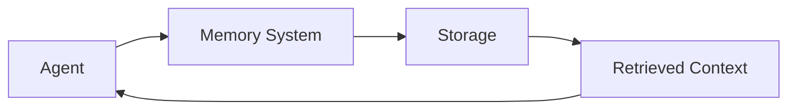
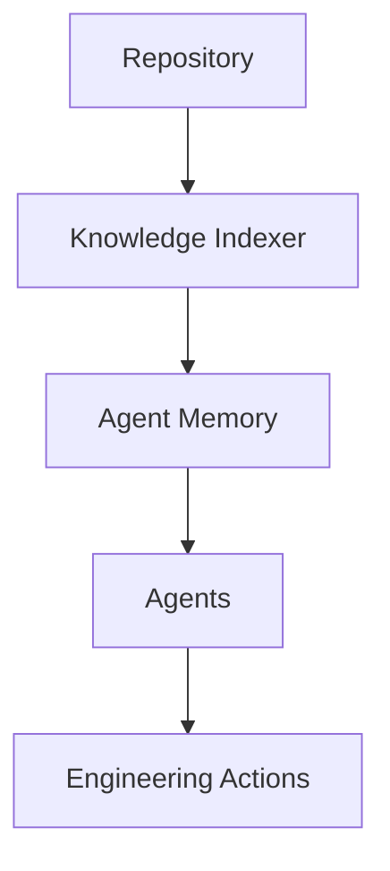

# Memoria de agentes IA

## 🎯 Objetivos de aprendizaje

Al finalizar este capítulo podrás:

- Comprender por qué los agentes necesitan memoria.
- Diferenciar tipos de memoria.
- Entender la relación entre embeddings y memoria.
- Conocer arquitecturas de memoria para agentes.
- Diseñar sistemas de memoria aplicados a ingeniería de software.

---

# Introducción

Un modelo de lenguaje tiene una capacidad limitada:

```
Context Window
```

Puede trabajar solamente con la información disponible en el contexto actual.

---

Ejemplo:

Conversación actual:

```
Usuario:

Analiza este componente Angular.
```

El modelo puede responder.

Pero mañana:

```
Usuario:

Continúa con el mismo componente.
```

El modelo no sabe necesariamente:

- qué componente era,
- qué decisiones tomó,
- qué problemas encontró.

---

# La memoria resuelve este problema

Un agente con memoria puede almacenar:

```
Experiencias

Decisiones

Documentación

Código

Contexto del proyecto
```

---

Modelo:

```
Sin memoria:

Input

↓

LLM

↓

Output
```

---

Agente con memoria:

```
Input

↓

Memory Retrieval

↓

Context

↓

LLM

↓

Action
```

---

# Arquitectura básica de memoria



---

# Tipos de memoria

Existen diferentes formas de clasificar memoria.

---

# 1. Short-Term Memory

También llamada memoria de trabajo.

Representa:

```
Contexto actual
```

---

Ejemplo:

Una conversación:

```
Usuario:
Crea un servicio.

IA:
Creé user.service.ts.

Usuario:
Ahora agrega tests.
```

La IA mantiene:

```
user.service.ts
```

dentro del contexto.

---

Limitación:

Cuando termina la sesión:

```
Memoria perdida.
```

---

# 2. Long-Term Memory

Memoria persistente.

Permite recordar información entre sesiones.

---

Ejemplo:

Proyecto:

```
Frontend utiliza Angular Signals.

Estado global con NgRx.

Testing con Jest.
```

---

Tiempo después:

```
Crear nuevo módulo.
```

El agente recupera:

```
Arquitectura existente.
```

---

# 3. Episodic Memory

Memoria basada en experiencias.

Guarda:

```
Qué ocurrió.

Qué decisión se tomó.

Qué resultado tuvo.
```

---

Ejemplo:

```
Intentamos migrar webpack.

Falló por incompatibilidad.

Se decidió mantener configuración actual.
```

---

# 4. Semantic Memory

Memoria de conocimiento.

Guarda conceptos.

Ejemplo:

```
La aplicación usa arquitectura hexagonal.

Los servicios externos están detrás de adapters.
```

---

# Memoria y agentes de ingeniería

En desarrollo de software la memoria es especialmente importante.

Un agente necesita conocer:

- arquitectura,
- convenciones,
- decisiones previas,
- reglas del negocio.

---

Ejemplo:

Un agente recibe:

```
Implementar nuevo endpoint.
```

Sin memoria:

```
Genera código genérico.
```

---

Con memoria:

```
Respeta:

- arquitectura actual.
- patrones usados.
- naming conventions.
- decisiones anteriores.
```

---

# Embeddings como memoria semántica

Aquí aparece un concepto visto anteriormente:

```
Embeddings
```

---

Los embeddings convierten información en vectores.

Ejemplo:

Documento:

```
La autenticación utiliza JWT.
```

Se transforma en:

```
[0.23, 0.71, -0.42...]
```

---

La ventaja:

Podemos buscar por significado.

---

Pregunta:

```
¿Cómo funciona la autenticación?
```

Puede recuperar:

```
auth-architecture.md
jwt-decisions.md
security-rules.md
```

aunque no tengan las mismas palabras.

---

# Vector Database

La memoria semántica normalmente usa:

```
Vector Database
```

Ejemplos:

- ChromaDB.
- Pinecone.
- Weaviate.
- Milvus.
- PostgreSQL con extensiones vectoriales.

---

Arquitectura:


---

# Memoria basada en RAG

RAG:

```
Retrieval Augmented Generation
```

Combina:

```
Recuperación

+

Generación
```

---

Flujo:

```
Pregunta

↓

Buscar memoria

↓

Obtener contexto

↓

Enviar al modelo

↓

Respuesta
```

---

# Ejemplo aplicado a código

Pregunta:

```
Implementa un guard de autorización.
```

---

El agente busca:

```
architecture.md

auth-spec.md

existing-guards.ts

adr-015.md
```

---

Obtiene contexto:

```
La aplicación usa functional guards.

Los permisos vienen del JWT.

Se utiliza Signals.
```

---

Genera código alineado.

---

# Memoria activa vs memoria pasiva

## Pasiva

El agente consulta cuando necesita.

Ejemplo:

```
Buscar documentación.
```

---

## Activa

El agente decide guardar información.

Ejemplo:

```
Esta decisión arquitectónica será importante.
Guardar ADR.
```

---

# Gestión de memoria

Una memoria profesional necesita:

## Selección

No todo debe guardarse.

---

## Actualización

El conocimiento cambia.

---

## Eliminación

Información obsoleta debe desaparecer.

---

# Memoria y gobernanza

Un problema importante:

¿Quién decide qué recuerda el agente?

---

Modelo recomendado:

```
Agent

↓

Propuesta de memoria

↓

Validación humana

↓

Persistencia
```

---

# Relación con SDD

SDD genera información ideal para memoria.

Ejemplo:

```
Specification

ADR

RFC

Decision Log

Test Evidence
```

---

La memoria del agente puede construirse alrededor de:

```
Engineering Knowledge Base
```

---

# Relación con Your Harness

Esta es una de las piezas centrales.

Your Harness necesitaría:

```
Knowledge Layer

├── Specifications

├── ADRs

├── RFCs

├── Decisions

├── Code Context

└── Agent Memory
```

---

Arquitectura:



---

# 💡 Consejo AI Champion

La memoria no es guardar todo.

La memoria es conservar aquello que mejora decisiones futuras.

---

# Buenas prácticas

- Separar tipos de memoria.
- Indexar información relevante.
- Mantener trazabilidad.
- Versionar conocimiento.
- Controlar qué recuerda el agente.

---

# Errores comunes

## Guardar todo

Genera ruido.

---

## No actualizar memoria

Produce decisiones incorrectas.

---

## Mezclar conocimiento y contexto temporal

No todo debe persistir.

---

# Conceptos clave

- Los agentes necesitan memoria para continuidad.
- Existen diferentes tipos de memoria.
- Embeddings permiten memoria semántica.
- RAG recupera conocimiento relevante.
- La memoria debe gobernarse.

---

# Ejercicio

Diseña la memoria de un:

```
Architecture Agent
```

Define:

- qué guarda,
- dónde lo guarda,
- cuándo recupera información,
- qué información requiere aprobación.

---

# Desafío AI Champion

Diseña una arquitectura:

```
Repository

↓

Indexer

↓

Embeddings

↓

Vector Database

↓

Agent Context

↓

Decision
```

Explica qué información debería almacenarse.

---

# Próximo capítulo

## Orquestación de agentes

Veremos cómo coordinar múltiples agentes especializados:

- planner agent,
- coding agent,
- QA agent,
- reviewer agent,
- orchestrator.
