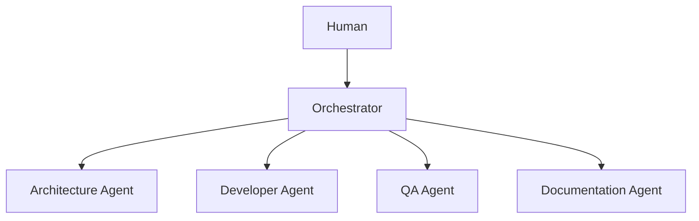
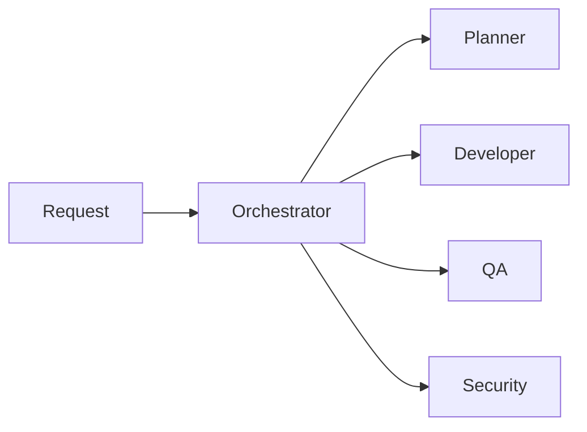
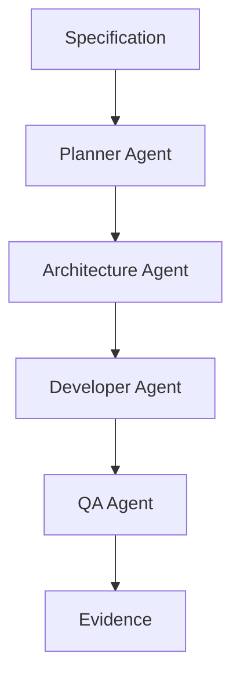
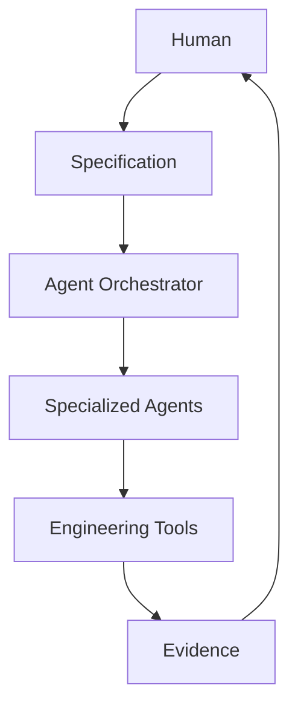

# Sistemas multi-agente

## 🎯 Objetivos de aprendizaje

Al finalizar este capítulo podrás:

- Comprender por qué utilizar múltiples agentes.
- Identificar patrones de colaboración.
- Entender el rol del agente orquestador.
- Diseñar equipos de agentes especializados.
- Aplicar estos conceptos a ingeniería de software.

---

# Introducción

Un primer enfoque podría ser:

```
Usuario

↓

Agente único

↓

Todo el trabajo
```

---

Este modelo funciona para tareas simples.

Ejemplo:

```
Crear una función.
```

---

Pero los sistemas reales requieren:

- arquitectura,
- diseño,
- implementación,
- pruebas,
- documentación,
- despliegue.

---

Intentar que un único agente haga todo genera problemas:

```
Demasiadas responsabilidades.

Menor precisión.

Mayor contexto.

Difícil control.
```

---

# La idea multi-agent

En lugar de:

```
Un agente generalista
```

tenemos:

```
Múltiples agentes especializados.
```

---

Ejemplo:

```
Architecture Agent

Coding Agent

QA Agent

Security Agent

Documentation Agent
```

---

# Modelo básico



---

# ¿Por qué especializar agentes?

Porque cada agente puede tener:

- instrucciones propias,
- herramientas específicas,
- memoria especializada,
- criterios de evaluación.

---

Ejemplo:

## Architecture Agent

Conoce:

```
ADRs

Patrones

Restricciones técnicas
```

---

## Coding Agent

Conoce:

```
Repositorio

Framework

Testing
```

---

## QA Agent

Conoce:

```
Casos de prueba

Calidad

Riesgos
```

---

# El rol del Orchestrator

El orquestador es el coordinador.

No implementa directamente.

Su responsabilidad:

```
Decidir qué agente participa.
```

---

Ejemplo:

Solicitud:

```
Agregar pagos.
```

Orchestrator:

```
Necesito:

Architecture Agent

+

Security Agent

+

Developer Agent

+

QA Agent
```

---

# Arquitectura con orquestador



---

# Patrones de colaboración

Existen varios patrones.

---

# 1. Sequential Workflow

Los agentes trabajan en cadena.

Ejemplo:

```
Planner

↓

Developer

↓

QA

↓

Reviewer
```

---

Ventaja:

Simple y controlable.

---

Desventaja:

Menor flexibilidad.

---

# 2. Parallel Agents

Varios agentes trabajan simultáneamente.

Ejemplo:

```
Architecture Agent

       |

       |

Security Agent

       |

       |

Performance Agent
```

---

Ventaja:

Más rápido.

---

Desventaja:

Necesita coordinación.

---

# 3. Reviewer Pattern

Un agente produce.

Otro revisa.

---

Ejemplo:

```
Developer Agent

↓

Code

↓

Reviewer Agent

↓

Feedback
```

---

Muy importante para ingeniería.

---

# 4. Debate Pattern

Dos agentes analizan alternativas.

Ejemplo:

```
Architecture Agent A

vs

Architecture Agent B

↓

Decision Agent
```

---

Útil para decisiones complejas.

---

# Multi-agent y SDD

Aquí aparece una conexión directa.

SDD define el flujo.

Los agentes ejecutan partes.

---

Ejemplo:

Specification:

```
SPEC-020

Sistema de pagos
```

---

Orchestrator:

Lee:

```
Necesitamos análisis arquitectónico.
```

Ejecuta:

```
Architecture Agent
```

---

Luego:

```
Plan aprobado.
```

Ejecuta:

```
Developer Agent
```

---

Luego:

```
Validación.
```

Ejecuta:

```
QA Agent
```

---

Flujo:



---

# Memoria especializada

Cada agente puede tener su propia memoria.

Ejemplo:

Architecture Agent:

```
ADRs

Architecture rules

Patterns
```

---

QA Agent:

```
Testing strategies

Known bugs

Quality rules
```

---

# Herramientas especializadas

También pueden variar.

---

Developer Agent:

```
Git

Filesystem

Compiler
```

---

Security Agent:

```
Scanner

Dependency Checker
```

---

QA Agent:

```
Testing Framework

Coverage Tools
```

---

# Control de permisos

Una ventaja importante:

No todos los agentes necesitan acceso completo.

---

Ejemplo:

```
Documentation Agent

Puede:

read_file()

crear docs
```

Pero no:

```
modify_source()
```

---

# Evaluación del sistema

¿Cómo sabemos que funciona?

Necesitamos:

```
Agent Metrics
```

---

Ejemplos:

- tareas completadas,
- errores detectados,
- revisiones necesarias,
- tiempo utilizado.

---

# Riesgos multi-agent

## Coordinación compleja

Más agentes:

```
Más comunicación.
```

---

## Información inconsistente

Un agente puede tener contexto diferente.

---

## Costos

Más ejecuciones:

```
Más consumo.
```

---

# Diseño recomendado

No comenzar con muchos agentes.

Evolución:

```
Single Agent

↓

Agent + Tools

↓

Agent + Memory

↓

Multi-Agent System
```

---

# Relación con Your Harness

Aquí aparece una arquitectura natural:

```
Your Harness

        |

        |

Agent Orchestrator

        |

----------------------------

Architecture

Planning

Coding

Testing

Documentation

Governance

```

---

# Arquitectura conceptual final



---

# 💡 Consejo AI Champion

Más agentes no significa más inteligencia.

La especialización debe existir porque existe una responsabilidad diferente.

---

# Buenas prácticas

- Definir responsabilidades claras.
- Mantener agentes pequeños.
- Usar un orquestador.
- Separar memorias.
- Controlar permisos.

---

# Errores comunes

## Crear un agente para cada tarea pequeña

Genera complejidad innecesaria.

---

## No definir responsabilidades

Todos hacen lo mismo.

---

## No tener un coordinador

Los agentes se contradicen.

---

# Conceptos clave

- Los sistemas complejos requieren especialización.
- El orquestador coordina.
- Cada agente puede tener memoria y herramientas propias.
- SDD define el proceso y los agentes ejecutan.
- Multi-agent requiere gobernanza.

---

# Ejercicio

Diseña un equipo de agentes para:

```
Crear una nueva aplicación web empresarial.
```

Define:

- agentes necesarios,
- responsabilidades,
- herramientas,
- orden de ejecución.

---

# Desafío AI Champion

Diseña un flujo:

```
Specification

↓

Orchestrator

↓

Architecture Agent

↓

Developer Agent

↓

QA Agent

↓

Evidence
```

Define qué información intercambia cada agente.

---

# Próximo capítulo

## Agent Orchestration Patterns

Profundizaremos en:

- planners,
- routers,
- workflows,
- state machines,
- grafos de agentes,
- patrones usados en frameworks modernos.
