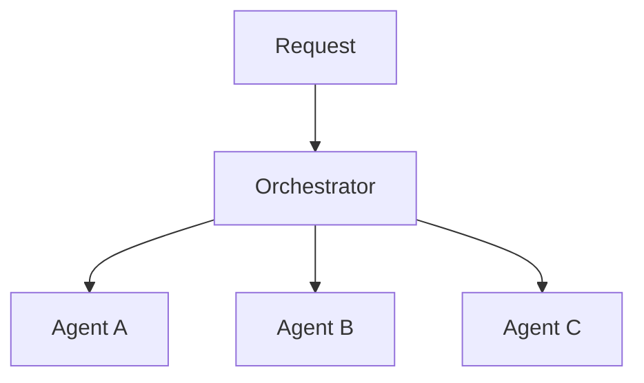
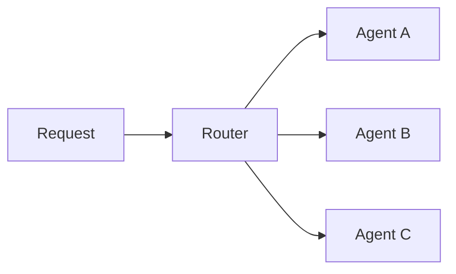
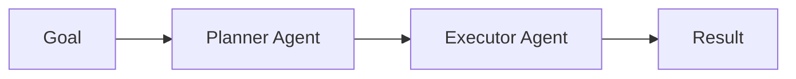
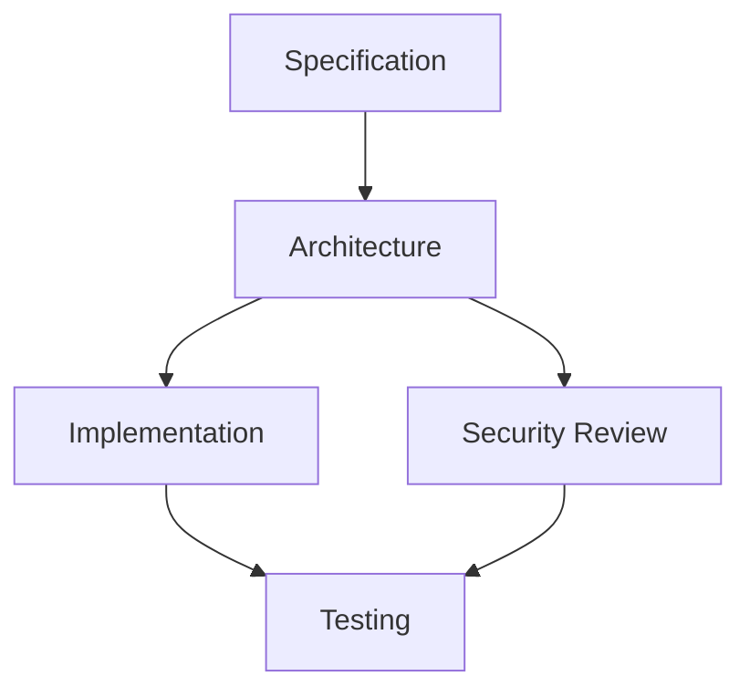
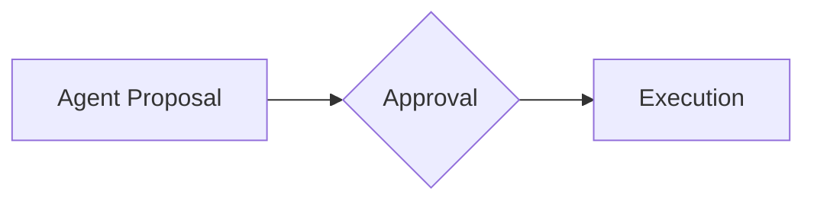

# Patrones de orquestación de agentes

## 🎯 Objetivos de aprendizaje

Al finalizar este capítulo podrás:

- Comprender qué es un orquestador de agentes.
- Conocer diferentes patrones de coordinación.
- Diseñar workflows basados en estados.
- Entender cuándo utilizar cada patrón.
- Aplicar estos conceptos a arquitecturas AI-native.

---

# Introducción

En un sistema simple:

```
Usuario

↓

Agente

↓

Resultado
```

todo es lineal.

---

Pero en un sistema real:

```
Usuario

↓

¿Necesito arquitectura?

¿Necesito código?

¿Necesito pruebas?

¿Necesito revisión?
```

Se necesita coordinación.

---

# ¿Qué es un orquestador?

El orquestador es el componente responsable de:

- analizar objetivos,
- seleccionar agentes,
- administrar flujo,
- controlar estados,
- manejar errores.

---

Modelo:



---

# Responsabilidades del orquestador

## 1. Routing

Decidir:

```
¿Qué agente debe actuar?
```

---

Ejemplo:

Solicitud:

```
Analizar vulnerabilidad.
```

Ruta:

```
Security Agent
```

---

Solicitud:

```
Crear componente React.
```

Ruta:

```
Frontend Agent
```

---

# 2. Workflow Management

Controlar secuencia.

Ejemplo:

```
Specification

↓

Planning

↓

Implementation

↓

Testing
```

---

# 3. State Management

Mantener estado del proceso.

Ejemplo:

```json
{
 "task": "payment-feature",
 "status": "testing",
 "completed": [
   "architecture",
   "implementation"
 ]
}
```

---

# 4. Error Handling

Gestionar fallos.

Ejemplo:

```
Developer Agent falla.

↓

Reintentar.

↓

Solicitar revisión.

↓

Escalar humano.
```

---

# Patrones principales

---

# 1. Router Pattern

El orquestador decide quién responde.



---

Ejemplo:

```
Pregunta de arquitectura

↓

Architecture Agent
```

```
Bug de código

↓

Developer Agent
```

---

Ventaja:

Simple.

---

Desventaja:

No coordina procesos complejos.

---

# 2. Sequential Workflow Pattern

Los agentes trabajan en orden.

Ejemplo:

```
Planner

↓

Developer

↓

QA

↓

Reviewer
```

---

Uso típico:

Procesos definidos.

---

Ventaja:

Predecible.

---

Desventaja:

Poco adaptable.

---

# 3. Planner-Executor Pattern

Uno de los patrones más importantes.

Separación:

```
Planificación

vs

Ejecución
```

---

Arquitectura:



---

Ejemplo:

Planner:

```
Crear API usuarios.

Plan:

1. Modelo.

2. Controller.

3. Tests.
```

Executor:

```
Ejecuta tareas.
```

---

# 4. Supervisor Pattern

Un agente controla otros agentes.

Ejemplo:

```
Supervisor Agent

       |

-----------------

Developer

QA

Security

```

---

El supervisor:

- revisa resultados,
- decide próximos pasos,
- solicita correcciones.

---

# 5. Graph-based Workflow

Los procesos se modelan como grafos.

Ejemplo:



---

Ventaja:

Permite caminos diferentes.

---

# 6. Human Approval Pattern

Fundamental para sistemas profesionales.

Flujo:



---

Ejemplo:

Antes de:

```
Modificar producción
```

se requiere:

```
Aprobación humana.
```

---

# State Machines para agentes

Una forma robusta de controlar agentes:

```
Estados
```

Ejemplo:

```text
CREATED

↓

ANALYZING

↓

PLANNING

↓

EXECUTING

↓

VALIDATING

↓

COMPLETED
```

---

Cada transición tiene reglas.

Ejemplo:

```
EXECUTING

solo si:

plan aprobado = true
```

---

# Orquestación y SDD

Aquí se unen todos los conceptos.

SDD define:

```
Qué debe ocurrir.
```

Orquestación define:

```
Quién lo ejecuta y cuándo.
```

---

Ejemplo:

```
SPEC-100

↓

Orchestrator

↓

Architecture Agent

↓

Developer Agent

↓

QA Agent

↓

Evidence
```

---

# Arquitectura AI-native

Una plataforma avanzada tendría:

```text
                 Human

                   |

                   ↓

            Specification

                   |

                   ↓

          Agent Orchestrator

                   |

      -------------------------

      |          |            |

Architecture  Coding       QA

 Agent        Agent       Agent

      |          |            |

      -------------------------

                   |

                   ↓

              Evidence

```

---

# Orquestación en Your Harness

Este componente sería uno de los principales.

Posible arquitectura:

```
yh-core

├── orchestrator

├── agents

├── workflows

├── memory

├── tools

└── governance
```

---

Ejemplo:

```yaml
workflow:
  name: feature-development

steps:

  - agent: planner

  - agent: architect

  - approval: human

  - agent: developer

  - agent: qa
```

---

# Métricas del orquestador

Un sistema profesional debe medir:

## Ejecución

```
Tiempo por workflow
```

---

## Calidad

```
Errores encontrados
```

---

## Autonomía

```
Acciones sin intervención humana
```

---

## Confianza

```
Nivel de aprobación humana
```

---

# Riesgos

## Workflow demasiado rígido

No permite adaptación.

---

## Demasiada autonomía

Pierde control.

---

## Orquestador demasiado inteligente

Se convierte en un punto difícil de mantener.

---

# Buen diseño

Un buen orquestador debe ser:

```
Simple

Observable

Extensible

Controlable
```

---

# 💡 Consejo AI Champion

El futuro no será un agente gigante.

Será una red coordinada de agentes especializados.

---

# Buenas prácticas

- Separar planificación y ejecución.
- Modelar estados.
- Registrar eventos.
- Incorporar aprobación humana.
- Diseñar workflows explícitos.

---

# Errores comunes

## Crear agentes sin workflow

No existe coordinación.

---

## Mezclar responsabilidades

Difícil de controlar.

---

## No guardar estado

Los procesos largos fallan.

---

# Conceptos clave

- El orquestador coordina agentes.
- Existen múltiples patrones.
- Los workflows representan procesos.
- Los estados permiten control.
- La aprobación humana es fundamental.

---

# Ejercicio

Diseña un workflow para:

```
Implementar una nueva funcionalidad empresarial.
```

Debe incluir:

- planner,
- architect,
- developer,
- QA,
- aprobación humana.

---

# Desafío AI Champion

Diseña un workflow YAML:

```
Feature Development Workflow
```

que pueda ser ejecutado por un motor de agentes.

---

# Próximo capítulo

## Agent Frameworks y ecosistema actual

Analizaremos:

- LangGraph,
- AutoGen,
- CrewAI,
- Semantic Kernel,
- patrones comunes,
- cómo elegir una arquitectura.
