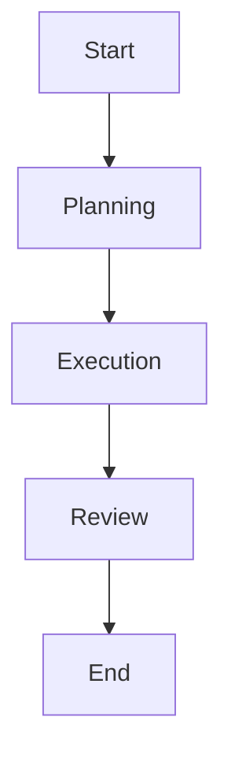

# Frameworks y ecosistema de agentes IA

## 🎯 Objetivos de aprendizaje

Al finalizar este capítulo podrás:

- Conocer los principales frameworks de agentes.
- Entender sus diferencias conceptuales.
- Identificar cuándo utilizar cada enfoque.
- Relacionar frameworks con arquitecturas SDD.
- Elegir una estrategia tecnológica.

---

# Introducción

Crear un agente desde cero implica resolver muchos problemas:

- comunicación con modelos,
- memoria,
- herramientas,
- workflows,
- estados,
- evaluación.

Los frameworks intentan abstraer estas piezas.

---

# Arquitectura base

La mayoría de frameworks implementan algo parecido:

```text
Agent

├── Model

├── Tools

├── Memory

├── State

├── Workflow

└── Evaluation
```

---

# Categorías de frameworks

Podemos dividirlos en:

## 1. Agent Graph Frameworks

Orientados a workflows complejos.

Ejemplo:

```
Estados

↓

Nodos

↓

Transiciones
```

---

## 2. Multi-Agent Frameworks

Orientados a equipos de agentes.

Ejemplo:

```
Agente A

+

Agente B

+

Coordinador
```

---

## 3. Enterprise Agent Platforms

Orientados a integración empresarial.

Incluyen:

- seguridad,
- observabilidad,
- gobierno.

---

# LangGraph

:contentReference[oaicite:0]{index=0} desarrolla LangGraph como una arquitectura basada en grafos para agentes.

---

## Concepto principal

Un agente es un grafo:



---

Cada nodo representa:

- agente,
- herramienta,
- decisión.

---

Ejemplo:

```text
Planner Node

↓

Developer Node

↓

Testing Node
```

---

## Fortalezas

- Workflows complejos.
- Control explícito.
- Estados persistentes.
- Procesos largos.

---

## Ideal para:

```
Sistemas empresariales.

Procesos con muchas etapas.
```

---

# AutoGen

:contentReference[oaicite:1]{index=1} desarrolló AutoGen como framework orientado a conversaciones entre agentes.

---

Concepto:

```
Agente A

habla con

Agente B
```

---

Ejemplo:

```text
Developer Agent:

Implementé solución.


Reviewer Agent:

Encontré problemas.
```

---

## Fortalezas

- Colaboración natural.
- Experimentación rápida.
- Roles múltiples.

---

## Ideal para:

```
Investigación.

Prototipos.

Sistemas conversacionales.
```

---

# CrewAI

CrewAI utiliza una metáfora:

```
Equipo de trabajo.
```

---

Modelo:

```text
Crew

├── Agent

├── Role

├── Task

└── Process
```

---

Ejemplo:

```yaml
agents:

- name: Architect
  role: System Designer

- name: Developer
  role: Implementer

- name: QA
  role: Tester
```

---

## Fortalezas

- Fácil de entender.
- Roles claros.
- Rápida implementación.

---

## Ideal para:

```
Automatizaciones empresariales.

Equipos de agentes.
```

---

# Semantic Kernel

:contentReference[oaicite:2]{index=2} es un SDK orientado a integración empresarial.

---

Concepto:

```text
AI

+

Aplicaciones existentes

+

Servicios empresariales
```

---

Fortalezas:

- Integración con ecosistemas Microsoft.
- Plugins.
- Enterprise readiness.

---

Ideal para:

```
Grandes organizaciones.
```

---

# Comparación conceptual

| Framework | Modelo mental | Mejor para |
|-|-|-|
| LangGraph | Grafos | Workflows complejos |
| AutoGen | Conversaciones | Colaboración entre agentes |
| CrewAI | Equipos | Automatizaciones rápidas |
| Semantic Kernel | Plugins empresariales | Integración corporativa |

---

# Frameworks vs arquitectura propia

Una decisión importante:

¿Construir sobre framework o crear plataforma propia?

---

## Framework

Ventajas:

- velocidad,
- comunidad,
- componentes existentes.

---

Desventajas:

- dependencia,
- limitaciones.

---

## Arquitectura propia

Ventajas:

- control,
- adaptación.

---

Desventajas:

- mayor esfuerzo.

---

# Estrategia recomendada

No empezar creando todo.

Evolución:

```text
Framework

↓

Patrones propios

↓

Abstracciones internas

↓

Plataforma propia
```

---

# Relación con SDD

Los frameworks son la capa de ejecución.

SDD define:

```
Specification

↓

Workflow

↓

Execution
```

El framework implementa:

```
Workflow

↓

Agents

↓

Tools
```

---

# Ejemplo completo

Specification:

```
Implementar módulo pagos.
```

---

Workflow:

```
Planner

↓

Architecture Agent

↓

Developer Agent

↓

QA Agent
```

---

Framework:

Implementa:

```
Nodes

Tools

Memory

State
```

---

# Relación con Your Harness

Your Harness probablemente no debería competir con estos frameworks.

La arquitectura puede ser:

```text
Your Harness

        |

        ↓

Agent Orchestration Layer

        |

-----------------------

LangGraph

CrewAI

Semantic Kernel

Custom Agents

```

---

La plataforma debería abstraer:

- conocimiento,
- gobernanza,
- workflows,
- memoria,
- evidencia.

---

# Criterios para elegir framework

Preguntas:

## ¿Necesito workflows complejos?

Usar:

```
Graph approach
```

---

## ¿Necesito agentes conversando?

Usar:

```
Multi-agent conversation
```

---

## ¿Necesito integración empresarial?

Usar:

```
Enterprise SDK
```

---

# 💡 Consejo AI Champion

No diseñes alrededor del framework.

Diseña alrededor del proceso de ingeniería.

---

# Buenas prácticas

- Definir arquitectura antes del framework.
- Mantener agentes pequeños.
- Separar dominio de infraestructura.
- Evitar dependencia excesiva.
- Medir resultados.

---

# Errores comunes

## Elegir framework por popularidad

No siempre encaja.

---

## Crear muchos agentes sin necesidad

Aumenta complejidad.

---

## Ignorar gobernanza

Los agentes necesitan límites.

---

# Conceptos clave

- Los frameworks implementan patrones.
- Cada framework tiene una filosofía.
- Los grafos son útiles para workflows.
- Los equipos de agentes requieren coordinación.
- La arquitectura debe venir antes de la herramienta.

---

# Ejercicio

Compara estos escenarios:

1. Generador automático de documentación.
2. Sistema completo de desarrollo asistido.
3. Agente de soporte técnico.

Selecciona qué arquitectura usarías.

---

# Desafío AI Champion

Diseña una arquitectura para Your Harness:

```
Specification Layer

↓

Agent Orchestration

↓

Framework Adapter

↓

Agents

↓

Tools
```

Define qué responsabilidades tendría cada capa.

---

# Próximo capítulo

## Evaluación y observabilidad de agentes

Analizaremos cómo medir:

- calidad,
- costos,
- errores,
- confianza,
- trazabilidad.
