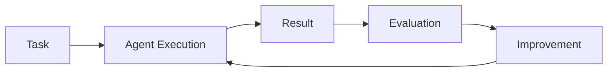

# Evaluación y observabilidad de agentes IA

## 🎯 Objetivos de aprendizaje

Al finalizar este capítulo podrás:

- Entender por qué evaluar agentes es diferente a evaluar software tradicional.
- Conocer métricas importantes para agentes.
- Diseñar sistemas de trazabilidad.
- Comprender la importancia de los logs de ejecución.
- Preparar agentes para entornos productivos.

---

# Introducción

En software tradicional normalmente evaluamos:

```
Código

↓

Tests

↓

Resultado esperado
```

---

En agentes IA el comportamiento puede variar:

```
Misma entrada

↓

Diferentes decisiones

↓

Diferentes caminos

↓

Resultado
```

---

Por eso necesitamos observar:

- qué pensó,
- qué herramientas utilizó,
- qué información recuperó,
- qué decisiones tomó.

---

# El problema de la caja negra

Un sistema tradicional:

```text
Input

↓

Código conocido

↓

Output
```

---

Un agente:

```text
Input

↓

Modelo

↓

Memoria

↓

Tools

↓

Decisiones

↓

Output
```

---

Si falla:

La pregunta no es solamente:

```
¿Qué salió mal?
```

También:

```
¿Por qué tomó esa decisión?
```

---

# Observabilidad de agentes

Un sistema observable permite conocer:

## 1. Estado actual

Ejemplo:

```
Agent status:

EXECUTING_TASK
```

---

## 2. Historial de acciones

Ejemplo:

```
10:01
Read specification

10:02
Loaded repository context

10:03
Created implementation plan
```

---

## 3. Decisiones

Ejemplo:

```
Selected Developer Agent

Reason:

Task requires code modification.
```

---

# Agent Trace

Un concepto importante:

```
Trace
```

Representa todo el recorrido del agente.

Ejemplo:

```json
{
 "task": "create-payment-api",

 "steps": [
   {
    "action": "read_spec"
   },
   {
    "action": "create_plan"
   },
   {
    "action": "call_tool"
   }
 ]
}
```

---

# Métricas importantes

## 1. Task Success Rate

Pregunta:

```
¿Cuántas tareas completó correctamente?
```

Ejemplo:

```
100 tareas

85 completadas correctamente

85%
```

---

# 2. Human Intervention Rate

Mide cuánto necesita ayuda humana.

Ejemplo:

```
100 ejecuciones

40 requieren aprobación adicional
```

---

Puede indicar:

- baja autonomía,
- tareas demasiado complejas,
- falta de contexto.

---

# 3. Tool Success Rate

Evalúa herramientas.

Ejemplo:

```
read_file()

99% éxito

deploy()

80% éxito
```

---

# 4. Cost Metrics

Los agentes consumen recursos.

Medimos:

- tokens,
- llamadas al modelo,
- tiempo,
- costo económico.

---

Ejemplo:

```
Feature implementation

15 agent steps

50k tokens

5 minutos
```

---

# 5. Quality Metrics

Más difícil.

Ejemplos:

- calidad del código,
- tests generados,
- errores encontrados,
- revisión humana.

---

# Evaluación basada en criterios

Un agente debería evaluarse contra objetivos.

Ejemplo:

Specification:

```
Crear endpoint usuarios.
```

Evaluación:

```
¿Existe endpoint?

¿Tiene validaciones?

¿Tiene tests?

¿Cumple arquitectura?
```

---

# Agent Evaluation Loop



---

# Evaluación automática

Algunas verificaciones pueden automatizarse:

## Código

```
Lint

Tests

Security Scan
```

---

## Especificación

```
Rules fulfilled

Acceptance criteria
```

---

## Documentación

```
Links valid

Format correct
```

---

# Evaluación humana

No todo puede automatizarse.

Ejemplos:

- decisiones arquitectónicas,
- trade-offs,
- impacto negocio.

---

Modelo recomendado:

```text
IA genera

↓

Automatización valida

↓

Humano decide
```

---

# Observabilidad en Multi-Agent

Cuando existen múltiples agentes necesitamos saber:

```
¿Qué agente hizo qué?
```

---

Ejemplo:

```
Orchestrator

↓

Architecture Agent

↓

Developer Agent

↓

QA Agent
```

---

Registro:

```
Architecture Agent:

Decision:
Use repository pattern.


Developer Agent:

Implemented service.


QA Agent:

Created tests.
```

---

# Auditoría de agentes

En entornos empresariales es necesario guardar:

- usuario que inició proceso,
- agentes ejecutados,
- herramientas usadas,
- cambios realizados,
- aprobación humana.

---

Ejemplo:

```
Execution ID:

RUN-2026-001

Started by:

Developer

Agents:

Planner
Developer
QA

Result:

Approved
```

---

# Observabilidad y SDD

SDD facilita evaluación porque existe trazabilidad.

Tenemos:

```
Specification

↓

Task

↓

Agent Action

↓

Code

↓

Evidence
```

---

Podemos responder:

```
¿Por qué existe este cambio?
```

Buscando:

```
Código

↓

Task

↓

Specification
```

---

# Relación con Your Harness

Esta capa es fundamental.

Una arquitectura completa necesitaría:

```
Your Harness

├── Specification Engine

├── Agent Orchestrator

├── Memory

├── Tools

├── Execution History

├── Metrics

└── Governance
```

---

# Ejemplo de Execution Report

```json
{
 "specification": "SPEC-001",

 "agents": [
   "architect",
   "developer",
   "qa"
 ],

 "tools_used": [
   "git",
   "filesystem",
   "testing"
 ],

 "tests": {
   "passed": 25
 },

 "approval": "human-approved"
}
```

---

# 💡 Consejo AI Champion

La autonomía sin observabilidad es solamente riesgo automatizado.

---

# Buenas prácticas

- Registrar ejecuciones.
- Medir resultados.
- Mantener trazabilidad.
- Evaluar calidad.
- Incorporar feedback.

---

# Errores comunes

## Medir solamente velocidad

Más rápido no siempre significa mejor.

---

## No guardar trazas

Los errores son difíciles de investigar.

---

## Evaluar solo el output final

El proceso también importa.

---

# Conceptos clave

- Los agentes necesitan observabilidad.
- Las métricas permiten mejorar.
- Los traces explican decisiones.
- SDD mejora la trazabilidad.
- La gobernanza es necesaria.

---

# Ejercicio

Diseña métricas para un:

```
Developer Agent
```

Incluye:

- éxito,
- calidad,
- costo,
- intervención humana.

---

# Desafío AI Champion

Diseña un esquema:

```
Agent Execution Record
```

Debe guardar:

- input,
- contexto,
- agentes usados,
- herramientas,
- resultado,
- aprobación.

---

# Próximo capítulo

## Seguridad y gobernanza de agentes

Veremos:

- permisos,
- límites,
- control humano,
- riesgos,
- políticas empresariales.
