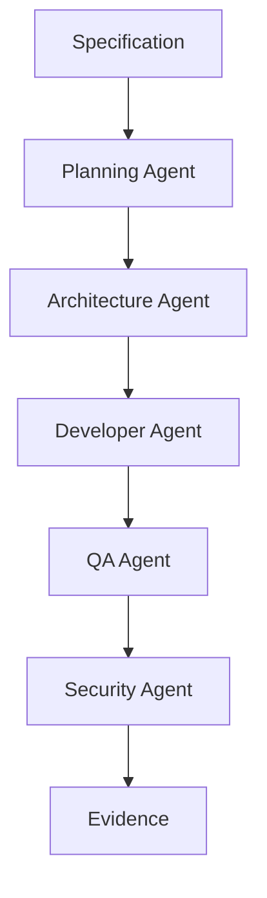

# Agentes aplicados a ingeniería de software

## 🎯 Objetivos de aprendizaje

Al finalizar este capítulo podrás:

- Identificar agentes especializados para desarrollo de software.
- Diseñar responsabilidades por agente.
- Comprender cómo interactúan dentro de un SDLC asistido por IA.
- Relacionar agentes con SDD.
- Diseñar una arquitectura AI-native para equipos de ingeniería.

---

# Introducción

El desarrollo tradicional utiliza personas con diferentes roles:

```
Product Owner

Arquitecto

Developer

QA

DevOps

Security
```

---

Una arquitectura basada en agentes replica estas responsabilidades.

No significa reemplazar personas.

Significa aumentar capacidades.

---

# Modelo tradicional vs AI-native

## Modelo tradicional

```text
Idea

↓

Análisis

↓

Diseño

↓

Desarrollo

↓

Testing

↓

Deploy
```

---

## Modelo AI-native

```text
Specification

↓

Agent Orchestrator

↓

Specialized Agents

↓

Evidence

↓

Human Approval
```

---

# Tipos de agentes de ingeniería

Una organización puede tener:

```
Architecture Agent

Planning Agent

Developer Agent

QA Agent

Security Agent

Documentation Agent

DevOps Agent
```

---

# Architecture Agent

## Responsabilidad

Diseñar soluciones técnicas.

---

Entrada:

```
Specification

Requirements

Constraints
```

---

Salida:

```
Architecture Proposal

ADRs

Technical Decisions
```

---

Ejemplo:

Solicitud:

```
Agregar sistema de pagos.
```

El agente analiza:

```
Integración externa.

Seguridad.

Persistencia.

Escalabilidad.
```

---

Herramientas:

```
Repository Reader

Documentation Search

Architecture Knowledge Base
```

---

Memoria:

```
ADRs

Patterns

Architecture Rules
```

---

# Planning Agent

## Responsabilidad

Transformar objetivos en trabajo ejecutable.

---

Entrada:

```
Feature Request
```

---

Salida:

```
Tasks

Dependencies

Execution Plan
```

---

Ejemplo:

```
Payment Feature

Tasks:

1. Crear modelo.

2. Crear API.

3. Crear UI.

4. Crear tests.
```

---

# Developer Agent

## Responsabilidad

Implementar código.

---

Puede:

```
Leer código.

Crear archivos.

Modificar componentes.

Ejecutar pruebas.
```

---

Debe conocer:

```
Framework.

Standards.

Architecture Decisions.
```

---

Herramientas:

```
Git

IDE Tools

Compiler

Test Runner
```

---

# QA Agent

## Responsabilidad

Validar calidad.

---

Puede analizar:

```
Tests.

Coverage.

Edge Cases.

Regression Risks.
```

---

Ejemplo:

Developer entrega:

```
Pull Request.
```

QA Agent analiza:

```
Faltan tests para error handling.
```

---

# Security Agent

## Responsabilidad

Evaluar riesgos.

---

Analiza:

```
Dependencies.

Authentication.

Authorization.

Secrets.

Vulnerabilities.
```

---

Ejemplo:

Detecta:

```
Token almacenado incorrectamente.
```

---

# Documentation Agent

## Responsabilidad

Mantener conocimiento.

---

Genera:

```
README.

API Docs.

Architecture Docs.

Release Notes.
```

---

Importante:

Este agente alimenta memoria.

---

# DevOps Agent

## Responsabilidad

Automatización operacional.

---

Puede trabajar con:

```
CI/CD

Infrastructure

Monitoring

Deployment
```

---

Pero normalmente requiere:

```
Human Approval
```

para producción.

---

# Comunicación entre agentes

Los agentes no deberían comunicarse solamente con texto libre.

Es mejor usar contratos.

---

Ejemplo:

Architecture Agent entrega:

```json
{
 "type": "architecture-proposal",

 "decision": "use-event-driven",

 "evidence": [
   "ADR-020"
 ]
}
```

---

Developer Agent recibe:

```
Architecture Contract
```

---

# Flujo completo



---

# Agentes y SDD

SDD es el elemento central.

Sin especificaciones:

```
Agentes improvisan.
```

---

Con SDD:

```
Specification

↓

Plan

↓

Implementation

↓

Validation
```

---

Cada agente tiene un contrato.

---

# Ejemplo real

Specification:

```
Crear módulo de beneficios.
```

---

Planning Agent:

Genera:

```
10 tareas.
```

---

Architecture Agent:

Define:

```
Microfrontend.

API Gateway.

Security model.
```

---

Developer Agent:

Implementa.

---

QA Agent:

Valida:

```
Tests.

Performance.

Accesibilidad.
```

---

Security Agent:

Revisa:

```
Permisos.

Datos sensibles.
```

---

# Arquitectura completa

```text
                 Human

                   |

                   ↓

            Specification

                   |

                   ↓

            Orchestrator

                   |

 ------------------------------------------------

 |          |          |          |             |

Arch      Dev        QA       Security      Docs

Agent    Agent      Agent      Agent       Agent

 |          |          |          |             |

 ------------------------------------------------

                   |

                   ↓

              Evidence Store

```

---

# Relación con Your Harness

Esta arquitectura se parece al objetivo inicial:

```
Your Harness

=

Sistema operativo para ingeniería
```

---

Componentes:

```
yh-core

├── specification-engine

├── orchestrator

├── agent-runtime

├── tool-system

├── memory-system

├── governance

└── evidence-store
```

---

# Métricas de agentes de ingeniería

Ejemplos:

## Developer Agent

```
Código generado.

Tests aprobados.

Cambios rechazados.
```

---

## QA Agent

```
Bugs encontrados.

Cobertura.

Falsos positivos.
```

---

## Architecture Agent

```
Decisiones aceptadas.

Revisiones necesarias.
```

---

# 💡 Consejo AI Champion

Los mejores agentes no son los que escriben más código.

Son los que toman mejores decisiones dentro de un proceso controlado.

---

# Buenas prácticas

- Definir roles claros.
- Mantener contratos entre agentes.
- Usar SDD como fuente de verdad.
- Registrar evidencia.
- Mantener aprobación humana.

---

# Errores comunes

## Crear un "super developer agent"

Termina mezclando responsabilidades.

---

## No tener contexto arquitectónico

Genera código inconsistente.

---

## Automatizar sin evidencia

Reduce confianza.

---

# Conceptos clave

- Los agentes pueden especializarse por rol.
- Cada agente necesita contexto y herramientas.
- SDD coordina el trabajo.
- La evidencia es parte del resultado.
- La arquitectura AI-native requiere gobernanza.

---

# Ejercicio

Diseña un equipo de agentes para:

```
Migrar una aplicación Angular 15 a Angular 20.
```

Define:

- agentes necesarios,
- responsabilidades,
- herramientas,
- aprobaciones.

---

# Desafío AI Champion

Diseña el primer workflow de Your Harness:

```
Feature Request

↓

Specification

↓

Planning Agent

↓

Architecture Agent

↓

Developer Agent

↓

QA Agent

↓

Evidence
```

---

# Próximo capítulo

## Construcción de un Agent Runtime

Veremos cómo se diseña el motor interno que ejecuta agentes:

- ciclo de vida,
- contexto,
- herramientas,
- memoria,
- eventos,
- ejecución.
