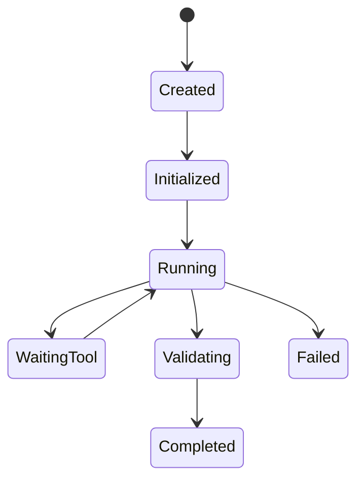

# Arquitectura de un Agent Runtime

## 🎯 Objetivos de aprendizaje

Al finalizar este capítulo podrás:

- Comprender qué es un Agent Runtime.
- Identificar sus componentes internos.
- Entender el ciclo de vida de un agente.
- Diseñar una arquitectura ejecutable de agentes.
- Relacionar el runtime con plataformas como Your Harness.

---

# Introducción

Hasta ahora vimos agentes como concepto:

```
Agent

=

Model

+

Tools

+

Memory

+

Instructions
```

Pero falta responder:

> ¿Quién ejecuta al agente?

La respuesta:

```
Agent Runtime
```

---

# ¿Qué es un Agent Runtime?

Es el motor responsable de:

- crear agentes,
- ejecutar ciclos,
- administrar contexto,
- invocar herramientas,
- manejar memoria,
- controlar estados.

---

Modelo conceptual:

```
              Agent Runtime

                    |

        -------------------------

        |          |            |

      Agent      Tools       Memory

        |

      Model
```

---

# Analogía con aplicaciones tradicionales

Aplicación tradicional:

```
Código

↓

Runtime

↓

Sistema Operativo
```

---

Agente IA:

```
Agent Definition

↓

Agent Runtime

↓

Infrastructure
```

---

# Componentes principales

Un runtime típico contiene:

```
Agent Runtime

├── Agent Manager

├── Execution Engine

├── Context Manager

├── Tool Manager

├── Memory Manager

├── Event System

└── Evaluation Layer
```

---

# 1. Agent Manager

Responsabilidad:

Gestionar agentes disponibles.

---

Ejemplo:

```json
{
 "agents": [

   {
    "name": "developer",
    "version": "1.0"
   },

   {
    "name": "qa",
    "version": "1.0"
   }

 ]
}
```

---

Funciones:

- registrar agentes,
- activar agentes,
- versionar agentes.

---

# 2. Execution Engine

Es el corazón del runtime.

Ejecuta:

```
Agent Loop
```

---

Recordemos:

```
Observe

↓

Reason

↓

Plan

↓

Act

↓

Evaluate
```

---

Ejemplo:

```text
Task received

↓

Load agent

↓

Load context

↓

Execute reasoning

↓

Call tools

↓

Evaluate result

```

---

# 3. Context Manager

Administra la información disponible para el agente.

Incluye:

```
System Instructions

User Request

Memory

Specification

Tool Results
```

---

Ejemplo:

```json
{
 "context": {

  "specification":
  "Create payment module",

  "architecture":
  "Microfrontend",

  "rules":
  "Use Angular Signals"

 }
}
```

---

# 4. Tool Manager

Gestiona herramientas.

Responsabilidades:

- registrar tools,
- validar permisos,
- ejecutar llamadas.

---

Ejemplo:

```text
Agent solicita:

run_tests()

↓

Tool Manager valida

↓

Ejecuta

↓

Devuelve resultado
```

---

# 5. Memory Manager

Controla:

```
Guardar

Buscar

Actualizar

Eliminar
```

---

Ejemplo:

Agente pregunta:

```
¿Existe alguna decisión previa sobre pagos?
```

Memory Manager:

```
Busca ADR-023.

Devuelve contexto.
```

---

# 6. Event System

Los agentes generan eventos.

Ejemplo:

```
AgentStarted

ToolCalled

ToolCompleted

AgentCompleted

ApprovalRequired
```

---

Esto permite:

- auditoría,
- observabilidad,
- integración externa.

---

# 7. Evaluation Layer

Después de ejecutar:

Pregunta:

```
¿El resultado cumple?
```

---

Puede evaluar:

```
Tests

Rules

Specification

Human Approval
```

---

# Ciclo de vida de un agente

Un agente normalmente pasa por estados:

```
CREATED

↓

INITIALIZED

↓

RUNNING

↓

WAITING_TOOL

↓

VALIDATING

↓

COMPLETED

↓

FAILED
```

---

Representación:



---

# Ejecución de una tarea

Ejemplo:

Solicitud:

```
Crear componente Angular.
```

---

Runtime:

## Paso 1

Carga agente:

```
Frontend Developer Agent
```

---

## Paso 2

Carga contexto:

```
Specification

Architecture

Repository
```

---

## Paso 3

Ejecuta:

```
Planning
```

---

## Paso 4

Usa tools:

```
read_file()

create_component()

run_tests()
```

---

## Paso 5

Evalúa:

```
Tests passed
```

---

## Paso 6

Genera evidencia:

```
Execution Report
```

---

# Arquitectura distribuida

Un runtime empresarial puede separar componentes:

```
                API Gateway

                    |

              Runtime Controller

                    |

        ----------------------------

        |            |             |

     Workers     Tool Server   Memory

```

---

# Persistencia del runtime

Procesos largos necesitan guardar estado.

Ejemplo:

```json
{
 "execution":

 {
  "id":"RUN-100",

  "status":"waiting_approval",

  "current_step":"deployment"
 }

}
```

---

# Runtime y SDD

El runtime ejecuta procesos definidos.

SDD aporta:

```
Intent

Rules

Constraints

Acceptance Criteria
```

---

El runtime convierte:

```
Specification

↓

Execution Plan

↓

Agent Actions

↓

Evidence
```

---

# Relación con Your Harness

Esta sería una de las piezas principales:

```
yh-runtime
```

Posible arquitectura:

```
yh-runtime

├── agent-engine

├── workflow-engine

├── context-manager

├── tool-registry

├── memory-adapter

├── event-bus

└── evaluator
```

---

# Ejemplo de definición de agente

```yaml
agent:

 name: developer-agent

 model:
   provider: openai

 tools:
   - filesystem
   - git
   - testing

 memory:
   enabled: true

 policy:
   approval:
     required: true
```

---

# Buen diseño de Runtime

Un runtime debe ser:

## Extensible

Agregar nuevos agentes fácilmente.

---

## Observable

Todo evento registrado.

---

## Seguro

Permisos controlados.

---

## Determinista

Procesos reproducibles.

---

# Errores comunes

## Mezclar agente y runtime

El agente debe ser una definición.

El runtime debe ejecutarla.

---

## No guardar estado

Los procesos largos fallan.

---

## Ejecutar tools directamente

Debe existir una capa de control.

---

# Conceptos clave

- El runtime ejecuta agentes.
- Gestiona ciclo de vida.
- Controla contexto y herramientas.
- Mantiene estado.
- Produce evidencia.

---

# Ejercicio

Diseña un runtime mínimo:

Debe soportar:

```
Agent

Tool

Memory

Execution History
```

---

# Desafío AI Champion

Diseña la interfaz:

```
AgentRuntime.execute(task)
```

Define:

- entrada,
- proceso interno,
- salida,
- eventos generados.

---

# Próximo capítulo

## Diseño de una plataforma AI Engineering completa

Integraremos:

- SDD,
- agentes,
- runtime,
- memoria,
- gobernanza,
- evidencia,

en una arquitectura completa similar a Your Harness.
