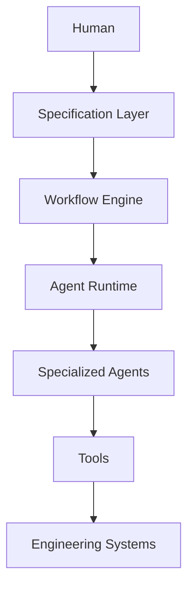

# Arquitectura de una plataforma de AI Engineering

## 🎯 Objetivos de aprendizaje

Al finalizar este capítulo podrás:

- Comprender cómo integrar todos los componentes estudiados.
- Diseñar una plataforma de AI Engineering.
- Identificar las responsabilidades de cada capa.
- Entender el papel de SDD dentro de una plataforma moderna.
- Construir una visión arquitectónica completa.

---

# Introducción

Durante este curso estudiamos muchas piezas:

- modelos,
- prompting,
- RAG,
- memoria,
- herramientas,
- agentes,
- orquestación,
- gobernanza.

La pregunta ahora es:

> ¿Cómo se integran todas estas piezas en un único sistema?

---

# La evolución de la IA aplicada al desarrollo

Podemos representar la evolución así:

```text
LLM

↓

Chat Assistant

↓

AI Copilot

↓

AI Agent

↓

Multi-Agent System

↓

AI Engineering Platform
```

---

Cada etapa incorpora nuevas capacidades.

---

# ¿Qué es una AI Engineering Platform?

Es una plataforma diseñada para asistir y automatizar el ciclo completo de ingeniería de software.

No es solamente un chatbot.

No es solamente un agente.

Es un ecosistema coordinado.

---

Sus componentes principales son:

```text
Specification Layer

↓

Orchestration Layer

↓

Agent Runtime

↓

Specialized Agents

↓

Tool Layer

↓

Engineering Systems
```

---

# Visión por capas



---

Cada capa tiene una responsabilidad distinta.

---

# 1. Specification Layer

Es la fuente de verdad.

Aquí viven:

- requerimientos,
- historias de usuario,
- especificaciones,
- criterios de aceptación,
- ADRs,
- RFCs.

---

El objetivo es responder:

```text
¿Qué debe construirse?
```

---

# 2. Workflow Layer

Transforma una intención en un proceso ejecutable.

Ejemplo:

```text
Nueva funcionalidad

↓

Análisis

↓

Diseño

↓

Implementación

↓

Testing

↓

Documentación
```

---

Esta capa define:

- orden,
- dependencias,
- aprobaciones.

---

# 3. Agent Runtime

Ejecuta el workflow.

Responsabilidades:

- cargar agentes,
- administrar contexto,
- ejecutar herramientas,
- guardar estado,
- registrar eventos.

---

# 4. Specialized Agents

Cada agente tiene una responsabilidad.

Ejemplo:

```text
Planning Agent

Architecture Agent

Developer Agent

QA Agent

Security Agent

Documentation Agent
```

---

Todos trabajan sobre la misma especificación.

---

# 5. Tool Layer

Los agentes no actúan directamente sobre el sistema.

Siempre utilizan herramientas.

Ejemplos:

```text
Filesystem

Git

CI/CD

Issue Tracker

Documentation

Cloud

Databases
```

---

La Tool Layer controla:

- permisos,
- auditoría,
- validación.

---

# 6. Engineering Systems

Finalmente aparecen los sistemas reales.

Ejemplos:

```text
GitHub

Azure DevOps

Jira

Docker

Kubernetes

Cloud Provider
```

---

La plataforma nunca interactúa directamente con ellos.

Siempre mediante herramientas controladas.

---

# Memoria compartida

Existe un componente transversal:

```text
Knowledge Layer
```

Contiene:

- especificaciones,
- ADRs,
- RFCs,
- documentación,
- decisiones,
- patrones,
- contexto del repositorio.

---

Arquitectura:

```mermaid
flowchart LR

Repository

-->

Indexer

-->

Embeddings

-->

Knowledge Base

-->

Agents

```

---

# Observabilidad

Otra capa transversal.

Debe registrar:

- ejecución,
- herramientas,
- decisiones,
- métricas,
- aprobaciones.

---

Ejemplo:

```text
RUN-125

Planner

↓

Developer

↓

QA

↓

Approved
```

---

# Gobernanza

Una plataforma profesional necesita reglas.

Ejemplo:

```yaml
workflow:

deployment:

  requires:

    - specification

    - tests

    - security_review

    - human_approval
```

---

Las políticas limitan la autonomía.

---

# Relación con SDD

Aquí aparece uno de los conceptos más importantes del curso.

En muchas plataformas actuales el flujo comienza con un prompt.

En una plataforma AI-native el flujo comienza con una especificación.

Comparación:

## Enfoque tradicional

```text
Prompt

↓

Código
```

---

## Enfoque SDD

```text
Specification

↓

Planning

↓

Architecture

↓

Implementation

↓

Validation

↓

Evidence
```

---

La especificación se convierte en el contrato de trabajo para todos los agentes.

---

# Evidencia como resultado

El producto final no debería ser únicamente código.

También debe existir evidencia.

Ejemplo:

```text
Specification

Architecture Decisions

Generated Code

Tests

Documentation

Execution Report

Approvals
```

---

Esto mejora:

- trazabilidad,
- auditoría,
- mantenimiento.

---

# Arquitectura conceptual completa

```text
                     Human

                       |

                       ↓

               Specification Layer

                       |

                Workflow Engine

                       |

               Agent Orchestrator

                       |

               Agent Runtime

                       |

------------------------------------------------------

|        |          |         |         |             |

Planner  Architect  Developer QA   Security     Docs

------------------------------------------------------

                       |

                 Tool Registry

                       |

------------------------------------------------------

Git

CI/CD

Filesystem

Issue Tracker

Cloud

Documentation

------------------------------------------------------

                       |

                Knowledge Layer

                       |

            Observability & Governance

```

---

# Relación con Your Harness

La visión de Your Harness puede entenderse como una implementación de esta arquitectura.

Una posible organización sería:

```text
your-harness/

├── specification-engine/

├── workflow-engine/

├── orchestrator/

├── runtime/

├── agents/

├── tools/

├── knowledge/

├── governance/

├── evidence/

└── integrations/
```

---

Es importante destacar que **Your Harness no reemplaza a un framework de agentes**.

Su función sería:

- organizar el proceso,
- gestionar el conocimiento,
- gobernar la ejecución,
- producir evidencia,
- integrar herramientas.

El runtime de agentes podría estar implementado sobre diferentes tecnologías según las necesidades del proyecto.

---

# 💡 Consejo AI Champion

Las plataformas de AI Engineering no compiten por tener el modelo más inteligente.

Compiten por tener:

- mejor proceso,
- mejor conocimiento,
- mejor gobernanza,
- mejor trazabilidad.

---

# Buenas prácticas

- Separar responsabilidades por capas.
- Tratar las especificaciones como fuente de verdad.
- Mantener evidencia de todas las ejecuciones.
- Limitar la autonomía mediante políticas.
- Diseñar componentes desacoplados.

---

# Errores comunes

## Empezar por los agentes

Los agentes son una capa de la plataforma, no la plataforma completa.

---

## Pensar que el modelo es el sistema

El modelo es solo un componente.

---

## No definir una arquitectura

La plataforma termina creciendo sin dirección.

---

# Conceptos clave

- Una plataforma de AI Engineering integra múltiples componentes.
- SDD proporciona la base para coordinar agentes.
- La gobernanza y la observabilidad son componentes transversales.
- La evidencia es un resultado de primera clase.
- El runtime y los agentes son parte de una arquitectura mayor.

---

# Ejercicio

Diseña la arquitectura de una plataforma para una empresa que desarrolla aplicaciones web.

Incluye:

- capa de especificaciones,
- runtime,
- agentes,
- herramientas,
- memoria,
- gobernanza,
- observabilidad.

Justifica las responsabilidades de cada componente.

---

# Desafío AI Champion

Diseña el primer diagrama de arquitectura de tu plataforma de AI Engineering.

Debe mostrar:

```text
Specification
        ↓
Workflow
        ↓
Orchestrator
        ↓
Runtime
        ↓
Agents
        ↓
Tools
        ↓
Evidence
```

Identifica cuáles de esos componentes implementarías tú y cuáles reutilizarías de herramientas existentes.

---

# Próximo capítulo

## Resumen del módulo y roadmap

Cerraremos el módulo con una visión global, conectando todos los conceptos y preparando el terreno para el siguiente módulo, donde comenzaremos a trabajar con **Specification-Driven Development (SDD)**, **OpenSpec** y **SpecKit**.
